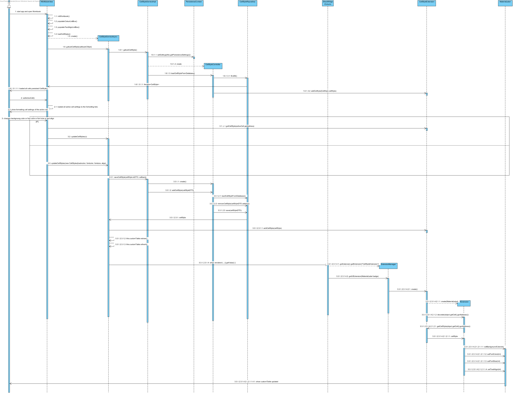

**Hernâni Gil** (n1050475) - Sprint 2 - Core08.1
===============================

# 1. General Notes
The application should have a new extension to associate styles with cells. The functionality should be similar to the one present in the desktop version of Cleansheets.
The similarities are in the use of extensions and the UI extension. This application is a web app and has next way of approach. This UC has lots of other UC that depend on it. Like Lang03.1, Lang03.2, IPC03.2, etc.
The challenge is to make something that is easily applied by everyone. Priorities shall be set by each of the UC that apply this UC.

*In this section you should register important notes regarding your work during the sprint. For instance, if you spend significant time helping a colleague or if you work in more than one feature increment.*
I was responsible for Lang03.1 that needed this UC. In this second sprint there was an Core02.1 that manage to create a change of color with the class Configuration and the ValueColorExtension. It was important
to deactivate this UC. Persistence was only able to persist one configuration for one Spreadsheet. So wasn't able to reuse this funcionality. Also, in the first sprint, some programmer change the cell widget
from MaterialLabel to MaterialButton. As I understood, the idea was to be able to rigth click and open an menu. A MaterialLabel can do this event as well as well, is more pratical to take care of the string
values from the cell. Also, is more pratical to set the color, font and alignment settings.

# 2. Requirements

This Core 8.1 we need to need a way in the UI to set several formatting settings to change the style of a cell. each cell, will have a style when the settings are set. It is important to persist this settings
no only in memory (client app), but also in the repository.

Proposal:

US1 - As the Product Owner I want the formatting settings of a cell to be persisted in the repository and updated everytime the user changes it.

US2 - As a User of the Application I want to be able to change backgroung color, font color, text alignment and font size of a cell.

# 3. Analysis

*In this section you should describe the study/analysis/research you developed in order to design a solution.*

For this feature increment, since it is the first one to be developed in a new project I need to:  

- Understand how the application works and also understand the key aspects of GWT, since it is the main technology behind the application 
	WorkbookView has a customTable that is redraw everytime that is updated. I found in the SheetWidgetColumn the render of each cell per column. The cell is materialized as a MaterialLabel. The value of
	the cell is stored in this label as a String. Then we can change background color that didnt fit the grid, so I resized a min height for the label to fit. Then we can change font color, align and font size.
	These were the setting I think a cleansheet needs for a cell and to respect the needs of other UC. It is important for the user to know the settings that are already applied in order to compare to the settings
	that we can choose. So when we press on a cell, the formatting lists show the user the style settings applied.

- Understand how to integrate a relational database into the project (Will be assuming JPA since it is studied in EAPLI)   
	The CellStyle is the class that stores the settings of a cell by background color, font color, font size and text align. The colors are all available in the gwt library, the font size are from 6 to 28 and the align of the
	text is "left", "center" and "right".
	
	The CellStyleExtension have a list of CellStyle that stores in memory while Client app is running. Anytime a setting is changed in the list, the list is check to see if the CellStyle already exists to be created or updated. 
	The same happens with the repository database. The CellStyleServiceImp sends the CellStyleDTO to the server, where the CellStyleController checks if exists any CellStyle with same address as this one. If exists,
	removes the last one and saves the new one. this way, there is only CellStyle per Cell. The save in the repository returns a CellStyle that is store. It is this cellStyle, after Success, that updates in memory
	the list of CellStyles in the first mentioned CellStyleExtension and the render of the customTable is forced for the user to see the changes happening in real-time.
	

## 3.4 Analysis Diagrams

The main idea for the "workflow" of this feature increment.

**Use Cases**

- **Use Cases**. Since these use cases have a one-to-one correspondence with the User Stories we do not add here more detailed use case descriptions. We find that these use cases are very simple and may eventually add more specification at a later stage if necessary.

**Domain Model (for this feature increment)**

- **Domain Model**. Since we found no specific requirements for the structure of Workbook Descriptions we follow the Structure of the existing DTO (WorkbookDescriptionDTO).

**System Sequence Diagrams**

**For US1 and US2**

# 4. Design

*In this section you should present the design solution for the requirements of this sprint.*

## 4.1. Tests

*In this section you should describe the design of the tests that, as much as possibe, cover the requirements of the sprint.*

Regarding tests we try to follow an approach inspired by test driven development. However it is not realistic to apply it for all the application (for instance for the UI part). Therefore we focus on the domain classes and also on the services provided by the server.

**Domain classes**

For the Domain classes we will have a class that represents the entity **WorkbookDescription**. This entity will have attributes that, for the moment, will be based on the class **WorkbookDescriptionDTO**:
	
	- name (string)
	- description (string) 

**Test:** We should ensure that a WorkbookDescription can be created when all the attributes are set.  

	@Test(expected = IllegalArgumentException.class)
		public void ensureNullIsNotAllowed() {
		System.out.println("ensureNullIsNotAllowed");
		WorkbookDescription instance = new WorkbookDescription(null, null);
	}

**Services/Controllers**

For the services the application already has a service specified in the interface **WorkbooksService**:

	@RemoteServiceRelativePath("workbooksService")
	public interface WorkbooksService extends RemoteService {
		ArrayList<WorkbookDescriptionDTO> getWorkbooks();
	}
	
This method seems to be sufficient for supporting US1 but not US2.

For US2 we need a method that can be used to create a new WorkbookDescription given a WorkbookDescriptionDTO.

The proposal is:

	@RemoteServiceRelativePath("workbooksService")
	public interface WorkbooksService extends RemoteService {
		ArrayList<WorkbookDescriptionDTO> getWorkbooks();
		WorkbookDescriptionDTO addWorkbookDescription(WorkbookDescriptionDTO wdDto) throws DataException;
	}
		
Tests:  
- The tests on the controllers require the presence of a database.  
- We will use the database in memory (H2).  
- We will have a *controller* from adding new WorkbookDescriptions. This controller will be invoked by the GWT RPC service.
- We will have a *controller* from listing WorkbookDescriptions. This controller will be invoked by the GWT RPC service.

Controller **AddWorkbookDescriptionController**

**Test:** Verify the normal creation of an WorkbookDescription.  

	@Test
	public void testNormalBehaviour() throws Exception {
		System.out.println("testNormalBehaviour");
		final String name = "Workbook1";
		final String description = "Description for Workbook1";
		final WorkbookDescription expected = new WorkbookDescription(name, description);
		AddWorkbookDescriptionController ctrl = new AddWorkbookDescriptionController();
		WorkbookDescription result = ctrl.addWorkbookDescription(expected.toDTO());
		assertTrue("the added WorkbookDescription does not have the same data as input", expected.sameAs(result));
	}

Controller **ListWorkbookDescriptionController**

Note: We will be using the annotation @FixMethodOrder(MethodSorters.NAME_ASCENDING) to ensure the test methods are executed in order. This is useful since the memory database will have state changing between tests.
 
**Test:** At the beginning of the tests the memory database should be empty, so listWorkbookDiscriptions should return an empty set.

	   @Test 
	   public void testAensureGetWorkbooksEmpty() {
		   System.out.println("testAensureGetWorkbooksEmpty");
		   ListWorkbookDescriptionController ctrl=new ListWorkbookDescriptionController();
		   Iterable<WorkbookDescription> wbs=ctrl.listWorkbookDescriptions();
		   assertTrue("the list of WorkbookDescriptions is not empty", !wbs.iterator().hasNext());
	   } 
 
**Test:** If a WorkbookDescription is created it should be present in a following invocation of getWorkbooks().

		@Test
		public void testBtestDatabaseInsertion() throws Exception {
			System.out.println("testBtestDatabaseInsertion");
			final String name = "Workbook1";
			final String description = "Description for Workbook1";
			final WorkbookDescription expected = new WorkbookDescription(name, description);
			AddWorkbookDescriptionController ctrlAdd = new AddWorkbookDescriptionController();
			WorkbookDescription result = ctrlAdd.addWorkbookDescription(expected.toDTO());
			ListWorkbookDescriptionController ctrlList=new ListWorkbookDescriptionController();
			Iterable<WorkbookDescription> wbs=ctrlList.listWorkbookDescriptions();
			assertTrue("the added WorkbookDescription is not in the database", wbs.iterator().hasNext());
		}

**Test Coverage**  
- The actual coverage for domain classes: 61%
- The actual coverage for application(controller) classes: 100%
 
- TODO: Add more tests to increase the coverage of the domain class. 

## 4.2. Requirements Realization

*In this section you should present the design realization of the requirements.*

Following the guidelines for JPA from EAPLI we envision a scenario like the following for realizing the use cases for this feature increment.

**For US1**

Notes:  
- The diagram only depicts the less technical details of the scenario;  
- For clarity reasons details such as the PersistenceContext or the RepositoryFactory are not depicted in this diagram.   
- **WorkbookServices** realizes the GWT RPC mechanism;  
- **ListWorkbookDescriptionController** is the *use case controller*;  
- **ListWorkbookDescriptionServices** is to group together all the services related to WorkbookDescription. 

**For US2**

## 4.3. Classes

*Present and describe the major classes of you solution.*

## 4.4. Design Patterns and Best Practices

*Present and explain how you applied design patterns and best practices.*

By memory we apply/use:  
- Singleton  
- Repository  
- DTO  
- MVP

**TODO:** Exemplify the realization of these patterns using class diagrams and/or SD with roles marked as stereotypes. 

# 5. Implementation

*If required you should present in this section more details about the implementation. For instance, configuration files, grammar files, etc. You may also explain the organization of you code. You may reference important commits.*

**For US1**

**For US2**

**For US1**

The UI for this US was already implemented. We simply implemented the server as described previously.

**For US2**

**UI: Button for adding a new Workbook Description**

For this concern we decided to use a Material Widget called Material FAB (Floating Action Button). This is a kind of button that usually appears at the left bottom part of the screen and contains actions available for the elements of the page.  

We updated the HomeView.ui.xml accordingly and declare the element with a tag *ui:field="newWorkbookButton"*. In the corresponding class View (i.e., HomeView) we bind that button to the corresponding widget class: 	

	@UiField
	MaterialButton newWorkbookButton;

We must now add the code that invokes the server to add a new workbook description when the user clicks in the button. This is an event. To implement this behavior we could use GWT Events such as the SetPageTitleEvent already used in the application. These are special type of events that GWT manages and are available to all pages in the application. 

We chose to provide our click event globally but to simple use the click event handler of the button and connect it to a method in the HomePresenter.

Since Presenters should only depend on a View interface we added a new method to the HomePresenter.MyView:

	interface MyView extends View {
		void setContents(ArrayList<WorkbookDescriptionDTO> contents);
		void addClickHandler(ClickHandler ch);
	}

Then, we implemented the *addClickHandler* in the HomeView class and call this method in the constructor of the HomePresenter. In the constructor our handler class the server method that adds a new workbook description.   

**Code Organization**  

We followed the recommended organization for packages:  
- Code should be added (when possible) inside packages that identify the group, sprint, functional area and author;
- For instance, we used **lapr4.white.s1.core.n4567890**

The code for this sprint:  
Project **server**    
- pt.isep.nsheets.server.**lapr4.white.s1.core.n4567890**.workbooks.application: contains the controllers  
- pt.isep.nsheets.server.**lapr4.white.s1.core.n4567890**.workbooks.domain: contains the domain classes  
- pt.isep.nsheets.server.**lapr4.white.s1.core.n4567890**.workbooks.persistence: contains the persistence/JPA classes 
- Updated the existing class: **pt.isep.nsheets.server.WorkbookServiceImpl**

Project **shared**  
- Added the class: **pt.isep.nsheets.shared.services.DataException**: This class is new and is used to return database exceptions from the server  
- Updated the classes: **pt.isep.nsheets.shared.services.WorkbookService** and **pt.isep.nsheets.shared.services.WorkbookServiceAsync**  

Project **NShests** 
- Updated the classes: **pt.isep.nsheets.client.aaplication.home.HomeView** and **pt.isep.nsheets.client.aaplication.home.HomePresenter**  
- Updated the file: **pt.isep.nsheets.client.aaplication.home.HomeView.ui.xml**  

# 6. Integration/Demonstration

*In this section document your contribution and efforts to the integration of your work with the work of the other elements of the team and also your work regarding the demonstration (i.e., tests, updating of scripts, etc.)*

# 7. Final Remarks 

*In this section present your views regarding alternatives, extra work and future work on the issue.*

Some Questions/Issues identified during the work in this feature increment:

1. The method getWorkbooks in the WorkbooksService returns an ArrayList. Maybe we should not bind the result to a specific collection implementation.

# 8. Work Log

Commits:

[#22] Core08.1 CellStyleExtension updated and correct my work from sp1 (https://bitbucket.org/lei-isep/lapr4-18-2db/commits/48693bc9b84fcfd07b3d8a820f0dfc748ae22222)
[#22] Core08.1 update workbook UI: (https://bitbucket.org/lei-isep/lapr4-18-2db/commits/dcd8f9a007d8fb064760be7ebb4f000f71092ac3)
a. lists for cell formatting options:
1. background color
2. font color
3. font size
4. font align
b. implementation of handlers for lists to change colors in the CellStyleExtension list of CellStyles
c. impl with getValue() is caled in SheetWidgetColumn, colors update if Cell has formating options
d. correction: last sp1, widget was changed to button and limits the formatting options. Changed back to label
[#22] Core08.1: https://bitbucket.org/lei-isep/lapr4-18-2db/commits/2ff4a72a74f8d68c1eb951d242bb7ce4d3002ce6
1. CellStyle created. Class has formatting options for each cell
2. CellStyle services created for persistence
[#22] CellStyle Persistence working: (https://bitbucket.org/lei-isep/lapr4-18-2db/commits/6274006ba9568026b11f6004a32f27082559b6be)
1. cellstyles aren't unique yet
[#22] CellStyle persisting 100% (https://bitbucket.org/lei-isep/lapr4-18-2db/commits/f50fef0c46a9f804ff105928b2b4d37d4a65f665)
1. Cells keep their style in repository
2. Possible to Update CellStyle that exists
3. Formatting menus show activeCell settings when click