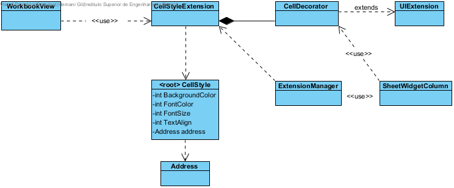

**Hernâni Gil** (n1050475) - Sprint 2 - Core08.1
===============================

# 1. General Notes
The application should have a new extension to associate styles with cells. The functionality should be similar to the one present in the desktop version of Cleansheets.
The similarities are in the use of extensions and the UI extension. This application is a web app and has next way of approach. This UC has lots of other UC that depend on it. Like Lang03.1, Lang03.2, IPC03.2, etc.
The challenge is to make something that is easily applied by everyone. Priorities shall be set by each of the UC that apply this UC.

*In this section you should register important notes regarding your work during the sprint. For instance, if you spend significant time helping a colleague or if you work in more than one feature increment.*
I was responsible for Lang03.1 that needed this UC. In this second sprint there was an Core02.1 that manage to create a change of color with the class Configuration and the ValueColorExtension. It was important
to deactivate this UC. Persistence was only able to persist one configuration for one Spreadsheet. So wasn't able to reuse this funcionality. Also, in the first sprint, some programmer change the cell widget
from MaterialLabel to MaterialButton. As I understood, the idea was to be able to rigth click and open an menu. A MaterialLabel can do this event as well as well, is more pratical to take care of the string
values from the cell. Also, is more pratical to set the color, font and alignment settings.

# 2. Requirements

This Core 8.1 we need to need a way in the UI to set several formatting settings to change the style of a cell. each cell, will have a style when the settings are set. It is important to persist this settings
no only in memory (client app), but also in the repository.

Proposal:

US1 - As a User I want the formatting settings of a cell to be persisted in the repository and updated everytime the user changes it.

US2 - As a User of the Application I want to be able to change backgroung color, font color, text alignment and font size of a cell.

# 3. Analysis

*In this section you should describe the study/analysis/research you developed in order to design a solution.*

For this feature increment, since it is the first one to be developed in a new project I need to:  

- Understand how the application works and also understand the key aspects of GWT, since it is the main technology behind the application 
	WorkbookView has a customTable that is redraw everytime that is updated. I found in the SheetWidgetColumn the render of each cell per column. The cell is materialized as a MaterialLabel. The value of
	the cell is stored in this label as a String. Then we can change background color that didnt fit the grid, so I resized a min height for the label to fit. Then we can change font color, align and font size.
	These were the setting I think a cleansheet needs for a cell and to respect the needs of other UC. It is important for the user to know the settings that are already applied in order to compare to the settings
	that we can choose. So when we press on a cell, the formatting lists show the user the style settings applied.

- Understand how to integrate a relational database into the project (Will be assuming JPA since it is studied in EAPLI)   
	The CellStyle is the class that stores the settings of a cell by background color, font color, font size and text align. The colors are all available in the gwt library, the font size are from 6 to 28 and the align of the
	text is "left", "center" and "right".
	
	The CellStyleExtension have a list of CellStyle that stores in memory while Client app is running. Anytime a setting is changed in the list, the list is check to see if the CellStyle already exists to be created or updated. 
	The same happens with the repository database. The CellStyleServiceImp sends the CellStyleDTO to the server, where the CellStyleController checks if exists any CellStyle with same address as this one. If exists,
	removes the last one and saves the new one. this way, there is only CellStyle per Cell. The save in the repository returns a CellStyle that is store. It is this cellStyle, after Success, that updates in memory
	the list of CellStyles in the first mentioned CellStyleExtension and the render of the customTable is forced for the user to see the changes happening in real-time.
	

## 3.4 Analysis Diagrams

The main idea for the "workflow" of this feature increment.

**Use Cases**

- **Use Cases**. 

**Domain Model (for this feature increment)**

- **Domain Model**. Since we found no specific requirements for the structure of Workbook Descriptions we follow the Structure of the existing DTO (WorkbookDescriptionDTO).

**System Sequence Diagrams**

**For US1 and US2**

# 4. Design

*In this section you should present the design solution for the requirements of this sprint.*

## 4.1. Tests

Only function tests were done.

** US1 **

As a User I want the formatting settings of a cell to be persisted in the repository and updated everytime the user changes it.

The CellStyle changes shall be created in real-time in the database
The CellStyle if change shall be updated with concurrency care
The CellStyles shall be uploaded when we open the WorkbookView

** US2 **

As a User of the Application I want to be able to change backgroung color, font color, text alignment and font size of a cell.

When user press a activeCell, the system shall look if there is any CellStyle applied and update the GWT MaterialListBox (backgroundColor, fontColor, fontSize, TextAlign)
When user changes one of the listbox, the is launch an event with and handler for selection change. The Cell Style is created or updated in the CellStyleExtension list only if saved in the database

## 4.2. Requirements Realization

*In this section you should present the design realization of the requirements.*

Following the guidelines for JPA from EAPLI we envision a scenario like the following for realizing the use cases for this feature increment.

**For US1**

Notes:  
- The diagram only depicts the less technical details of the scenario;  
- For clarity reasons details such as the PersistenceContext or the RepositoryFactory are not depicted in this diagram.   
- **CellStyleServices** realizes the connection with the controller from the UI;  
- **CellStyleController** is the *use case controller* and manages the repository;  

**For US2**
- **CellStyleExtension** manages the CellDecorator to change Cell formatting style. 

## 4.3. Classes

CellStyle is the main class of this Core08.1. It has the colors and settings and has a One to One relation with the cell Address.

CellStyleExtension is the main responsible for this funcionality. It has the list of CellStyles and the CellDecorator class inside that allows to change the formatting settings of the GWT widgets.

## 4.4. Design Patterns and Best Practices

*Present and explain how you applied design patterns and best practices.*

By memory we apply/use:  
- Singleton  
- Repository  
- DTO  
- MVP

**TODO:** Exemplify the realization of these patterns using class diagrams and/or SD with roles marked as stereotypes. 

# 5. Implementation

*If required you should present in this section more details about the implementation. For instance, configuration files, grammar files, etc. You may also explain the organization of you code. You may reference important commits.*

**For US1**

In the WorkView, anytime a CellStyle setting is changed in the ListBox, there is an event handler that starts the US2. This one also updates the database, if successful, updates the CellStyleExtension list
and redraw the customTable for the user to see the changes in real-time:

backgroundcolorLst.addValueChangeHandler(event -> {

            if (activeCell != null) {
                CellStyle c = CellStyleExtension.getCellStyle(activeCell.getAddress());
                if (c != null) {
                    c.setBackgroungColor(backgroundcolorLst.getSelectedValue().ordinal());
                    this.updateCellStyles(c);
                    MaterialToast.fireToast("existia " + CellStyleExtension.getCellStyle(activeCell.getAddress()).getBackgroungColor());
                } else {
                    MaterialToast.fireToast("nao existia");
                    //CellStyleExtension.addCellStyle(new CellStyle(activeCell.getAddress(), backgroundcolorLst.getSelectedValue().ordinal(), Color.BLACK.ordinal(),0,12));
                    this.updateCellStyles(new CellStyle(activeCell.getAddress(), backgroundcolorLst.getSelectedValue().ordinal(), Color.BLACK.ordinal(), 0, 12));
                }
            }
        });
		
Note the call of method updateCellStyles() and what happens when successful:

public void updateCellStyles(CellStyle cellStyle) {
        CellStyleServiceAsync cellStyleServiceAsync = GWT.create(CellStyleService.class);

        AsyncCallback<CellStyleDTO> callback = new AsyncCallback<CellStyleDTO>() {
            @Override
            public void onFailure(Throwable caught) {
                MaterialToast.fireToast("Error saving cellStyle! " + caught.getMessage());
            }

            @Override
            public void onSuccess(CellStyleDTO result) {
                MaterialToast.fireToast("CellStyle repository updated!");
                CellStyleExtension.addCellStyle(CellStyle.fromDTO(result));
                customTable.getView().setRedraw(true);
                customTable.getView().refresh();
            }
        };

        cellStyleServiceAsync.saveCellStyle(cellStyle.toDTO(), callback);

        //loadCellStyles();
    }

**For US2**

The CellStyleExtension has the List of CellStyles in client app memory.

public class CellStyleExtension extends Extension {

    public static ArrayList<CellStyle> lstCellStyle = new ArrayList<CellStyle>();

Inside CellStyleExtension, the UIExtension is extended in a CellDecorator that is responsible to change widget that represents a Cell for the User.

@Override
    public UIExtension getUIExtension(MaterialWidget element) {
        return new CellDecorator(element);
    }

    class CellDecorator extends UIExtension {
        MaterialWidget element;

        CellDecorator(MaterialWidget element) {
            this.element = element;
        }

        @Override
        public void decorate(Object o) {
            CellStyle c = CellStyleExtension.getCellStyle((Address) o);
            if (c != null) {
                element.setBackgroundColor(Color.values()[c.getBackgroungColor()]);
                element.setTextColor(Color.values()[c.getFontColor()]);
                if(c.getTextALIGN() == -1){
                    element.setTextAlign(TextAlign.LEFT);
                }else if(c.getTextALIGN() == 1){
                    element.setTextAlign(TextAlign.RIGHT);
                }else{
                    element.setTextAlign(TextAlign.CENTER);
                }
                element.setFontSize(c.getFontSize(), Style.Unit.PX);
            }else{
                element.setBackgroundColor(Color.WHITE);
                element.setTextColor(Color.BLACK);
                element.setTextAlign(TextAlign.CENTER);
                element.setFontSize(12, Style.Unit.PX);
            }
        }
    }

Any time that the customTable of the Workbook is rendered, the method getValue() of the SheetWidgetColumn is called for each cell, returning a MaterialLabel that represents the cell.
If the CellStyleExtension isn't null, it looks if each cell has a CellStyle associated and decorates this widget.

public MaterialLabel getValue(SheetCell object) {
        MaterialLabel badge = new MaterialLabel();
        //badge.setPixelSize(180,30);
        badge.setMinHeight("30px");
        if (this.colNumber == -1) {
            badge.setText("" + (object.getCell(0).getAddress().getRow() + 1));
        } else {
            badge.setText(object.getCell(this.colNumber).getValue().toString());
            Extension ui = ExtensionManager.getInstance().getExtension("CellStyleExtension");
            if(ui != null) {
                ui.getUIExtension(badge).decorate(object.getCell(this.colNumber).getAddress());
                try {
                    this.view.customTable.getRow(object.getCell(this.colNumber).getAddress().getRow()).getWidget().getColumn(object.getCell(this.colNumber).getAddress().getColumn()+1).setBackgroundColor(Color.values()[CellStyleExtension.getCellStyle(object.getCell(this.colNumber).getAddress()).getBackgroungColor()]);
                }catch (Exception e){
                    e.printStackTrace();
                }
            }
        }
       badge.setLayoutPosition(Style.Position.RELATIVE);

        return badge;
    }

# 6. Integration/Demonstration

*In this section document your contribution and efforts to the integration of your work with the work of the other elements of the team and also your work regarding the demonstration (i.e., tests, updating of scripts, etc.)*

# 7. Final Remarks 

*In this section present your views regarding alternatives, extra work and future work on the issue.*

Some Questions/Issues identified during the work in this feature increment:

1. The method getWorkbooks in the WorkbooksService returns an ArrayList. Maybe we should not bind the result to a specific collection implementation.

# 8. Work Log

Commits:

[#22] Core08.1 CellStyleExtension updated and correct my work from sp1 
(https://bitbucket.org/lei-isep/lapr4-18-2db/commits/48693bc9b84fcfd07b3d8a820f0dfc748ae22222)

[#22] Core08.1 update workbook UI: 
a. lists for cell formatting options:
1. background color
2. font color
3. font size
4. font align
b. implementation of handlers for lists to change colors in the CellStyleExtension list of CellStyles
c. impl with getValue() is caled in SheetWidgetColumn, colors update if Cell has formating options
d. correction: last sp1, widget was changed to button and limits the formatting options. Changed back to label
(https://bitbucket.org/lei-isep/lapr4-18-2db/commits/dcd8f9a007d8fb064760be7ebb4f000f71092ac3)

[#22] Core08.1: 
1. CellStyle created. Class has formatting options for each cell
2. CellStyle services created for persistence
(https://bitbucket.org/lei-isep/lapr4-18-2db/commits/2ff4a72a74f8d68c1eb951d242bb7ce4d3002ce6)

[#22] CellStyle Persistence working: 
1. cellstyles aren't unique yet
(https://bitbucket.org/lei-isep/lapr4-18-2db/commits/6274006ba9568026b11f6004a32f27082559b6be)

[#22] CellStyle persisting 100% 
1. Cells keep their style in repository
2. Possible to Update CellStyle that exists
3. Formatting menus show activeCell settings when click
(https://bitbucket.org/lei-isep/lapr4-18-2db/commits/f50fef0c46a9f804ff105928b2b4d37d4a65f665)