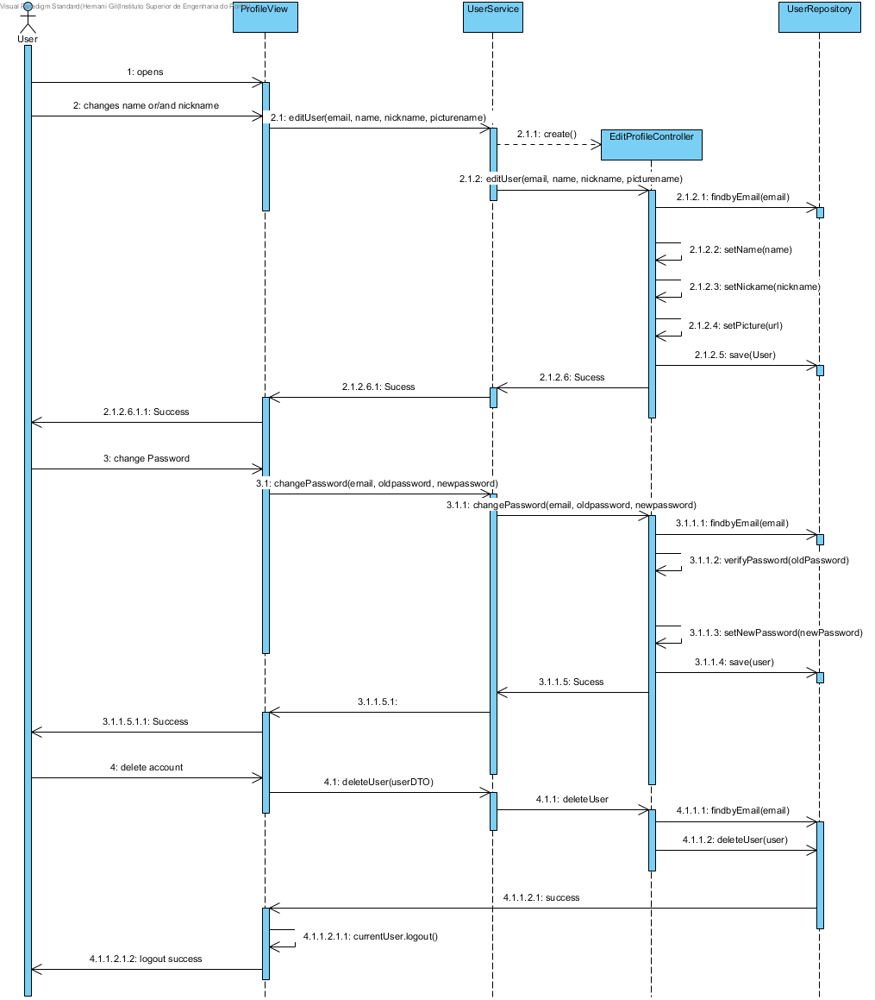
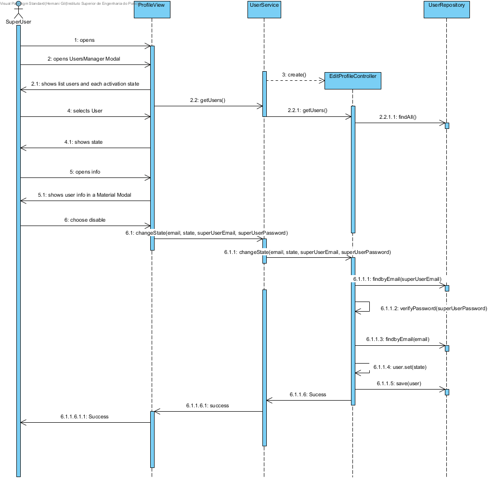

**Hernâni Gil** (n1050475) - Sprint 3 - IPC01.3
===============================

# 1. General Notes
The application should now have a new "Profile" page to allow users to manage their accounts. The user should be able to change his information (name, nickname and photo) and also delete the account. The super-user should be able to access all the accounts and be able to enable/disable accounts. When an account is disable its user is not able to authenticate.

*In this section you should register important notes regarding your work during the sprint. For instance, if you spend significant time helping a colleague or if you work in more than one feature increment.*

To do this UC, I had first to understand the work done in the last sprints IPC01.1 and IPC01.2. The redirection of pages wasnt working for login and logout. So I had to fix it and fixing the changing from log in  to logout and then the logout button turns to a signup button, and is redirected to the proper place.

# 2. Requirements

To do this UC case, I divided the work in 3 main parts. Fixing login erros and bugs, User interface for profile edition and SuperUser, Repository and Controller actions and persistence.

Proposal:

US1 - Fixing bugs, page's redirections, buttons and CurrentUser.

US2 - UI Profile and UI for Superuser manager

US3 - Repository and Controller for the actions related to the UI

# 3. Analysis

*In this section you should describe the study/analysis/research you developed in order to design a solution.*

For this feature increment, since it is the first one to be developed in a new project I need to:  

- Understand how the application works and also understand the key aspects of GWT, since it is the main technology behind the application 
	
	For this app I userd the login button. After login, I plan to redirect to a new profile page where the user can edit the name, username and picture. also change the password or deleted he's own account.

- Understand how to integrate a relational database into the project (Will be assuming JPA since it is studied in EAPLI)   
	
	The main idea to user a async service connection to the server where the controller will take care of the data and always authicating the user in the server side and verifying if also if it can be authorized the operation.
	

## 3.4 Analysis Diagrams

The main idea for the "workflow" of this feature increment.

**System Sequence Diagrams**

**For US2 and US3**

# 4. Design

*In this section you should present the design solution for the requirements of this sprint.*

## 4.1. Tests

Only function tests were done.

** US2 **
As a User of the Application I want to be able to profile: name, picture, nickname, delete account.

SuperUser can access all accounts see the profiles, delete or enable/disable.

** US3 **

As a User I want the formatting settings of a cell to be persisted in the repository and updated everytime the user changes it.

The EditProfileController changes shall be created in real-time in the database
The EditProfileController if change shall be updated with concurrency care
The CurrentUser shall be uploaded after login

## 4.2. Requirements Realization

*In this section you should present the design realization of the requirements.*

Following the guidelines for JPA from EAPLI we envision a scenario like the following for realizing the use cases for this feature increment.

**For US2**
- **ProfileView** manages the UI to change Users Profiles.

**For US3**

Notes:  
- The diagram only depicts the less technical details of the scenario;  
- For clarity reasons details such as the PersistenceContext or the RepositoryFactory are not depicted in this diagram.   
- **UserServices** realizes the connection with the controller from the UI;  
- **EditProfileController** is the *use case controller* and manages the repository;  

## 4.3. Classes

Users is the main class of this IPC1.3. 

EditProfileController is the main responsible for this funcionality.

## 4.4. Design Patterns and Best Practices

*Present and explain how you applied design patterns and best practices.*

By memory we apply/use:  
- Singleton  
- Repository  
- DTO  
- MVP

**TODO:** Exemplify the realization of these patterns using class diagrams and/or SD with roles marked as stereotypes. 

# 5. Implementation

public class EditProfileController implements Controller {
    public EditProfileController() {
    }

    public UserDTO editProfile(UserDTO userDTO,String oldPassword, boolean passwordChanged) throws DataConcurrencyException, DataIntegrityViolationException {
        final UserRepository userRepository = PersistenceContext.repositories().users();

        User user = userRepository.findByEmail(userDTO.getEmail());

        User newUser;
        if(passwordChanged){
            if(user.verifyPassword(DigestUtils.sha256Hex(oldPassword))){
                userRepository.removeUser(user);
                newUser = User.fromDTOHashPassword(userDTO);
            }else{
                return null;
            }
        }else{
            userRepository.removeUser(user);
            newUser = User.fromDTO(userDTO);
        }

        return userRepository.save(newUser).toDTO();
    }

    public boolean deleteProfile(String email) {

        final UserRepository userRepository = PersistenceContext.repositories().users();

        User user = userRepository.findByEmail(email);

        userRepository.removeUser(user);

        return true;
    }

    public boolean changeState(String email, boolean state, String superUserEmail, String superUserPassword) throws DataConcurrencyException, DataIntegrityViolationException {
        final UserRepository userRepository = PersistenceContext.repositories().users();

        User superUser = userRepository.findByEmail(superUserEmail);

        if(superUser.verifyPassword(DigestUtils.sha256Hex(superUserPassword)) || superUser.verifyPassword(superUserPassword)){
            User userChanging = userRepository.findByEmail(email);
            if(state){
                userChanging.activate();
            }else{
                userChanging.deactivate();
            }

            User user = userRepository.save(userChanging);
            return user.isActivated();
        }

        return false;
    }

    public UserDTO changePassword(String email, String oldPassword, String newPassword) throws DataConcurrencyException, DataIntegrityViolationException {
        final UserRepository userRepository = PersistenceContext.repositories().users();

        User superUser = userRepository.findByEmail(email);

        if(superUser.verifyPassword(DigestUtils.sha256Hex(oldPassword)) || superUser.verifyPassword(oldPassword)){
            User userChanging = userRepository.findByEmail(email);
            userChanging.setPassword(DigestUtils.sha256Hex(newPassword));

            User user = userRepository.save(userChanging);
            return user.toDTO();
        }

        return null;
    }

    public UserDTO editUser(String email, String name, String nickname, String url) throws DataConcurrencyException, DataIntegrityViolationException {
        final UserRepository userRepository = PersistenceContext.repositories().users();

        User user = userRepository.findByEmail(email);

        user.setName(name);
        user.setNickname(nickname);
        user.setPictureName(url);

        User newUser = userRepository.save(user);
        return newUser.toDTO();
    }
}

# 6. Integration/Demonstration

*In this section document your contribution and efforts to the integration of your work with the work of the other elements of the team and also your work regarding the demonstration (i.e., tests, updating of scripts, etc.)*

# 7. Final Remarks 

*In this section present your views regarding alternatives, extra work and future work on the issue.*

Some Questions/Issues identified during the work in this feature increment:

# 8. Work Log

Commits:

[#27] Profile UI (https://bitbucket.org/lei-isep/lapr4-18-2db/commits/ca8f1c6768e68aa65af7dcd6447e38cee0b92c9c)
[#27] EditProfileController & UsersRepository updated (https://bitbucket.org/lei-isep/lapr4-18-2db/commits/9f192c6cc622f93e0581e5a97111d2186a0653a2)
[#27] EditProfileController remove and update user (https://bitbucket.org/lei-isep/lapr4-18-2db/commits/66c7ade0aad9b6adf68e60a1e91b2bce4b1e7e6f)
[#27] Security Login: User attribute boolean state added to enable or disable user login (https://bitbucket.org/lei-isep/lapr4-18-2db/commits/456b2603726fde0611c18d43ebce6081ba040458)
[#27] Security Login: login redirect to pages correctly (https://bitbucket.org/lei-isep/lapr4-18-2db/commits/b69eecf2a3884088bd196c35cafbdd00aa930640)
2. logout corrected
3. currentUser updated corrected to logout
4. currentUser updated after changes
5. change Password only if correctly checked again the currentPassword
6. super users can open functionaly "ManageUsers"
[#27] Security Login: (https://bitbucket.org/lei-isep/lapr4-18-2db/commits/66a7f40b7c52f72b2121227b7d6e082dce276308)
1. currentPassword checked in the server side before password changes
2. superuser email and password checked before enable or disable users 
[#27] Security Login : Super User gets info about if selected user in the listbox is enabled or disabled (https://bitbucket.org/lei-isep/lapr4-18-2db/commits/fd4d79fa062bfd14cbd20a599635b7bd8916e68c)
[#27] Security Login: SuperUser can delete any user account (https://bitbucket.org/lei-isep/lapr4-18-2db/commits/4c52c90b165ba363f13c11c649fb3265a897fd35)

[#30] revert Tiago Correia changes (https://bitbucket.org/lei-isep/lapr4-18-2db/commits/f950329fab406c8c672a6bd127c27232aaea3bc1)
BUG COMMENTED - APP WORKING AGAIN (https://bitbucket.org/lei-isep/lapr4-18-2db/commits/87be1def860a7f3aef0cae730d3435f5eb336efe)
#30: Async connection to Server (https://bitbucket.org/lei-isep/lapr4-18-2db/commits/76fc67d34c85d259c297879023eb237da47fcca2)