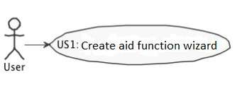
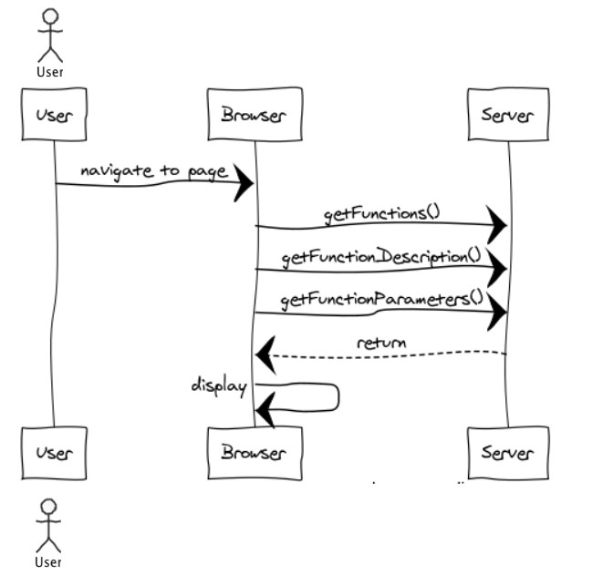
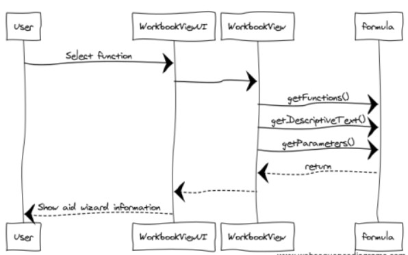

**Carlos Figueiredo** (1140317) - Sprint 1 - LANG04.1
===============================

# 1. General Notes

The workbooks are visible to all users.

1 wizard implemented to aid calling functions

# 2. Requirements

LANG04.1 - The application should have an option to launch a wizard to aid the user in calling functions in formulas. This new window should display a list of possible functions. The construction of this list should be made dynamically
 based on the self-description of the functions. When a function is selected in the list its syntax should be displayed in a edit box. The "syntax" should include the name of the function and its parameters. For example, for the factorial 
 function, that only has one parameter, the following text should be displayed in the edit box "= FACT(Number)". The window should also contain an area to display a text describing the selected function (i.e., help text). The window should have 
 an "Apply" and a "Cancel" button. If the user selects the "Apply" button the text of the syntax of the function should be written in the "formula bar".

# 3. Analysis

- Understand how the web design and the code "behind" it works. 

- Understand how to use the GWT components to a certain function. (ActionHandlers, MaterialButtons, MaterialModals, etc)

- Understand how the Home Page is implemented (for instance, how the UI gets the function Descriptions and Parameters that are displayed)

## 3.1 GWT and Project Structure

**Modules**. From the pom.xml file we can see that the application is composed of 5 modules:  
- **server**. It is the "server part" of the web application.  
- **shared**. It contains code that is shared between the client (i.e., web application) and the server.   
- **nsheets**. It is the web application (i.e., Client).  
- **util**. This is the same module as the one of EAPLI.  
- **framework**. This is the same module as the one of EAPLI.   
  
From [GWT Overview](http://www.gwtproject.org/overview.html): *"The GWT SDK contains the Java API libraries, compiler, and development server. It lets you write client-side applications in Java and deploy them as JavaScript."*

Therefore:
  - The project is totally developed in Java, event for the UI parts.
  - GWT uses a technique know as "transpilation" to translate Java code to Javascript. This is totally transparent to the user
  - A GWT application is comprised of "GWT modules" (see [GWT Tutorial](http://www.gwtproject.org/doc/latest/tutorial/create.html)). These GWT modules are described in .gwt.xml files.
   The nsheets project contains a .gwt.xml file named nsheets.gwt.xml (nsheets/src/main/resources/pt/isep/nsheets/nsheets.gwt.xml). One of the important contents of the file is the specification of the entry point of the application. However, since the application uses the [GWTP framework](http://dev.arcbees.com/gwtp/) the entry point is automatically provided (no need to specify it in the .gwt.xml file). In this case what is specified is the GIN client module pt.isep.nsheets.client.gin.ClientModule:
   
	    <extend-configuration-property name="gin.ginjector.modules"
                                   value="pt.isep.nsheets.client.gin.ClientModule"/>
                                   
   It is from this **ClientModule** that the application starts.
   Another important content of a .gwt.xml file is setting the paths for translatable code, .i.e., java code that should be translated to javascript. Usually the default source path is the client subpackage underneath where the .gwt.xml File is stored. In this case every code inside package pt.isep.nsheets.client and pt.isep.nsheets.shared will be translated to javascript. 
   
	<!-- Specify the paths for translatable code                    -->
    <source path='client'/>
    <source path='shared'/>
        
   The shared package is where shared code between server and client should reside. See [GWT - What to put in the shared folder?](https://stackoverflow.com/questions/5664601/gwt-what-to-put-in-the-shared-folder?utm_medium=organic&utm_source=google_rich_qa&utm_campaign=google_rich_qa) and also [using GWT RPC](http://www.gwtproject.org/doc/latest/tutorial/RPC.html).
   
   In this project the shared, server and client (i.e, nsheets) code are separated also in Maven modules (but they could all be in the same project/maven module). 
   
## 3.2 GWTP Manipulation

  The components used were initiated in the WorkbookView. The position of this components 
  is manipulated in the WorkbookView.ui.xml file, where is defined the icons, text, grid, effects, etc. 
  The ActionHandlers are implemented in the WorkbookView class as well, where each button is a function. So:
  
  1. **WorkbookModule**
  2. **WorkbookPresenter**
  3. **WorkbookView**
  4. **WorkbookView.ui.xml**

## 3.3 Server and RPC

The Home page displays what seems to be Workbooks that should reside in the server.

In the method **onReveal** the Home presenter invokes a WorkbookService asynchronously. It uses the base communication mechanism of GWT called [GWT RPC](http://www.gwtproject.org/doc/latest/tutorial/RPC.html).

Basically, it requires the definition of an interface for the service. In this case:

	@RemoteServiceRelativePath("workbooksService")
	public interface WorkbooksService extends RemoteService {
		ArrayList<WorkbookDescriptionDTO> getWorkbooks();
	}
	
Note: The @RemoteServiceRelativePath annotation associates the service with a default path relative to the module base URL.

When an RPC is invoked since it is always executed asynchronously we have to prove a callback: 

	// Make the call to the stock price service.
	workbooksSvc.getWorkbooks(callback);
	
The callback is simple a class that provides two methods, one for a successful result and the other for a failure:

	// Set up the callback object.
	AsyncCallback<ArrayList<WorkbookDescriptionDTO>> callback = new AsyncCallback<ArrayList<WorkbookDescriptionDTO>>() {
		public void onFailure(Throwable caught) {
			// TODO: Do something with errors.
		}
		public void onSuccess(ArrayList<WorkbookDescriptionDTO> result) {
			refreshView(result);
		}
	}; 

Since the interface is code that must be accessed by both server and client code it should reside in the **shared** project.

The interface must be implemented in the **server**. The implementation can be very simple, like the one presented in the project. In this case the server simply returns always the same objects:

	@Override
	public ArrayList<WorkbookDescriptionDTO> getWorkbooks() {
	    ArrayList<WorkbookDescriptionDTO> workbooks = new ArrayList<WorkbookDescriptionDTO>();
	    WorkbookDescriptionDTO wb=new WorkbookDescriptionDTO("workbook1", "Este workbook contem uma lista...");
	    workbooks.add(wb);
		WorkbookDescriptionDTO wb2=new WorkbookDescriptionDTO("workbook notas", "Este workbook contem notas de disciplinas...");
	    workbooks.add(wb2);	    
		return workbooks;
	}

Since the service is a servlet it must be declared in the **web.xml** file of the project (see file nsheets/src/main/webapp/WEB-INF/web.xml).

	<!-- Servlets for the workbooks -->
	<servlet>
		<servlet-name>workbooksServiceServlet</servlet-name>
		<servlet-class>pt.isep.nsheets.server.services.WorkbooksServiceImpl</servlet-class>
	</servlet>
	<servlet-mapping>
		<servlet-name>workbooksServiceServlet</servlet-name>
		<!-- The first "part" of the url is the name of the GWT module as in "rename-to" in .gwt.xml -->
		<url-pattern>/nsheets/workbooksService</url-pattern>
	</servlet-mapping> 
	
	

## 3.4 Analysis Diagrams

##USE CASES

##SSD

# 4. Design

## 4.1. Tests 

No tests were implemented.

## 4.2. Requirements Realization

## 4.3. Classes

**WorkbookView** 

**WorkbookView.ui.xml**
  

# 5. Implementation

To implement this UC, I created an UI with Apply and Close Options, with 1 comboBox , 2 textBoxes and 2 buttons. 
The Text Box is to introduce the parameters and the description of the selected function.
An ActionHandler was implemented for each button:
-Aplly: Aplly selected function to workbook
-Close: simply closes the window to cancel the operation.

# 6. Integration/Demonstration

# 7. Final Remarks 

  No final remarks.

