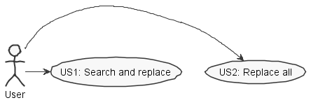

**Tiago Correia** (1140403) - Sprint 2 - IPC02.3
===============================

# 1. General Notes

*In this section you should register important notes regarding your work during the sprint. For instance, if you spend significant time helping a colleague or if you work in more than one feature increment.*

# 2. Requirements

IPC02.3 - Global Search/Replace

The application should now support "Search" and "Search and Replace" to be 
applied for all the workbooks of the user (may they be active/open or not). It 
should be possible to apply the search to workbooks which name matches a specific
regular expression. 

In a more brief text:

In this iteration of the use casa about "search and replace", it was required
that now, instead of looking for a certain expression in the current workbook,
it should now look in all the workbooks of the user.

Sub-Issues:
US1 - As a user I want to be able replace one occurrence of my desired expression 
at a time.

US2 - As a user I want to be able to replace all occurrences of my specified 
expression

# 3. Analysis

*In this section you should describe the study/analysis/research you developed in order to design a solution.*

Use case diagram:

For this feature increment I need to:  

- Understand how the application works and also understand the key aspects of GWT, since it is the main technology behind the application  
- Understand how to integrate a relational database into the project (Will be assuming JPA since it is studied in EAPLI)  

## 3.4 Analysis Diagrams

Use case diagram:

# 4 Design
## 4.1 TESTS

### Test Search And replace
1. User requests the search of a certain expression
2. System finds the first/next cell that contains the specified expression
4. User requests a change in the cell contents
5. The cell content is changed

### Test Replace All
1. User requests that all cells that contain the specified expression are changed
2. The system finds all occurrences of the expression in the workbooks of the user
and changes the content of all cells.

## 4.2. Requirements Realization

*In this section you should present the design realization of the requirements.*

Following the guidelines for JPA from EAPLI we envision a scenario like the 
following for realizing the use cases for this feature increment:

## 4.3. Classes

*Present and describe the major classes of you solution.*

## 4.4. Design Patterns and Best Practices

*Present and explain how you applied design patterns and best practices.*

By memory we apply/use:
- Singleton, across multiple classes
- Repository, in the package Server
- DTO, in the package Shared
- MVP, in the package NSheets
- GRASP, GoF, SOLID and DDD, where shown in some classes and relations bettween classes.
	For instance, we have controller pattern in controller classes, pure fabrication in the factory's done by Server,  high cohesion and low coupling especially important for Shared package and many moore.

