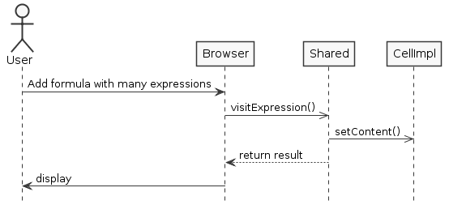
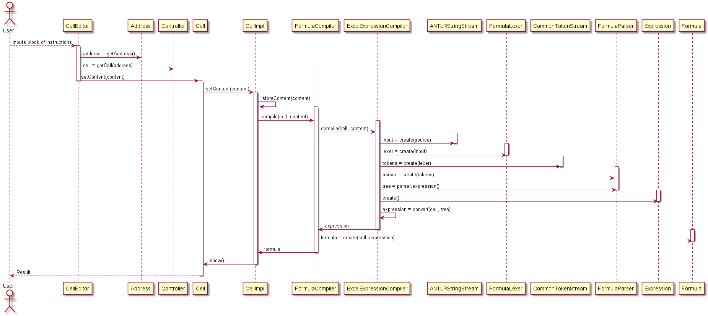

**Pedro Alves** (1150372) - Sprint 1 - Lang01.1
===============================

# Requirements

Lang01.1 - Block of Instructions

Add the possibility of writing blocks (or sequences) of instructions. A block must be delimited by curly braces and its instructions must be separated by ";". The instructions of a block are executed sequentially and the block "result" is the result of the last statement of the block. For example, the formula "= {1+ 2; sum (A1:A10); B3 + 4 }" must result in the sequential execution of all expressions and the result is the value of the expression "B3 + 4". Add the assign operator (its symbol is ":="). This operator assigns to its left the result of the right expression. At the moment the left of the assign operator can only be a cell reference. The FOR loop should also be implemented based on instruction blocks. For example, the formula"= FOR {A1: = 1 ; A1<10; A2: = A2 + A1; A1: = A1 + 1 }" executes a for loop in which: the first expression is the initialization, the second term is the boundary condition, all other expressions are performed for each iteration of the loop.

*Specification of the user stories:* 

```
US01
	As an user,
	I want to add sequences of instructions in formula.
```

```
US02
	As an user,
	I want to add assignment one reference to a expression.
```

```
US03
	As an user,
	I want to add the function for.
```

#  Analysis

##  Analysis Plan

**Expression** - An expression that contains two operands and an operator;
**Value** - Many Types of Value.
**Formula** - A formula starts with "=" and contains a set of operations separated by ";", with binary operations and predefined functions.

## Analysis Diagrams

**System Sequence Diagrams**

**For US**


**System Sequence Diagrams**

**US1, US2 and US3**



## Design

**Tests**

Regarding tests we try to follow an approach inspired by test driven development. 
However it is not realistic to apply it for all the application (for instance for the UI part). 
Therefore we focus on the domain classes and also on the services provided by the server.

####TEST ADD MANY EXPRESSION IN FORMULA
1. Add a formula to many expression in the Brownser;
2. Show result and compare the results;

####TEST ADD BINARY OPERATOR ASSIGNMENT TO THE FORMULA
1. Add a binary operator in formula in the Brownser;
2. Show result and compare the results;

####TEST ADD FUNCTION FOR TO THE FORMULA
1. Add a function for in the Brownser;
2. Show result and compare the results;

**Requirements Realization**

**US1**



**Classes**

	* FormulaEvalVisitor
	* Assignment
	* For
	* ManyExpression
	* Language
	* ExcelLanguage