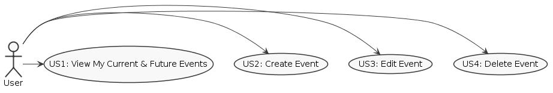
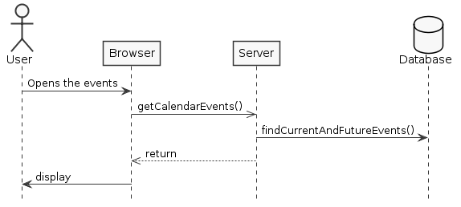
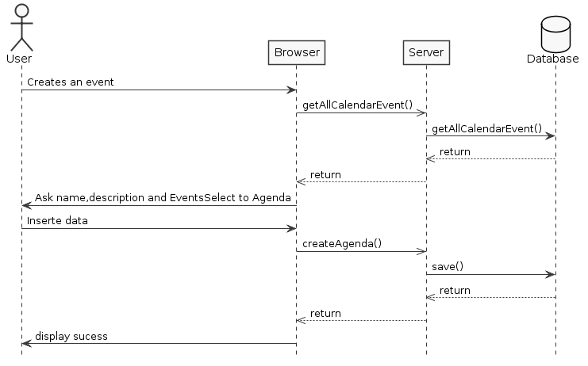
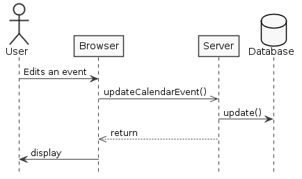
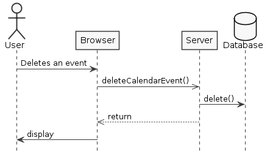
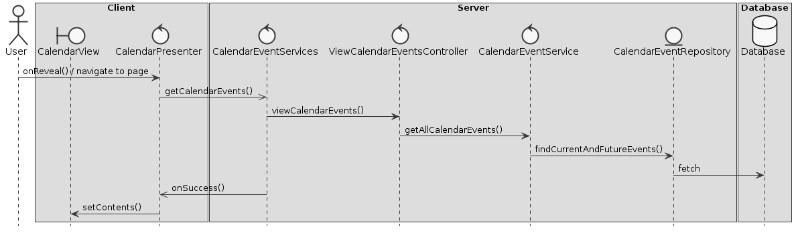
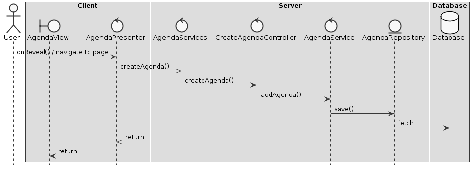
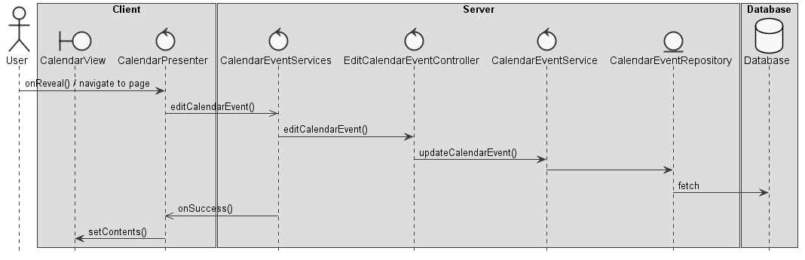
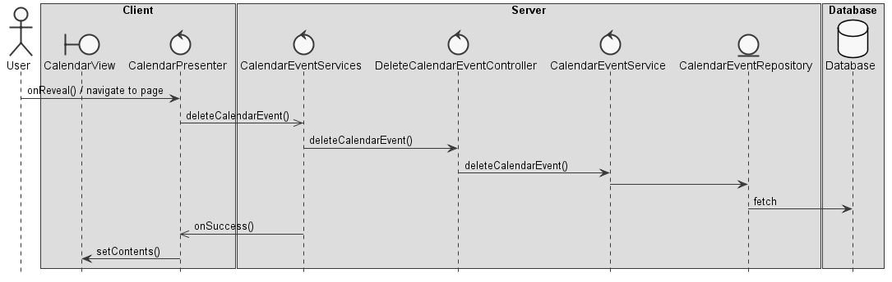

**Pedro Alves** (1150372) - Sprint 2 - Core06.2
=================================================

## Requirements

**Core06.2 - Agenda**

The calendar view should now evolve into an agenda view that may display several calendars. 

It should be possible to create, edit and remove calendars. 

Each user can have one or more calendars. 

Each calendar has a name (e.g., work, birthdays, home, etc.) and a textual description. 

It should be possible to associate a color to a calendar (events of that calendar are displayed with the color of the calendar). 

It should be possible to filter what calendars are displayed in the agenda view. 

The agenda view can be implemented as a simple list of events (from the calendars). 

The view should display only actual and future events.

Proposal:

* US1 - As a User, I want to access my calendar, so I can view my current and future events .

* US2 - As a User, I want to create an event, so I can .

* US3 - As a User, I want to edit a previously created event, so I can correct misspelled information.

* US4 - As a User, I want to delete an event, so I can .

## Analysis

For this feature increment, since it is the first one to be developed in a new project I need to:  

- Understand how the application works and also understand the key aspects of GWT, since it is the main technology behind the application.

- Understand how the UI is implemented.

- Understand how my colleague implemented the calendar.

- Fix my colleague's mistakes in adding and deleting the calendar.

- Fix my colleague's errors in persistence in the database.

- Fix my colleague's mistakes and assign a calendar/multiple calendars to a user.

- Understand how to integrate a relational database into the project.

**Use Cases**

**System Sequence Diagrams**

**US1**

**US2**

**US3**

**US4**

## Design

**Tests**

Regarding tests we try to follow an approach inspired by test driven development. 
However it is not realistic to apply it for all the application (for instance for the UI part). 
Therefore we focus on the domain classes and also on the services provided by the server.

####TEST VIEW A FUTURE AND CURRENT EVENTS
1. ---------------------------------------;
2. ---------------------------------------;
3. ---------------------------------------;
4. ---------------------------------------;

####TEST CREATE ONE CALENDAR
1. ---------------------------------------;
2. ---------------------------------------;
3. ---------------------------------------;
4. ---------------------------------------;
    4.1 ---------------------------------------;
    4.2 ---------------------------------------;

####TEST EDIT ONE CALENDAR
1. ---------------------------------------;
2. ---------------------------------------;
3. ---------------------------------------;
4. ---------------------------------------;
    4.1 ---------------------------------------;
    4.2 ---------------------------------------;
	
####TEST DELETE ONE CALENDAR
1. ---------------------------------------;
2. ---------------------------------------;
3. ---------------------------------------;
4. ---------------------------------------;
    4.1 ---------------------------------------;
    4.2 ---------------------------------------;

**Requirements Realization**

**US1**

**US2**

**US3**

**US4**

**Classes**
ainda a ver

## Work Log

Commits:
	Exemplo
[Added base folder for documentation](https://bitbucket.org/lei-isep/lapr4-18-2db/commits/e75f35afa3b5a8ec77c9eb332fb9eb97f87f3157)
