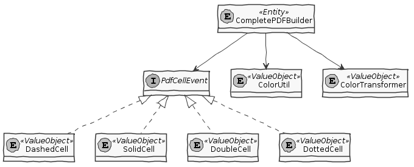
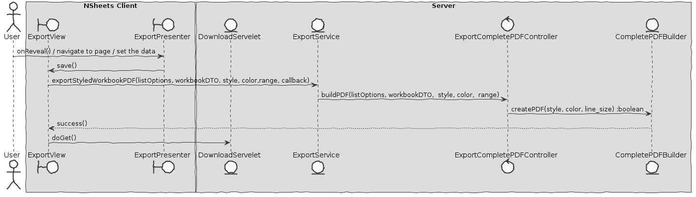

**Pedro Alves** (1150372) - Sprint 3 - IPC03.3
===============================

# Requirements

**Core03.3 - PDF Complete Export**
At this level, the export may include all the contents that are persisted with a workbook. 
For instance, all the following contents should be exported: the source of formulas, comments, images, macros, etc. 
However, the user should be given the possibility to select the type of contents to include in the PDF. 
Therefore, it is expected that the PDF includes sections that represent the visual aspect of the exported spreadsheets (as far as possible in a similar manner to how they are displayed on screen) and also new sections to include the contents that do not appear in the cells like, for instance, macros, comments or images. 
In each of this sections the contents should make references to the cells that are related to them (if they are related to cells).

We can specify this requirements in 1 User Story only:
+ US1 - As a user I want to export my complet workbook table to a PDF;

#  Analysis
In this part I tried to see how the export to PDF works and see how the servlet HTTP service works, since it is not RCOMP this year has enough difficulties in this aspect.

## Analysis Diagrams
####USE CASE

####DOMAIN MODEL (For this feauture increment)

# Design

## Requirements Realization

