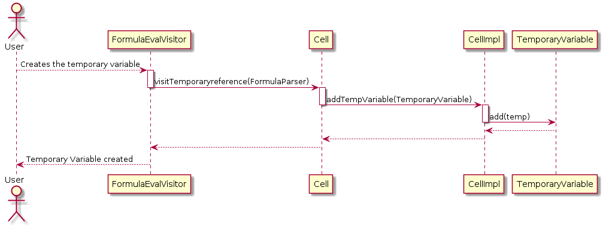

**João Pires** (1150455) - Sprint 1 - Lang02.1
===============================

# 1. Requirements
Add support for temporary variables. The name of temporary variables must start with the "_" sign. When a variable is referred in a formula for the first time, it is created. To set the value of a variable it must be used on the left of the assign operator (":="). Temporary variables are variables that only exist in the context of the execution of a formula. Therefore, it is possible for several formulas to use temporary variables with the same name and they will be different instances. Example: "= {_Counter:=1; WhileDo(Eval( "A"&_Counter)> 0; {C1:=C1+Eval("B"&_Counter); _Counter:=_Counter+1 }) }” . In this example, the cell C1 will get the sum of all the values of column B in that the corresponding values in column A are greater than zero.

# 2. Analysis

    ## 2.1. Principal Actor
    User

    ## 2.2. Pre conditions
    SpreadSheet ready to create the new variable

    ## 2.3. Post conditions
    The temporary variable is created

# 3. Design

## 4. Classes

	* FormulaEvalVisitor
	* Cell
	* CellImpl
	* TemporaryVariable
	* ExcelLanguage

