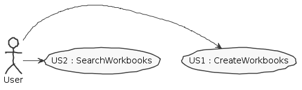
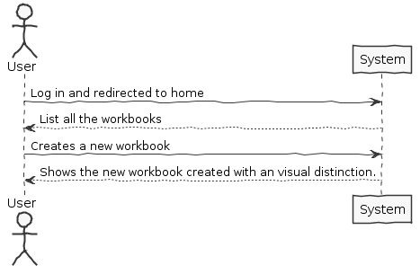
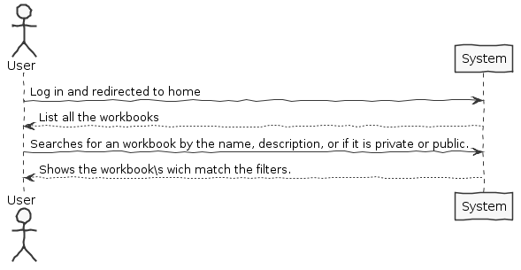
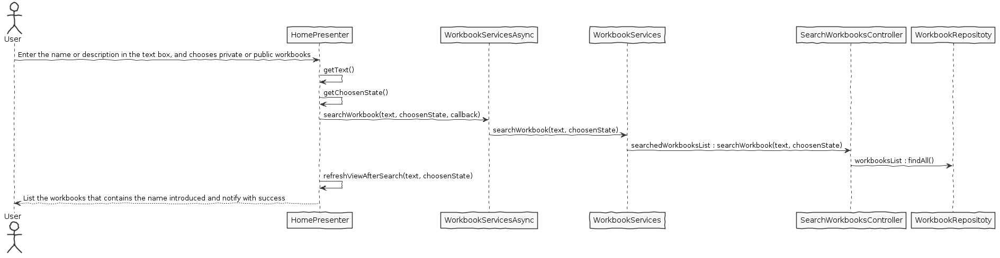

**João Pereira** (1150478) - Sprint 3 - IPC06.2
===============================

# 1. General Notes


# 2. Requirements

*IPC06.2 - Private Workbooks - Description:*
"Workbooks that are created by the user should be considered private. 
The "Home" page should now be able to display private and public workbooks. 
It should be possible to apply filters to this view/page to display only private or public workbooks with specific names or descriptions (the application should accepted regular expressions to filter the workbooks). 
Public and private workbooks should have some visual distinction (e.g, icon)."

*Specification of the User Stories:* 

```
US01
	As an user, 
	I want to create new workbooks, and they have to be created in private state, with some visual distinction.
```

```
US02
	As an user,
	I want to search for workbooks by their name, description or state.
```
                                                                                    
# 3. Analysis

## 3.1 Analysis Diagrams

The main idea for the "workflow" of this feature increment.

**Use Cases**



**System Sequence Diagrams**

**For US1**



**For US2**



# 4. Design

## 4.1. Tests

### 4.1.1 Testing the use case:

```
	1- Create 2 different acounts.
	2- In one, create public and private workbooks.
	3- On the other, see that only the public workbooks are shown.
	4- Search for workbooks by their name, description or state.

```

## 4.2. Requirements Realization

*Sequence Diagrams*

**For US1**


**For US2**



## 4.3. Classes

**Used classes**
* For this use case, it was needed to use the classes on the module *NSheets - A Web version of CleanSheets*, of the packages:

**Classes used**:
```
	- Workbook;
	- WorkbookDTO;
	- WorkbookService;
	- WorkbookDescriptionService;
	- WorkbookServiceImpl;
	- HomeView;
	- HomePresenter;
	- HomeView.xml;

```
## 4.4. Design Patterns and Best Practices

By memory we apply/use:
```
	- Repository  
	- DTO
	- MVP
```
# 5. Implementation

*If required you should present in this section more details about the implementation. For instance, configuration files, grammar files, etc. You may also explain the organization of you code. You may reference important commits.*

**For US1**
```
	public Iterable<Workbook> allWorkbooksFromUser(String user) {

        final WorkbookRepository workbookRepository = PersistenceContext.repositories().workbooks();
        Iterable<Workbook> list = workbookRepository.findAll();
        List<Workbook> returned = new LinkedList<>();
        
        for (Workbook w : list) {
            if(w.getUserName().equals(user) || w.isPublicState()) {
                returned.add(w);
            }
        }
        return returned;
    }
	
	---
	
	if (wb.publicState) {
            cardTitle.setIconType(IconType.LOCK_OPEN);
        } else {
            cardTitle.setIconType(IconType.LOCK);
        }
		
	---
```

**For US2**

```
	@Override
    public ArrayList<WorkbookDTO> searchWorkbooks(String name, boolean state) {
        PersistenceContext.setSettings(this.getPersistenceSettings());

        SearchWorkbooksController ctrl = new SearchWorkbooksController();
        ArrayList<WorkbookDTO> wbs = new ArrayList<>();
        ArrayList<Workbook> workbooksSearched = ctrl.searchWorkbooks(name);

        for (Workbook w : workbooksSearched) {
            if (state==true) {
                if (!w.isPublicState()) {
                    wbs.add(w.toDTO());
                }
            } else {
                if (w.isPublicState()) {
                    wbs.add(w.toDTO());
                }
            }
        }

        return wbs;
    }
```


# 6. Final Remarks 

Some Questions/Issues identified during the work in this feature increment

# 8. Work Log

[[Documentation] IPC06.2 - readMe.MD updated. [Implementation] IPC06.2 - implementation starting ] (https://bitbucket.org/lei-isep/lapr4-18-2db/commits/8f4f673322897f0525247d5a6ef74402c5611d79)
[[Implementation] IPC06.2 - users now have workbooks associated ] (https://bitbucket.org/lei-isep/lapr4-18-2db/commits/77afedd8e1ba50a204dac92ac237bd1ac2758ca4)
[[Implementation] IPC06.2 - now users can select wich workbook is private or public ] (https://bitbucket.org/lei-isep/lapr4-18-2db/commits/386c4622e755701223b7715f8aa2feed395743bf)
[[Implementation] IPC06.2 - now workbooks are private for each user. ] (https://bitbucket.org/lei-isep/lapr4-18-2db/commits/958a111544582eeb59876803714538a69466346e)
[[Implementation] IPC06.2 - Now users can filtre workbooks search by description or name. ] (https://bitbucket.org/lei-isep/lapr4-18-2db/commits/98ad229def0d000ad379f79991d836ea1215bc2c)
[[Implementation] IPC06.2 - Now users can search for private or public workbooks. ] (https://bitbucket.org/lei-isep/lapr4-18-2db/commits/d357aeb7267b076a141a00fca2e597bb8757e23b)
[[Documentation] IPC06.2 - SSD for user story 1 and 2 added. US diagram added. ] (https://bitbucket.org/lei-isep/lapr4-18-2db/commits/cd5604faf953807e472f4522c42b741d88ead9a2)
