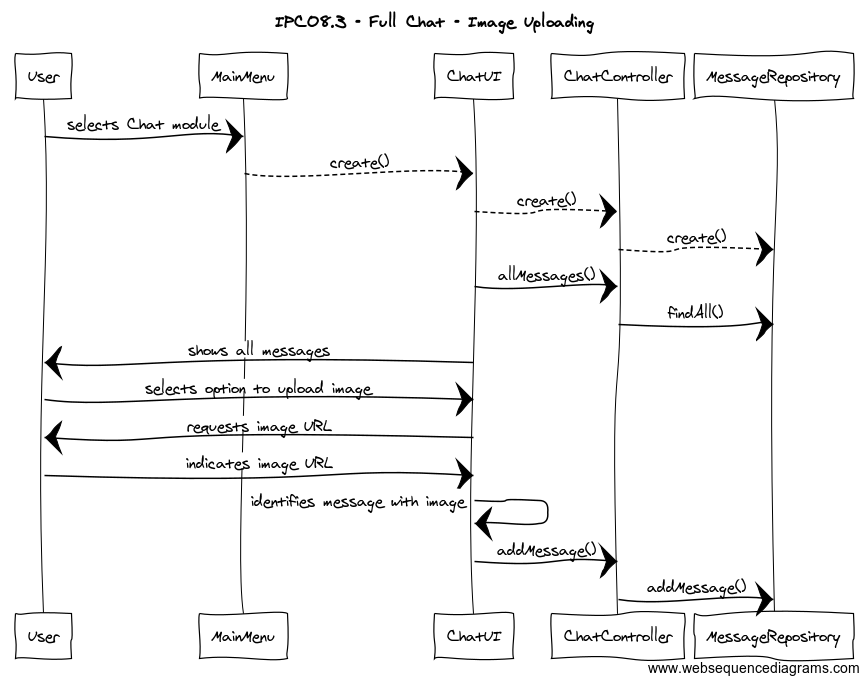
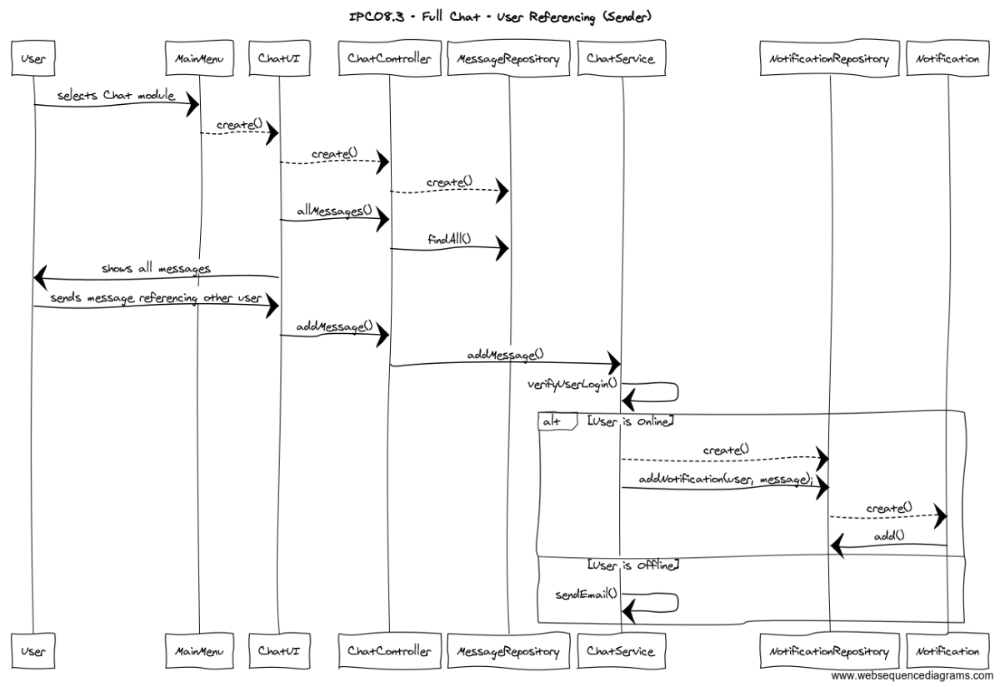
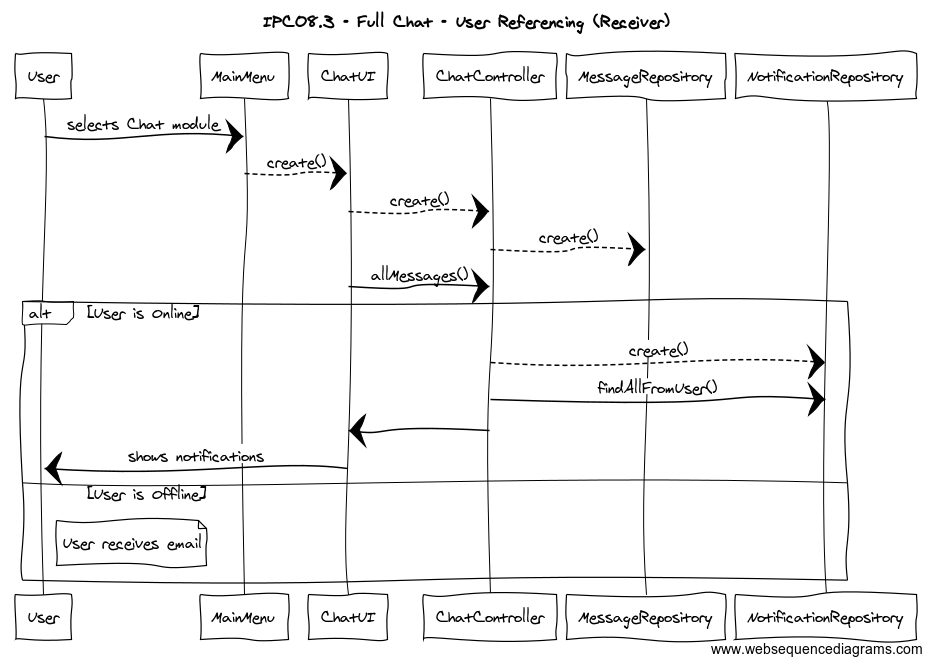

**Josué Lapa** (1160713) - Sprint 3 - Core08.3
===============================

# 1. General Notes

Questions made to the Product Owner:

```

```

# 2. Requirements

*Core08.3 - Full Chat - Description:*
"Users should be able to post Images and make mentions of other users (they should receive a notification email if they are not online)."

*Specification of the User Stories:* 

```
US01
	As an user,
	I want to upload an image to a Chat
```

```
US02
	As an user,
	I want to be able to reference other others in a Chat
```
                                                                       
# 3. Analysis

## 3.1 Analysis Plan
**Mention** - User Reference made by other users in a Chat


## 3.2 Analysis Diagrams

The main idea for the "workflow" of this feature increment.

**Use Cases**

User: 
US1: Upload Image
US2: Reference another user in a Chat

**Domain Model**

**System Sequence Diagrams**


# 4. Design

## 4.1. Tests

### 4.1.1 Testing the use case:

	US1:

	1. User selects Chat tab

	2. System redirects User to the correct module

	3. User uploads image

	4. System adds image message to Chat

	-------------------------------
	
	US2:
	
	1. User selects Chat tab

	2. System redirects User to the correct module

	3. User references other user

	4. System adds message with reference and notifies other other via the App or by E-mail
		

## 4.2. Requirements Realization

*Sequence Diagrams*

**For US1 - Image Upload**



**For US2 - Reference Dispatch**



**For US2 - Reference Reception**




## 4.3. Classes

**Used classes**

```
	- ChatModule;
	- ChatPresenter;
	- ChatView;
	- ChatView.ui.xml.
	
	- Message
	- MessageController
	- MessageService
	- MessageServiceImpl
	- MessageRepository
	- JpaMessageRepositoryImpl
	
	- NotificationRepository
	- JpaNotificationRepositoryImpl
	- Notification
```
## 4.4. Design Patterns and Best Practices

By memory we apply/use:
```
	- Repository  
	- DTO
	- MVP
```
# 5. Implementation

*If required you should present in this section more details about the implementation. For instance, configuration files, grammar files, etc. You may also explain the organization of you code. You may reference important commits.*

**For US1**

		- In order that a user was able to send an invitation to another user, a button was placed in the Contacts User Interface Module allowing an user to send a invitation only if the end user's email is known by the sender. After the button is clicked the System creates a Contact waiting for approval and sends it to the end user. The contact will only be available for the end user after further acception.

**For US2**

		- When an invitation is sent, the receiver will see the it in a collapsible menu items that only shows the invitations sent by other users. The user could choose to accept the invitation (a new contact is added), deny it (the invitation is dismissed and not added to the contact list), block invitations from the other user or unblock invitations from the other user.
	

# 6. Integration/Demonstration

--

# 7. Final Remarks 

Some Questions/Issues identified during the work in this feature increment

# 8. Work Log
