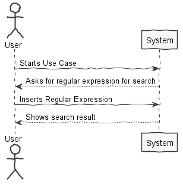
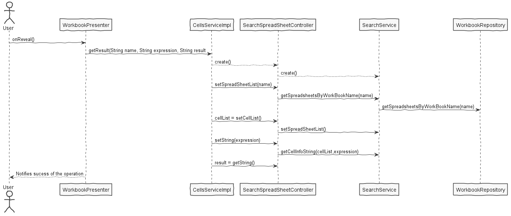

**Diogo Monteiro** (1140302) - Sprint 1 - IPC02.1
===============================

# 1. General Notes

Use case is not entirely functional because of some problems regarding the persistence of the spreadsheet cells
In theory the use case works but without the persistence it was almost impossible to test it out

# 2. Requirements

IPC02.1 - The application should now allow for searching the contents of the active workbook. The new window should be composed of two parts. The first part (upper part of the window) should contain a text box for the user to enter a regular expression to be the basis for the search. This part should also contain a button to launch the search. The second part (lower part of the window) should be used to display the search results (cell coordinates and value or contents). The search should include no only the content of the cell (i.e., the text entered by the user) but also its value (that could have been calculated by a formula).

# 3. Analysis

- Understand how the frontend and backend of the project works and how they connect

- Understand how to use GWT components and their functionality

- Understand how to correlate the GWT and the persistence entities

## 3.1 GWT and Project Structure

**Modules**. From the pom.xml file we can see that the application is composed of 5 modules:  
- **server**. It is the "server part" of the web application.  
- **shared**. It contains code that is shared between the client (i.e., web application) and the server.   
- **nsheets**. It is the web application (i.e., Client).  
- **util**. This is the same module as the one of EAPLI.  
- **framework**. This is the same module as the one of EAPLI.   
  
From [GWT Overview](http://www.gwtproject.org/overview.html): *"The GWT SDK contains the Java API libraries, compiler, and development server. It lets you write client-side applications in Java and deploy them as JavaScript."*

Therefore:
  - The project is totally developed in Java, event for the UI parts.
  - GWT uses a technique know as "transpilation" to translate Java code to Javascript. This is totally transparent to the user
  - A GWT application is comprised of "GWT modules" (see [GWT Tutorial](http://www.gwtproject.org/doc/latest/tutorial/create.html)). These GWT modules are described in .gwt.xml files.
   The nsheets project contains a .gwt.xml file named nsheets.gwt.xml (nsheets/src/main/resources/pt/isep/nsheets/nsheets.gwt.xml). One of the important contents of the file is the specification of the entry point of the application. However, since the application uses the [GWTP framework](http://dev.arcbees.com/gwtp/) the entry point is automatically provided (no need to specify it in the .gwt.xml file). In this case what is specified is the GIN client module pt.isep.nsheets.client.gin.ClientModule:
   
	    <extend-configuration-property name="gin.ginjector.modules"
                                   value="pt.isep.nsheets.client.gin.ClientModule"/>
                                   
   It is from this **ClientModule** that the application starts.
   Another important content of a .gwt.xml file is setting the paths for translatable code, .i.e., java code that should be translated to javascript. Usually the default source path is the client subpackage underneath where the .gwt.xml File is stored. In this case every code inside package pt.isep.nsheets.client and pt.isep.nsheets.shared will be translated to javascript. 
   
	<!-- Specify the paths for translatable code                    -->
    <source path='client'/>
    <source path='shared'/>
        
   The shared package is where shared code between server and client should reside. See [GWT - What to put in the shared folder?](https://stackoverflow.com/questions/5664601/gwt-what-to-put-in-the-shared-folder?utm_medium=organic&utm_source=google_rich_qa&utm_campaign=google_rich_qa) and also [using GWT RPC](http://www.gwtproject.org/doc/latest/tutorial/RPC.html).
   
   In this project the shared, server and client (i.e, nsheets) code are separated also in Maven modules (but they could all be in the same project/maven module). 
   
## 3.2 GWT Manipulation

   WorkbookView initializes the components and handles the click handlers
   For this use case various components were created:
   **MaterialTextBox (searchBox) -** this is the box for user input
   
   **MaterialIcon (searchButton)-** this is the button to execute the search
   
   **MaterialModal (searchModal) -** this is the "popup window" that will have the search results
    
   **MaterialTitle (searchTitle) -** this is the title of the modal
   
   **MaterialTextArea (searchTextArea) -** this is the searchResult that appears in the modal in readOnly mode
  
  **Classes Used:**
  1. **WorkbookModule**
  2. **WorkbookPresenter**
  3. **WorkbookView**
  4. **WorkbookView.ui.xml**

	

## 3.3 Analysis Diagrams

# 4. Design

## 4.1. Tests 

As the classes used only use the repository (persistence), no test were executed

## 4.2. Requirements Realization

## 4.3. Classes

**WorkbookPresenter** 

**CellServiceImpl**

**SearchSpreadshitController**

**SearchService**

**WorkbookRepository**  

## 4.4. Design Patterns and Best Practices

By memory we apply/use:  
- Interaction View/Presenter
- Interaction Services/Controller
- Repository
- DTO  
- Singleton

**TODO:** Exemplify the realization of these patterns using class diagrams and/or SD with roles marked as stereotypes. 

# 5. Implementation

This UC was implemented with the following steps: added searchBox to UI with one text box and one button. Clicking this button makes a window pop up with the search results
ClickHandler was implemented for the button, the click handler does the search and fills the resultTextArea with the search results

**Code Organization**  

The code for this sprint:  
Project **Server**    
- pt.isep.nsheets.server.**lapr4.green.s1.core.n1140302**.users.application: contains the controller and service 
- Added Query to get the spreadsheets from a Workbook: pt.isep.nsheets.server.**lapr4.white.s1.core.n4567890.workbooks.persistence.jpa**.JpaWorkbookRepository

Project **NSheets** 
- Changed: **pt.isep.nsheets.client.application.workbook.WorkbookView**  
- Changed: **pt.isep.nsheets.client.application.workbook.WorkbookPresenter** 

Project **Shared** 
- Created : **pt.isep.nsheets.shared.services.CellDtoAux**
- Created : **pt.isep.nsheets.shared.services.CellsService**
- Created : **pt.isep.nsheets.shared.services.CellsServiceAsync**

# 6. Integration/Demonstration

# 7. Final Remarks 

Some Questions/Issues identified during the work in this feature increment:
How exacly is the relation between SpreadSheet and Cell? ( couldn't ever get the cell to persist in the database)

# 8. Work Log

Commits:

[Workbook Repository method initialization](https://bitbucket.org/lei-isep/lapr4-18-2db/commits/169a6dfa4ca6879ce2881dce63c5989792c5f808)

[Workbook Jpa Repository method coding](https://bitbucket.org/lei-isep/lapr4-18-2db/commits/21b0af5d0475e3a3dd797d6333a3872c50bef3e0)

[Created DTO class for Cell](https://bitbucket.org/lei-isep/lapr4-18-2db/commits/b250a0c917df9ba55054744d2e041862ac5828c0)

[Created Class SearchService as an intermediate between Persitence and Controller](https://bitbucket.org/lei-isep/lapr4-18-2db/commits/3c0b8ef242a31b062a244f563d118aa7b52cea1b)

[Created Controller](https://bitbucket.org/lei-isep/lapr4-18-2db/commits/d8cf01ea24f871075087645bcfe4596ee3ca583d)

[Created the services needed for gwt](https://bitbucket.org/lei-isep/lapr4-18-2db/commits/1f414b9dd42864048f010f2a82a52401b0ee914f)

[Update in SearchService and Controller](https://bitbucket.org/lei-isep/lapr4-18-2db/commits/0837659d077c584f2d72710e5b43b5941939e81f)

[Test](https://bitbucket.org/lei-isep/lapr4-18-2db/commits/139667a9bb5f2188641df92725c9cba76787bbc4)

[UI](https://bitbucket.org/lei-isep/lapr4-18-2db/commits/6248a5e6fbaf0203b371f6cae44353901955cd8c)

[Documentation](https://bitbucket.org/lei-isep/lapr4-18-2db/commits/3acb9677a468f5bd8295008f17f9568c0da87b18)

