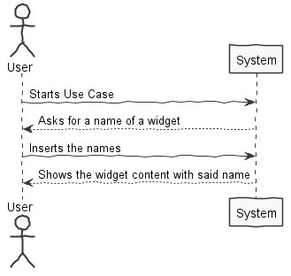
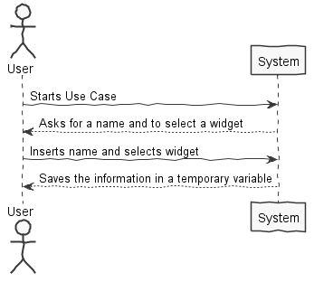
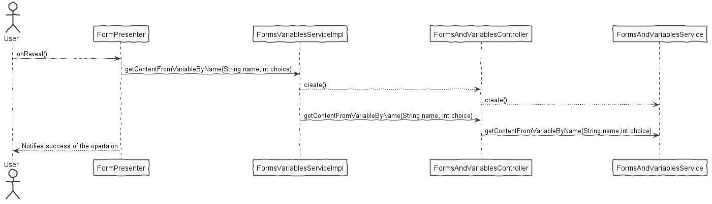
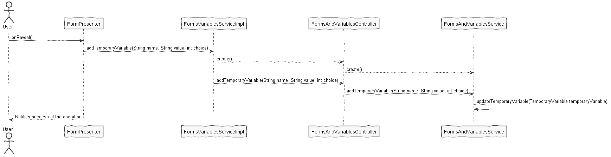

**Diogo Monteiro** (1140302) - Sprint 2 - Lang05.2
===============================

# 1. General Notes

Use Case is working and it is possible for the information to be accessed even from outside the classes that handle this Use Case ( as it was requested ).

# 2. Requirements

Lang05.2 - In order for forms to become useful in formulas or macros it is necessary to associate data with the contents of the visual widgets. The mechanism used for that will be the binding of variables (macros or formulas variables) with the contents of the visual widgets. One simple way to achieve this is by using temporary variables (from macros and formulas). The matching between widgets and variables should be done by associating the ones with the same name. When displaying a form (in the context of a macro or a formula), if the temporary variables with the same name of widgets exist, them they are used to set the content of the widgets. For widgets for which no temporary variables with the same name are found then new temporary variables should be created. The user should be able to change the contents of edit boxes. When closing the form window the contents of the temporary variables should be updated from the contents of the corresponding visual widgets.

# 3. Analysis

- Understand how the frontend and backend of the project works and how they connect

- Understand how to use GWT components and their functionality

- Understand how to correlate the GWT and the persistence entities

- Understand how to use temporary variables

- Understand how to save said temporary variables with no persistence

## 3.1 GWT and Project Structure

**Modules**. From the pom.xml file we can see that the application is composed of 5 modules:  
- **server**. It is the "server part" of the web application.  
- **shared**. It contains code that is shared between the client (i.e., web application) and the server.   
- **nsheets**. It is the web application (i.e., Client).  
- **util**. This is the same module as the one of EAPLI.  
- **framework**. This is the same module as the one of EAPLI.   
  
From [GWT Overview](http://www.gwtproject.org/overview.html): *"The GWT SDK contains the Java API libraries, compiler, and development server. It lets you write client-side applications in Java and deploy them as JavaScript."*

Therefore:
  - The project is totally developed in Java, event for the UI parts.
  - GWT uses a technique know as "transpilation" to translate Java code to Javascript. This is totally transparent to the user
  - A GWT application is comprised of "GWT modules" (see [GWT Tutorial](http://www.gwtproject.org/doc/latest/tutorial/create.html)). These GWT modules are described in .gwt.xml files.
   The nsheets project contains a .gwt.xml file named nsheets.gwt.xml (nsheets/src/main/resources/pt/isep/nsheets/nsheets.gwt.xml). One of the important contents of the file is the specification of the entry point of the application. However, since the application uses the [GWTP framework](http://dev.arcbees.com/gwtp/) the entry point is automatically provided (no need to specify it in the .gwt.xml file). In this case what is specified is the GIN client module pt.isep.nsheets.client.gin.ClientModule:
   
	    <extend-configuration-property name="gin.ginjector.modules"
                                   value="pt.isep.nsheets.client.gin.ClientModule"/>
                                   
   It is from this **ClientModule** that the application starts.
   Another important content of a .gwt.xml file is setting the paths for translatable code, .i.e., java code that should be translated to javascript. Usually the default source path is the client subpackage underneath where the .gwt.xml File is stored. In this case every code inside package pt.isep.nsheets.client and pt.isep.nsheets.shared will be translated to javascript. 
   
	<!-- Specify the paths for translatable code                    -->
    <source path='client'/>
    <source path='shared'/>
        
   The shared package is where shared code between server and client should reside. See [GWT - What to put in the shared folder?](https://stackoverflow.com/questions/5664601/gwt-what-to-put-in-the-shared-folder?utm_medium=organic&utm_source=google_rich_qa&utm_campaign=google_rich_qa) and also [using GWT RPC](http://www.gwtproject.org/doc/latest/tutorial/RPC.html).
   
   In this project the shared, server and client (i.e, nsheets) code are separated also in Maven modules (but they could all be in the same project/maven module). 
   
## 3.2 GWT Manipulation

   WorkbookView initializes the components and handles the click handlers
   For this use case various components were created:
   **MaterialTextBox (nameTextBox) -** this is the box for user input ( name )
   
   **MaterialTextBox (txtAreaAdd) -** this is the box for user input ( content )
   
   **MaterialButton (checkBtn)-** this is the button to check if there is already a widget with the same name
   
   **MaterialButton (btnAddRow) -** this is the button to add a row, it will also create/update the Temporary Variables
    
     **Classes Used:**
  1. **FormModule**
  2. **FormPresenter**
  3. **FormView**
  4. **FormView.ui.xml**

	

## 3.3 Analysis Diagrams

**Check Temporary Variables**

**Add/Update Temporary Variables**

# 4. Design

## 4.1. Tests 

No unit testing done, tests were done by try/fail mechanism

## 4.2. Requirements Realization

**Check Temporary Variables**

**Add/Update Temporary Variables**

## 4.3. Classes

**FormPresenter** 

**FormsVariablesServiceImpl**

**FormsAndVariablesController**

**FormsAndVariablesService**

## 4.4. Design Patterns and Best Practices

By memory we apply/use:  
- Interaction View/Presenter
- Interaction Services/Controller
- Repository
- DTO  
- Singleton

**TODO:** Exemplify the realization of these patterns using class diagrams and/or SD with roles marked as stereotypes. 

# 5. Implementation

This UC was implemented with the follow steps:

1- Created a Class to handle the methods needed in memory (FormsAndVariablesService)

2- Created a Controller to be the middleman between the UI async call and the methods previsouly mentioned

3- Created the AsyncService for this UC to connect the UI and the Controller

4- Reformated the UI to go with pair with the UC specifications

5- Connected all together to make the Use Case work

5.1- The "Check/Search" button searches for existing Temporary Variables. And the "Add Row" button creates/updates the Temporary Variables

**Code Organization**  

The code for this sprint:  
Project **Server**   
- Created **pt.isep.nsheets.server.services.FormsVariablesServiceImpl** 

Project **NSheets** 
- Changed: **pt.isep.nsheets.client.application.form.FormView**  
- Changed: **pt.isep.nsheets.client.application.form.FormPresenter** 

Project **Shared** 
- Created : **pt.isep.nsheets.shared.lapr4.green.n1140302.s2.Forms.FormsAndVariablesService**
- Created : **pt.isep.nsheets.shared.lapr4.green.n1140302.s2.Forms.FormsAndVariablesController**
- Created : **pt.isep.nsheets.shared.services.FormsVariablesService**
- Created : **pt.isep.nsheets.shared.services.FormsVariablesServiceAsync**

# 6. Integration/Demonstration

# 7. Final Remarks 

The way the Use Case is explained could be better.
The way the form is supposed to work should be more detailed.

# 8. Work Log

Commits:

[Removed an Unused Exception](https://bitbucket.org/lei-isep/lapr4-18-2db/commits/d279b5cad1821ebc14f0790a5d507844f01998a7)

[Created and Implemented Class FormsAndVariablesService](https://bitbucket.org/lei-isep/lapr4-18-2db/commits/d01c067f516071c91e020cf9c131615d54913c81)

[Created and Implemented Class FormsAndVariablesController](https://bitbucket.org/lei-isep/lapr4-18-2db/commits/ac893da9c42eaf611bd9b91a538acb71f92fad74)

[Created and Implemented Classes FormsVariableService and FormsVariableServiceAsync](https://bitbucket.org/lei-isep/lapr4-18-2db/commits/9be0a46624f3c6f807a935a0526438cebbded554)

[Created and Implemented Class FormsVariableServiceImpl](https://bitbucket.org/lei-isep/lapr4-18-2db/commits/504a35b36f88eb1f771ce995963d9fa404f98b6f)

[Updated the UI and UI handler](https://bitbucket.org/lei-isep/lapr4-18-2db/commits/6c60b334a3567a9ee548caa90f5465b19db8dea2)

[Small Change in FormsAndVariablesService](https://bitbucket.org/lei-isep/lapr4-18-2db/commits/0501d305c800ae85364948324254f92b0102ae2b)

[Small changes in UI](https://bitbucket.org/lei-isep/lapr4-18-2db/commits/5640daabd77af3bba49d8501061e54896e0fdbb0)

[Documentation](https://bitbucket.org/lei-isep/lapr4-18-2db/commits/66564a0a714f09aa87f02357c9e8a73e27f65113)

