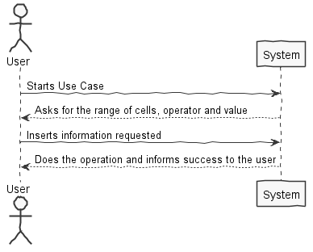

**Diogo Monteiro** (1140302) - Sprint 3 - Core03.2
===============================

# 1. General Notes

Use Case is working but it only works for the first match of a range.

# 2. Requirements

Core03.2 - It should be possible to filter a range of cells. The filter should be a boolean formula that is applied to each row (and a specific column of the range). If the result is true, the row is visible. If the result is false, the row should become invisible.
# 3. Analysis

- Understand how the frontend and backend of the project works and how they connect

- Understand how to use GWT components and their functionality

- Understand how to correlate the GWT and the persistence entities

- Understand how to iterate the spreadsheet

- Understand how to compare the values on a cell

## 3.1 GWT and Project Structure

**Modules**. From the pom.xml file we can see that the application is composed of 5 modules:  
- **server**. It is the "server part" of the web application.  
- **shared**. It contains code that is shared between the client (i.e., web application) and the server.   
- **nsheets**. It is the web application (i.e., Client).  
- **util**. This is the same module as the one of EAPLI.  
- **framework**. This is the same module as the one of EAPLI.   
  
From [GWT Overview](http://www.gwtproject.org/overview.html): *"The GWT SDK contains the Java API libraries, compiler, and development server. It lets you write client-side applications in Java and deploy them as JavaScript."*

Therefore:
  - The project is totally developed in Java, event for the UI parts.
  - GWT uses a technique know as "transpilation" to translate Java code to Javascript. This is totally transparent to the user
  - A GWT application is comprised of "GWT modules" (see [GWT Tutorial](http://www.gwtproject.org/doc/latest/tutorial/create.html)). These GWT modules are described in .gwt.xml files.
   The nsheets project contains a .gwt.xml file named nsheets.gwt.xml (nsheets/src/main/resources/pt/isep/nsheets/nsheets.gwt.xml). One of the important contents of the file is the specification of the entry point of the application. However, since the application uses the [GWTP framework](http://dev.arcbees.com/gwtp/) the entry point is automatically provided (no need to specify it in the .gwt.xml file). In this case what is specified is the GIN client module pt.isep.nsheets.client.gin.ClientModule:
   
	    <extend-configuration-property name="gin.ginjector.modules"
                                   value="pt.isep.nsheets.client.gin.ClientModule"/>
                                   
   It is from this **ClientModule** that the application starts.
   Another important content of a .gwt.xml file is setting the paths for translatable code, .i.e., java code that should be translated to javascript. Usually the default source path is the client subpackage underneath where the .gwt.xml File is stored. In this case every code inside package pt.isep.nsheets.client and pt.isep.nsheets.shared will be translated to javascript. 
   
	<!-- Specify the paths for translatable code                    -->
    <source path='client'/>
    <source path='shared'/>
        
   The shared package is where shared code between server and client should reside. See [GWT - What to put in the shared folder?](https://stackoverflow.com/questions/5664601/gwt-what-to-put-in-the-shared-folder?utm_medium=organic&utm_source=google_rich_qa&utm_campaign=google_rich_qa) and also [using GWT RPC](http://www.gwtproject.org/doc/latest/tutorial/RPC.html).
   
   In this project the shared, server and client (i.e, nsheets) code are separated also in Maven modules (but they could all be in the same project/maven module). 
   
## 3.2 GWT Manipulation

   WorkbookView initializes the components and handles the click handlers
   For this use case various components were created:
   **MaterialTextBox (filterStartCellTextBox) -** this is the box for user input ( Starting cell )
   
   **MaterialTextBox (filterEndCellTextBox) -** this is the box for user input ( Ending Cell )
   
   **MaterialTextBox (valueTextBox) -** this is the box for user input ( Value for the filtering )
   
   **MaterialButton (filterButton)-** this is the button to check the boolean formula and remove or not row
   
   **MaterialListBox (filterListBox) -** this is the list of operators
   
   **MaterialLink (filterLink) -** this is link to be accessed from the main workbook window
   
   **MaterialWindow (filterWindow) -** this is the window that will have the text boxes the list box and the button
    
     **Classes Used:**
  1. **WorkbookModule**
  2. **WorkbookPresenter**
  3. **WorkbookView**
  4. **WorkbookView.ui.xml**

	

## 3.3 Analysis Diagrams

**Filter Cells**

# 4. Design

## 4.1. Tests 

No unit testing done, tests were done by try/fail mechanism

## 4.2. Requirements Realization

**Filter Cells**

## 4.3. Classes

**WorkbookPresenter** 

**FilterServiceImpl**

**FilterController**

**FilterServices**

## 4.4. Design Patterns and Best Practices

By memory we apply/use:  
- Interaction View/Presenter
- Interaction Services/Controller
- Repository
- DTO  
- Singleton

**TODO:** Exemplify the realization of these patterns using class diagrams and/or SD with roles marked as stereotypes. 

# 5. Implementation

This UC was implemented with the follow steps:

1- Created a Class to handle the methods needed in memory (FilterServices)

2- Created a Controller to be the middleman between the UI async call and the methods previsouly mentioned

3- Created the AsyncService for this UC to connect the UI and the Controller

4- Reformated the UI to go with pair with the UC specifications

5- Connected all together to make the Use Case work

5.1- The "Check/Search" button searches for existing Temporary Variables. And the "Add Row" button creates/updates the Temporary Variables

**Code Organization**  

The code for this sprint:  
Project **Server**   
- Created **pt.isep.nsheets.server.services.FilterServiceImpl** 

Project **NSheets** 
- Changed: **pt.isep.nsheets.client.application.form.WorkbookView**  
- Changed: **pt.isep.nsheets.client.application.form.WorkbookPresenter** 

Project **Shared** 
- Created : **pt.isep.nsheets.shared.lapr4.green.n1140302.s3.Filter.FilterServices**
- Created : **pt.isep.nsheets.shared.lapr4.green.n1140302.s3.Filter.FilterController**
- Created : **pt.isep.nsheets.shared.services.FilterService**
- Created : **pt.isep.nsheets.shared.services.FilterServiceAsync**

# 6. Integration/Demonstration

# 7. Final Remarks 

The way the use case is explained, it doesn't say what "making a row invisible" actually means. So i opted to delete the row

# 8. Work Log

Commits:

[Created and Implemented Class FilterServiceAsync](https://bitbucket.org/lei-isep/lapr4-18-2db/commits/7d57a5ba45f165a1dc41d3503087b69d4581b5b8)

[Created and Implemented Class FilterService and updated web.xml](https://bitbucket.org/lei-isep/lapr4-18-2db/commits/26a0e54bc4249714d3bc2523d20c85e6b76a8597)

[Created and Implemented Class FilterServices](https://bitbucket.org/lei-isep/lapr4-18-2db/commits/38572e1707c2a4c1040c02439af4969be407dadd)

[Created and Implemented Class FilterController](https://bitbucket.org/lei-isep/lapr4-18-2db/commits/39dd3868ae31c6424d411aa570622506b113c667)

[Updated UI](https://bitbucket.org/lei-isep/lapr4-18-2db/commits/e515064e993a08ce68e741a3b72c16b64b757ef8)

[Documentation](https://bitbucket.org/lei-isep/lapr4-18-2db/commits/84193175ba733375fa62d97ad704070e53f94223)

