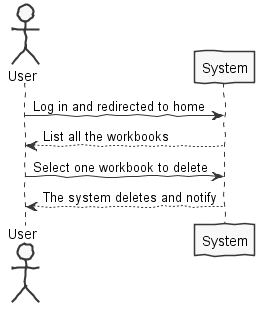
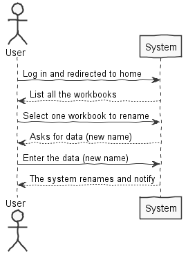
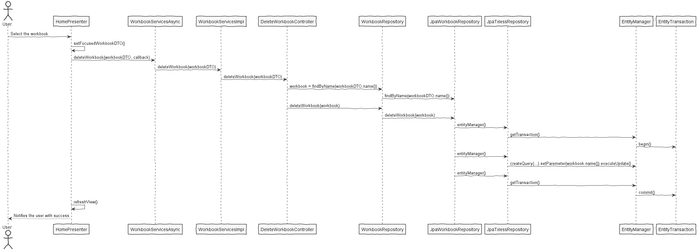

**Pedro Rodrigues** (1140572) - Sprint 1 - IPC06.1
===============================

# 1. General Notes

The workbooks are visible to all users.

3 Functions implemented: Search Workbook, Delete Workbook and Rename Workbook

# 2. Requirements

IPC06.1 - Workbooks should be considered public. A public workbook is a workbook that can be accessed by all users. The "Home" page should display all the workbooks. It should be possible to apply filters to this view/page to display only workbooks with specific names or descriptions (the application should accepted regular expressions to filter the workbooks). It should be possible to open, rename or delete a selected workbook in this page/view.

# 3. Analysis

- Understand how the web design and the code "behind" it works. 

- Understand how to use the GWT components to a certain function. (ActionHandlers, MaterialButtons, MaterialModals, etc)

- Understand how to get together both UI and the Database information. 

## 3.1 GWT and Project Structure

**Modules**. From the pom.xml file we can see that the application is composed of 5 modules:  
- **server**. It is the "server part" of the web application.  
- **shared**. It contains code that is shared between the client (i.e., web application) and the server.   
- **nsheets**. It is the web application (i.e., Client).  
- **util**. This is the same module as the one of EAPLI.  
- **framework**. This is the same module as the one of EAPLI.   
  
From [GWT Overview](http://www.gwtproject.org/overview.html): *"The GWT SDK contains the Java API libraries, compiler, and development server. It lets you write client-side applications in Java and deploy them as JavaScript."*

Therefore:
  - The project is totally developed in Java, event for the UI parts.
  - GWT uses a technique know as "transpilation" to translate Java code to Javascript. This is totally transparent to the user
  - A GWT application is comprised of "GWT modules" (see [GWT Tutorial](http://www.gwtproject.org/doc/latest/tutorial/create.html)). These GWT modules are described in .gwt.xml files.
   The nsheets project contains a .gwt.xml file named nsheets.gwt.xml (nsheets/src/main/resources/pt/isep/nsheets/nsheets.gwt.xml). One of the important contents of the file is the specification of the entry point of the application. However, since the application uses the [GWTP framework](http://dev.arcbees.com/gwtp/) the entry point is automatically provided (no need to specify it in the .gwt.xml file). In this case what is specified is the GIN client module pt.isep.nsheets.client.gin.ClientModule:
   
	    <extend-configuration-property name="gin.ginjector.modules"
                                   value="pt.isep.nsheets.client.gin.ClientModule"/>
                                   
   It is from this **ClientModule** that the application starts.
   Another important content of a .gwt.xml file is setting the paths for translatable code, .i.e., java code that should be translated to javascript. Usually the default source path is the client subpackage underneath where the .gwt.xml File is stored. In this case every code inside package pt.isep.nsheets.client and pt.isep.nsheets.shared will be translated to javascript. 
   
	<!-- Specify the paths for translatable code                    -->
    <source path='client'/>
    <source path='shared'/>
        
   The shared package is where shared code between server and client should reside. See [GWT - What to put in the shared folder?](https://stackoverflow.com/questions/5664601/gwt-what-to-put-in-the-shared-folder?utm_medium=organic&utm_source=google_rich_qa&utm_campaign=google_rich_qa) and also [using GWT RPC](http://www.gwtproject.org/doc/latest/tutorial/RPC.html).
   
   In this project the shared, server and client (i.e, nsheets) code are separated also in Maven modules (but they could all be in the same project/maven module). 
   
## 3.2 GWTP Manipulation

  The components used were initiated in the HomeView, where each workbook is a MaterialCard with a button to open the "Options". The position of this components 
  is manipulated in the HomeView.ui.xml file, where is defined the icons, text, grid, effects, etc. 
  The ActionHandlers are implemented in the HomePresenter class, where each button is a function. So:
  
  1. **HomeModule**
  2. **HomePresenter**
  3. **HomeView**
  4. **HomeView.ui.xml**

## 3.3 Server and RPC

The Home page displays what seems to be Workbooks that should reside in the server.

In the method **onReveal** the Home presenter invokes a WorkbookService asynchronously. It uses the base communication mechanism of GWT called [GWT RPC](http://www.gwtproject.org/doc/latest/tutorial/RPC.html).

Basically, it requires the definition of an interface for the service. In this case:

	@RemoteServiceRelativePath("workbooksService")
	public interface WorkbooksService extends RemoteService {
		ArrayList<WorkbookDescriptionDTO> getWorkbooks();
	}
	
Note: The @RemoteServiceRelativePath annotation associates the service with a default path relative to the module base URL.

When an RPC is invoked since it is always executed asynchronously we have to prove a callback: 

	// Make the call to the stock price service.
	workbooksSvc.getWorkbooks(callback);
	
The callback is simple a class that provides two methods, one for a successful result and the other for a failure:

	// Set up the callback object.
	AsyncCallback<ArrayList<WorkbookDescriptionDTO>> callback = new AsyncCallback<ArrayList<WorkbookDescriptionDTO>>() {
		public void onFailure(Throwable caught) {
			// TODO: Do something with errors.
		}
		public void onSuccess(ArrayList<WorkbookDescriptionDTO> result) {
			refreshView(result);
		}
	}; 

Since the interface is code that must be accessed by both server and client code it should reside in the **shared** project.

The interface must be implemented in the **server**. The implementation can be very simple, like the one presented in the project. In this case the server simply returns always the same objects:

	@Override
	public ArrayList<WorkbookDescriptionDTO> getWorkbooks() {
	    ArrayList<WorkbookDescriptionDTO> workbooks = new ArrayList<WorkbookDescriptionDTO>();
	    WorkbookDescriptionDTO wb=new WorkbookDescriptionDTO("workbook1", "Este workbook contem uma lista...");
	    workbooks.add(wb);
		WorkbookDescriptionDTO wb2=new WorkbookDescriptionDTO("workbook notas", "Este workbook contem notas de disciplinas...");
	    workbooks.add(wb2);	    
		return workbooks;
	}

Since the service is a servlet it must be declared in the **web.xml** file of the project (see file nsheets/src/main/webapp/WEB-INF/web.xml).

	<!-- Servlets for the workbooks -->
	<servlet>
		<servlet-name>workbooksServiceServlet</servlet-name>
		<servlet-class>pt.isep.nsheets.server.services.WorkbooksServiceImpl</servlet-class>
	</servlet>
	<servlet-mapping>
		<servlet-name>workbooksServiceServlet</servlet-name>
		<!-- The first "part" of the url is the name of the GWT module as in "rename-to" in .gwt.xml -->
		<url-pattern>/nsheets/workbooksService</url-pattern>
	</servlet-mapping> 
	
	

## 3.4 Analysis Diagrams

# 4. Design

## 4.1. Tests 

The following tests must be realized (JUnit Tests are done):
- Try to rename a workbook -> Expected result: Page updated with the new name introduced.
- Try to delete a workbook -> Expected result: The workbook disappear from the page.
- Try do search a workbook -> Expected result: The workbooks that will appear should contains the word/words that you introduced.
- Try to open a workbook by clicking in the name -> Expected result: The workbook should maximize.

## 4.2. Requirements Realization

## 4.3. Classes

**Workbook** 

**WorkbookDTO**

**WorkbookServicesImpl**  

## 4.4. Design Patterns and Best Practices

By memory we apply/use:  
- Interaction View/Presenter
- Interaction Services/Controller
- Repository
- DTO  
- Singleton

**TODO:** Exemplify the realization of these patterns using class diagrams and/or SD with roles marked as stereotypes. 

# 5. Implementation

To implement this UC, I created an UI with Rename, Delete and Cancel Options, with 1 Text Box and 3 Buttons. 
The Text Box is to introduce the new name to the selected workbook.
An ActionHandler was implemented for each button:
-Rename: get the TextBox text and then press the button "Rename" to change it in the Database.
-Delete: find the selected Workbook in the Database and then press the button "Delete" to eliminate.
-Cancel: simply closes the MaterialModal to cancel the operation.

**Code Organization**  

The code for this sprint:  
Project **Server**    
- pt.isep.nsheets.server.**lapr4.green.s1.core.n1140572**.users.application: contains the controllers  
- Added Query to delete Workbook: pt.isep.nsheets.server.**lapr4.white.s1.core.n4567890.workbooks.persistence.jpa**.JpaWorkbookRepository

Project **NShests** 
- Changed: **pt.isep.nsheets.client.application.home.HomeView**  
- Changed: **pt.isep.nsheets.client.application.home.HomePresenter** 

**Note:** Minor changes in WorkbookServices and WorkbookServicesAsync

# 6. Integration/Demonstration

# 7. Final Remarks 

Some Questions/Issues identified during the work in this feature increment:

# 8. Work Log

Commits:

[Creation of UI Delete](https://bitbucket.org/lei-isep/lapr4-18-2db/commits/64d9eeed87aeaeda1a26a2f92396353fcbab5f9a)

[Creation of UI Search](https://bitbucket.org/lei-isep/lapr4-18-2db/commits/aae397d4afd36dedfffcd4423f79f87b756c80fb)

[Creation of UI Rename](https://bitbucket.org/lei-isep/lapr4-18-2db/commits/64d9eeed87aeaeda1a26a2f92396353fcbab5f9a)

[UI Minor Update](https://bitbucket.org/lei-isep/lapr4-18-2db/commits/bf6abb1e4e9c96ebfce166bdf98d71aa7a5b885b)

[Improvement of UI and Button click Handler Search](https://bitbucket.org/lei-isep/lapr4-18-2db/commits/5bedbfe84778b4d0f1fe07f030544078bb5fa524)

[Improvement of UI and Button click Handler Search 2](https://bitbucket.org/lei-isep/lapr4-18-2db/commits/78bd02c7ecfb39e52ea3c8748b41690a9780b928)

[Implementation of Delete Function](https://bitbucket.org/lei-isep/lapr4-18-2db/commits/439892e8f7341e029d0ba9485876721838c80d19)

[Implementation of Search Function](https://bitbucket.org/lei-isep/lapr4-18-2db/commits/d18a71654a04c7bdbd0302c7700ca69f8f21b162)

[Implementation of Rename Function](https://bitbucket.org/lei-isep/lapr4-18-2db/commits/657e77a52d59fe744a91f457f745f272f6c8abf2)

[Improvement of Search Function](https://bitbucket.org/lei-isep/lapr4-18-2db/commits/b18ad9a1674df59d38f7c85127553934452af048)

[Improvement of Search Function 2](https://bitbucket.org/lei-isep/lapr4-18-2db/commits/f49ad5bdacd506146270003cb5d705ac1adc4e91)

[Improvement of Rename Function](https://bitbucket.org/lei-isep/lapr4-18-2db/commits/85f09feeaae2cd07d13cf549d4f85e35052d76f1)

[Improvement of Rename Function 2](https://bitbucket.org/lei-isep/lapr4-18-2db/commits/59eb8157f4eab330bae14667d36dc2bad63a9b1d)

[Controller Unit Tests](https://bitbucket.org/lei-isep/lapr4-18-2db/commits/7a5fc056c57634d063d84355a434f1f1c5ac09aa)

[Documentation](https://bitbucket.org/lei-isep/lapr4-18-2db/commits/2973e25cd9b693db7988237998ea14eb41497ce3)