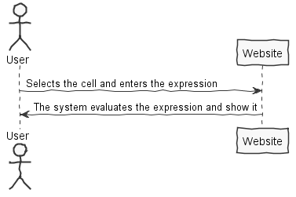
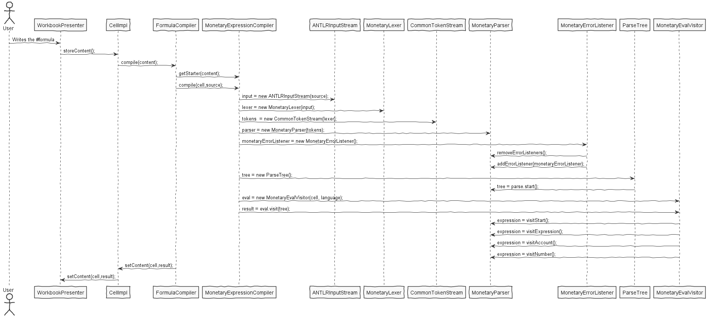

**Pedro Rodrigues** (1140572) - Sprint 2 - Lang02.1
===============================

# 1. General Notes

Functions implemented: Operations with Monetary Values and save in the selected cell.

# 2. Requirements

Lang01.2 - Add a new formulas language (currently the application only has Excel formulas that begin with the character "="). The new language should do only calculations related to currencies. The character that begins the formula should be "#". The formula should only accept the addition, subtraction, multiplication and division operators. Operands are monetary values in which it is necessary to provide the currency (e.g., 10.21e, 1.32£ or 0.20$). All expressions are required to be contained within brackets with the currency prefix in which we want the result, e.g., "#euro{10.32$ + 12.89£}" or "#dollar{ 10.32$ + 12.89£}" or "#pound{10.32$ + 12.89£}". For the user to use this language instead of the "regular" Excel language it should start the formula by the character "#" instead of the "=" character. The application should also provide a way for setting exchange rates (by means of a configuration). The implementation should avoid the use of numbers in floating point representation (e.g., float, double) in order to avoid precision problems.

# 3. Analysis

- Understand how the web design and the code "behind" it works. 

- Understand how to interact with Visitors, Lexer, Parser and ParseTree.

- Understand how to get together both UI and the Database information. 

## 3.1 GWT and Project Structure

**Modules**. From the pom.xml file we can see that the application is composed of 5 modules:  
- **server**. It is the "server part" of the web application.  
- **shared**. It contains code that is shared between the client (i.e., web application) and the server.   
- **nsheets**. It is the web application (i.e., Client).  
- **util**. This is the same module as the one of EAPLI.  
- **framework**. This is the same module as the one of EAPLI.   
  
From [GWT Overview](http://www.gwtproject.org/overview.html): *"The GWT SDK contains the Java API libraries, compiler, and development server. It lets you write client-side applications in Java and deploy them as JavaScript."*

Therefore:
  - The project is totally developed in Java, event for the UI parts.
  - GWT uses a technique know as "transpilation" to translate Java code to Javascript. This is totally transparent to the user
  - A GWT application is comprised of "GWT modules" (see [GWT Tutorial](http://www.gwtproject.org/doc/latest/tutorial/create.html)). These GWT modules are described in .gwt.xml files.
   The nsheets project contains a .gwt.xml file named nsheets.gwt.xml (nsheets/src/main/resources/pt/isep/nsheets/nsheets.gwt.xml). One of the important contents of the file is the specification of the entry point of the application. However, since the application uses the [GWTP framework](http://dev.arcbees.com/gwtp/) the entry point is automatically provided (no need to specify it in the .gwt.xml file). In this case what is specified is the GIN client module pt.isep.nsheets.client.gin.ClientModule:
   
	    <extend-configuration-property name="gin.ginjector.modules"
                                   value="pt.isep.nsheets.client.gin.ClientModule"/>
                                   
   It is from this **ClientModule** that the application starts.
   Another important content of a .gwt.xml file is setting the paths for translatable code, .i.e., java code that should be translated to javascript. Usually the default source path is the client subpackage underneath where the .gwt.xml File is stored. In this case every code inside package pt.isep.nsheets.client and pt.isep.nsheets.shared will be translated to javascript. 
   
	<!-- Specify the paths for translatable code                    -->
    <source path='client'/>
    <source path='shared'/>
        
   The shared package is where shared code between server and client should reside. See [GWT - What to put in the shared folder?](https://stackoverflow.com/questions/5664601/gwt-what-to-put-in-the-shared-folder?utm_medium=organic&utm_source=google_rich_qa&utm_campaign=google_rich_qa) and also [using GWT RPC](http://www.gwtproject.org/doc/latest/tutorial/RPC.html).
   
   In this project the shared, server and client (i.e, nsheets) code are separated also in Maven modules (but they could all be in the same project/maven module). 
	

## 3.2 Analysis Diagrams

	The user selects a cell and enter the expression. 
	The system will match a monetary expression and evaluate it.
	
	

**TODO:** Exemplify the realization of these patterns using class diagrams and/or SD with roles marked as stereotypes.
# 4. Design

## 4.1. Tests 

The following tests must be realized (JUnit Tests are done):
- Try to operate with 1 or 2 operands using differente operators -> Expected Result: The cell selected is updated with the result.

## 4.2. Requirements Realization

## 4.2. Classes

**MonetaryEvalVisitor**
  **FormulaCompiler**
  **MonetaryLanguage**
  **MonetaryExpressionCompiler**
  **Language**
  **LanguageManager**
  **MonetaryConversion**

## 4.3. Design Patterns and Best Practices

By memory we apply/use:  

- Parse
- Lexer
- Visitor
- ParseTree
- Compiler

# 5. Implementation

To implement this UC, I created a Compiler and it tried to match a Expression based on the ANTLR4 Monetary.g4 file using a ParseTree.
After the match, a Visitor will get the operands (already converted to the currency that the user asked for) and the operator info and returns it to evaluate.
After the evaluate, the result is set to the previous selected cell.

**Code Organization**  

The code for this sprint:  
Project **Shared**    
- pt.isep.nsheets.shared.lapr4.green.s2.n1140572.MonetaryConversion: contains the monetary conversion data.  
- pt.isep.nsheets.shared.core.formula.compiler: contains the MonetaryExpressionCompiler and the EvalVisitor used.
- pt.isep.nsheets.shared.core.formula.lang: contains the MonetaryLanguage itself.

**Note:** Minor changes in BinaryOperation and FormulaCompiler.

# 6. Integration/Demonstration

# 7. Final Remarks 

Some Questions/Issues identified during the work in this feature increment:

# 8. Work Log

Commits:

[Minor Changes](https://bitbucket.org/lei-isep/lapr4-18-2db/commits/1ba59796db7a1d7646f466b8334b62617d367263)

[Monetary.g4 Update](https://bitbucket.org/lei-isep/lapr4-18-2db/commits/bf02d3be3a8333fe3b4427d9027d2064edca66f1)

[DecimalFormat Update 2](https://bitbucket.org/lei-isep/lapr4-18-2db/commits/b48a4dc6d56d2bb6b7a1b64c5163fa29846f8625)

[DecimalFormat Update](https://bitbucket.org/lei-isep/lapr4-18-2db/commits/bf6abb1e4e9c96ebfce166bdf98d71aa7a5b885b)

[MonetaryExpressionCompiler ready to convert](https://bitbucket.org/lei-isep/lapr4-18-2db/commits/e686c8dff7e3b67fd722cca1c1ade71cffc4a702)

[MonetaryEvalVisitor updated and working](https://bitbucket.org/lei-isep/lapr4-18-2db/commits/bbc240cbdc42721f183c85de2b55a8601d75bb35)

[Monetary.g4 implemented](https://bitbucket.org/lei-isep/lapr4-18-2db/commits/eaee58e985b74912c0c982874c7af86b609d30cf)

[Inherit NumberFormat](https://bitbucket.org/lei-isep/lapr4-18-2db/commits/1dcf8551a548a8e19c203656580b5b3492c0b37b)

[MonetaryEvalVisitor and MonetaryExpressionCompiler updated,Visitors missing](https://bitbucket.org/lei-isep/lapr4-18-2db/commits/84c1b43f1c355b42f84c7d0e088d74f72b212b2f)

[MonetaryEvalVisitor updated](https://bitbucket.org/lei-isep/lapr4-18-2db/commits/f4bb02d8bd551dd3b5e6eac2d2969609258ab1cd)

[MonetaryEvalVisitor implemented.](https://bitbucket.org/lei-isep/lapr4-18-2db/commits/053322b91e044f12ad192a74a939f7ff63c4168b)

[MonetaryExpressionCompiler finally fixed. Returning result = null :/](https://bitbucket.org/lei-isep/lapr4-18-2db/commits/a2ce1690dba3cd037339872d130bec6c6215a765)

[Monetary.g4 ANTLR4 created. Formula.g4 updated.](https://bitbucket.org/lei-isep/lapr4-18-2db/commits/420d0920d33e9c3d1255a40db420d9e19675ef26)

[MonetaryExpresionCompiler fixed. FormulaParser bug needs fix.](https://bitbucket.org/lei-isep/lapr4-18-2db/commits/07cd2e5f248357ae32a26e8272b24d3b44536165)

[Formula.g4 updated.](https://bitbucket.org/lei-isep/lapr4-18-2db/commits/5042bc3fa406aa5cc4f987719d15d4a39f1c62d0)

[Minor changes](https://bitbucket.org/lei-isep/lapr4-18-2db/commits/86cbc5d6c58c960abfe7b832ca092fe6f9fc1133)

[MonetaryExpressionCompiler source fixed. VisitMonetaryContext missing for now.](https://bitbucket.org/lei-isep/lapr4-18-2db/commits/0f232e684687f53b6602d2cc85e2d45abe05eb50)

[MonetaryExpressionCompiler updated but not fixed.](https://bitbucket.org/lei-isep/lapr4-18-2db/commits/bed523e72efb3932632d8f5c2dd955c204fdd803)

[Formula.g4 fixed for Monetary Language.](https://bitbucket.org/lei-isep/lapr4-18-2db/commits/2e89819483fdda9c6834cef2b1b30384803d453b)

[MonetaryExpressionCompiler: MonetaryValues updated](https://bitbucket.org/lei-isep/lapr4-18-2db/commits/af3abcfa57709f8b123d56b0885b2ddb26e17bfa)

[FormulaEvalVisitor updated.](https://bitbucket.org/lei-isep/lapr4-18-2db/commits/3bb599c2ebbc5156947ba6caa8a709095e432c4c)

[XML Monetary Conversion Decoder implemented.](https://bitbucket.org/lei-isep/lapr4-18-2db/commits/477c59118772791fec25f69589fdd7cbe810deb4)

[XML Monetary Conversion for configuration created.](https://bitbucket.org/lei-isep/lapr4-18-2db/commits/6dc30d8a6dce79ea21e604f1db9cf500b45a2375)

[Formula.g4 expression updated.](https://bitbucket.org/lei-isep/lapr4-18-2db/commits/3a941fb54c938f174677a0ab8e4c69d0c44ce790)

[FormulaEvalVisitor and EvalVisitor updated for monetary language](https://bitbucket.org/lei-isep/lapr4-18-2db/commits/74d20741731597cfa4b4a3e0ef9449c24ab549d9)
