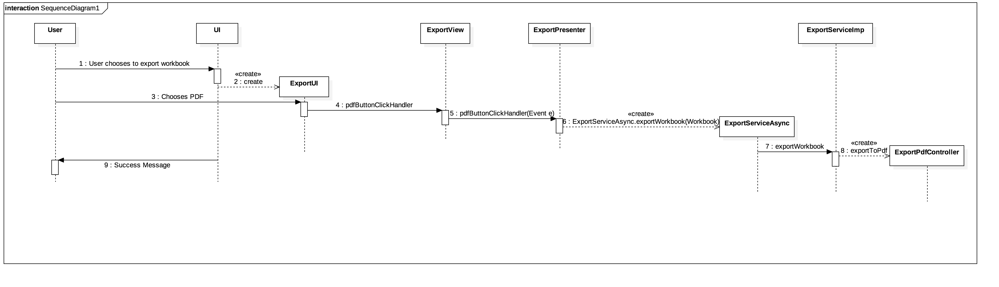

**Gonçalo Fonseca** (1150503) - Sprint 1 - IPC03.1
===============================

# 1. General Notes

Possibilty to export a workbook to pdf

# 2. Requirements

IPC03.1 - It should be possible to export to PDF an entire workbook, a spreadsheet or a range of cells. The contents should include only the values of the cells (and not its formulas, for instance). The user should be able to select the content to be exported and also if the document should have a table of contents with links to the sections or not. If select, sections/chapters should be generated for each spreadsheet of the workbook. The generated PDF should be downloaded to the user local file system.

# 3. Analysis

- Understand how the web design and the code "behind" it works. 

- Understand how to use the GWT components to a certain function. (ActionHandlers, MaterialButtons, MaterialModals, etc)

- Understand how to get together both UI and methods to export. 

## 3.1 GWT and Project Structure

**Modules**. From the pom.xml file we can see that the application is composed of 5 modules:  
- **server**. It is the "server part" of the web application.  
- **shared**. It contains code that is shared between the client (i.e., web application) and the server.   
- **nsheets**. It is the web application (i.e., Client).  
- **util**. This is the same module as the one of EAPLI.  
- **framework**. This is the same module as the one of EAPLI.   
  
From [GWT Overview](http://www.gwtproject.org/overview.html): *"The GWT SDK contains the Java API libraries, compiler, and development server. It lets you write client-side applications in Java and deploy them as JavaScript."*

Therefore:
  - The project is totally developed in Java, event for the UI parts.
  - GWT uses a technique know as "transpilation" to translate Java code to Javascript. This is totally transparent to the user
  - A GWT application is comprised of "GWT modules" (see [GWT Tutorial](http://www.gwtproject.org/doc/latest/tutorial/create.html)). These GWT modules are described in .gwt.xml files.
   The nsheets project contains a .gwt.xml file named nsheets.gwt.xml (nsheets/src/main/resources/pt/isep/nsheets/nsheets.gwt.xml). One of the important contents of the file is the specification of the entry point of the application. However, since the application uses the [GWTP framework](http://dev.arcbees.com/gwtp/) the entry point is automatically provided (no need to specify it in the .gwt.xml file). In this case what is specified is the GIN client module pt.isep.nsheets.client.gin.ClientModule:
   
	    <extend-configuration-property name="gin.ginjector.modules"
                                   value="pt.isep.nsheets.client.gin.ClientModule"/>
                                   
   It is from this **ClientModule** that the application starts.
   Another important content of a .gwt.xml file is setting the paths for translatable code, .i.e., java code that should be translated to javascript. Usually the default source path is the client subpackage underneath where the .gwt.xml File is stored. In this case every code inside package pt.isep.nsheets.client and pt.isep.nsheets.shared will be translated to javascript. 
   
	<!-- Specify the paths for translatable code                    -->
    <source path='client'/>
    <source path='shared'/>
        
   The shared package is where shared code between server and client should reside. See [GWT - What to put in the shared folder?](https://stackoverflow.com/questions/5664601/gwt-what-to-put-in-the-shared-folder?utm_medium=organic&utm_source=google_rich_qa&utm_campaign=google_rich_qa) and also [using GWT RPC](http://www.gwtproject.org/doc/latest/tutorial/RPC.html).
   
   In this project the shared, server and client (i.e, nsheets) code are separated also in Maven modules (but they could all be in the same project/maven module). 
   
## 3.2 GWTP Manipulation

  The components used were initiated in the HomeView, where each workbook is a MaterialCard with a button to open the "Options". The position of this components 
  is manipulated in the HomeView.ui.xml file, where is defined the icons, text, grid, effects, etc. 
  The ActionHandlers are implemented in the HomePresenter class, where each button is a function. So:
  
  1. **HomeModule**
  2. **HomePresenter**
  3. **HomeView**
  4. **HomeView.ui.xml**

## 3.3 PDF method and iText library

  Used iText library to export to pdf, after some hours reading the documentation coding and setting up everything
  wasn't that hard. The library basicly is build around the common Document Builder but much more customizable and pdf friendly.
	

# 4. Design

## 4.1. Tests 

## 4.2. Requirements Realization

## 4.3. Classes

**Workbook** 

**WorkbookDTO**

**ExportServicesImpl**  

## 4.4. Design Patterns and Best Practices

By memory we apply/use:  
- Interaction View/Presenter
- Interaction Services/Controller
- Repository
- DTO  
- Singleton

**TODO:** Exemplify the realization of these patterns using class diagrams and/or SD with roles marked as stereotypes. 

# 5. Implementation

To implement this UC, I created an UI with the help of Rubén to export the current workbook.
After that I had to connect the export to pdf with my controller so I could export the workbook to pdf

**Code Organization**  

The code for this sprint:  
Project **Server**    
- pt.isep.nsheets.server.**lapr4.green.s1.ipc.n1150503** contains the controllers 

Project **NShests** 
- Changed: **pt.isep.nsheets.client.application.export.**

# 6. Integration/Demonstration

# 7. Final Remarks 

Some Questions/Issues identified during the work in this feature increment:

- How do I export to pdf? 
- How can I learn a 121 000 java project just to impliment on UC?
- How to push the libraries so My collegues can build the project?

# 8. Work Log

Commits:

