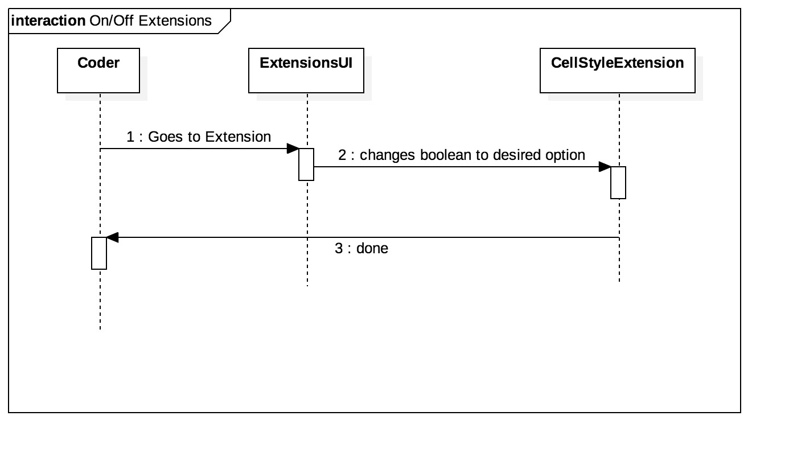

**Gonçalo Fonseca** (1150503) - Sprint 3 - Core02.3
===============================

# 1. General Notes

Possibilty to enable and disable an Extension

# 2. Requirements

Core 02.3 - It should be possible to enable and disable extensions. At least one of the extensions of Core 08 should be updated to support this feature.

# 3. Analysis

- Understand how Extensions workd

- Understand what users can manipulate them

- Solving the Use Case

## 3.1 Enabling / Disabling extensions

I created a boolean which dicatated if the user could or not use the extension. Made the necessary changes to the methods to implement this feature.
	

# 4. Design

## 4.1. Sequence Diagram

## 4.3. Classes

**CellStyleExtension** 

**SheetWidgetColumn**

**UIExtension** 

# 5. Final Remarks 

Some Questions/Issues identified during the work in this feature increment:

- What users can manipulate extensions?

- Can site users / clients choose to enable or disable an extension?

- How to implement boolean on the extensions method

