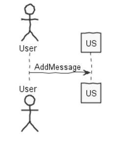
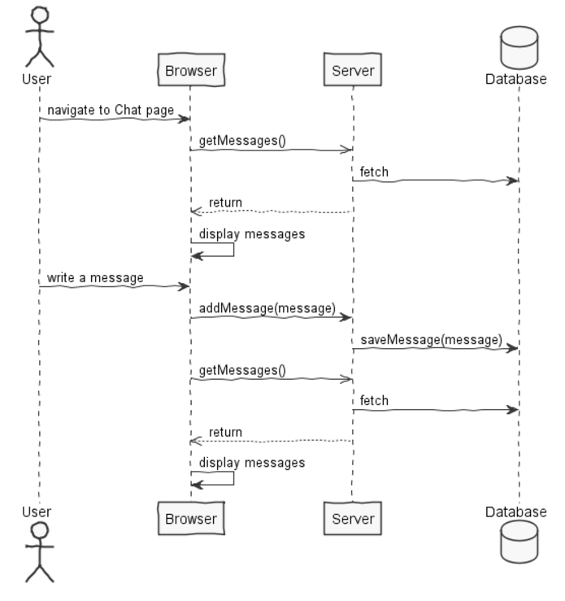
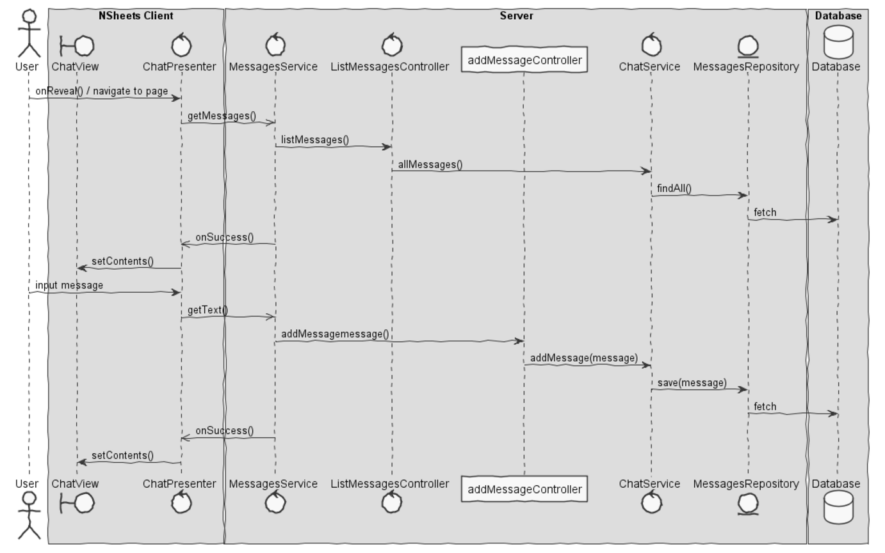

**Leandro Pinto** (n1160815) - Sprint 1 - IPC08.1
===============================

# 1. General Notes

A atualização das mensagens pode ter um pequeno delay, pois só atualiza de segundo em segundo.

Por utilizarmos uma ferramenta de UI que nunca utilizamos o aspeto da página web do chat não me satisfaz.

# 2. Requirements

IPC08.1 - All online users should be able to use the online public chat. They should only be able to exchange text messages. Other types of exchanges should be implemented in further sprints.

# 3. Analysis

- Understanding how the basic project works and most important Understanding the key aspects of GWt, since its the main technology in the application.

- Understanding how the UI was nested.

- Understand how to implment a timer to refresh the messages.

## 3.2 Messages
Messages are entities composed with an atribute text wich is stored the content of the message, user wich is stored the user who send the message and a date, wich saves the date wich the message was sent.

## 3.3 Refreshing the Messages
In this application i used a pooling method, wich consists of in a certain time interval the client asks the server for all of is messages. In that way we can "delete" all the messages currently in the client and replace them with the new ones. This method can become slow because the client can be asking for new messages and updating them but nothing changes, so it becomes inefficent.

Another solution is the server pushes the new messages when they are creted, resulting in a better perfoming server. This solution is a lot harder to develop and brings little to none beneficts to this particular application, so i opted for the polling method.

## 3.4 Analysis Diagrams

The main idea for the "workflow" of this feature increment.

**Use Cases**

**System Sequence Diagrams
**For US1**

# 4. Design

## 4.1. Tests
Some Functional tests are:

-Writting any type of message show immediately show in the messages area.
-If not pressed the send button, no message should be sent.

## 4.2. Requirements Realization

Following the guidelines for JPA from EAPLI we envision a scenario like the following for realizing the use cases for this feature increment.

**For US1**

MUDAR ISTO
MUDAR
MUDAR
Notes:  
- The diagram only depicts the less technical details of the scenario;  
- For clarity reasons details such as the PersistenceContext or the RepositoryFactory are not depicted in this diagram.   
- **WorkbookServices** realizes the GWT RPC mechanism;  
- **ListWorkbookDescriptionController** is the *use case controller*;  
- **ListWorkbookDescriptionServices** is to group together all the services related to WorkbookDescription.

## 4.3. Classes
The most important classes i used were the following:
-MessageRegister
-Message
-MessageDTO
-AddMessageController
-ListMessagesController
-ChatService
-MessagesService
-MessagesServiceAsync
-MessagesServiceImpl
-ChatPresenter
-ChatView

## 4.4. Design Patterns and Best Practices

By memory we apply/use:  
- Singleton  
- Repository  
- DTO  
- MVP  

**TODO:** Exemplify the realization of these patterns using class diagrams and/or SD with roles marked as stereotypes.

# 5. Implementation
**UI: Button for adding a new Workbook Description**

For this concern we decided to use a Material Widget called Material FAB (Floating Action Button). This is a kind of button that usually appears at the left bottom part of the screen and contains actions available for the elements of the page.  

We updated the HomeView.ui.xml accordingly and declare the element with a tag *ui:field="newWorkbookButton"*. In the corresponding class View (i.e., HomeView) we bind that button to the corresponding widget class: 	

	@UiField
	MaterialButton newWorkbookButton;

We must now add the code that invokes the server to add a new workbook description when the user clicks in the button. This is an event. To implement this behavior we could use GWT Events such as the SetPageTitleEvent already used in the application. These are special type of events that GWT manages and are available to all pages in the application.

We chose to provide our click event globally but to simple use the click event handler of the button and connect it to a method in the HomePresenter.

Since Presenters should only depend on a View interface we added a new method to the HomePresenter.MyView:

	interface MyView extends View {
		void setContents(ArrayList<WorkbookDescriptionDTO> contents);
		void addClickHandler(ClickHandler ch);
	}

Then, we implemented the *addClickHandler* in the HomeView class and call this method in the constructor of the HomePresenter. In the constructor our handler class the server method that adds a new workbook description.   

**Code Organization**  

The code for this sprint:

Project **server**    
- pt.isep.nsheets.server.**lapr4.green.s1.ipc.n1160815**.users.application: contains the controllers and a Service
- pt.isep.nsheets.server.**lapr4.green.s1.ipc.n1160815**.users.domain: contains the domain classes  
- pt.isep.nsheets.server.**lapr4.green.s1.ipc.n1160815**.users.persistence: contains the persistence/JPA classes  
- Created class: **pt.isep.nsheets.server.MessagesServiceImpl**  

Project **shared**  
- Added the class: **pt.isep.nsheets.shared.services.MessagesDTO**: This class is new and is used as a Data Transfer Object for the class Message  

Project **NShests**
- Created the UI: **pt.isep.nsheets.client.application.Chat**

# 6. Integration/Demonstration

# 7. Final Remarks

Some Questions/Issues identified during the work in this feature increment:

1. The messages sent by the user should be highlighted and aligned to the left

# 8. Work Log

Commits:

[Services and Controllers required to add a new message to the chat](https://bitbucket.org/lei-isep/lapr4-18-2db/commits/4b5ea4c45f33755f86820be4513c05a8d04d0fbd)

[Persist Messages in DB](https://bitbucket.org/lei-isep/lapr4-18-2db/commits/079074a363d3b162ac30d7177ed0c3d54b6c8eae)

[Update Messages periodicaly](https://bitbucket.org/lei-isep/lapr4-18-2db/commits/6ed683c0931bb1388c63f113ca81dc7b9366a9dd)

[Added Tests and Javadocs](https://bitbucket.org/lei-isep/lapr4-18-2db/commits/bf599b19013ecad3381f9e3c837d4b1de19aa022)

[Added new feature so the user message are highlighted in grey](https://bitbucket.org/lei-isep/lapr4-18-2db/commits/383fefb4e7c84c7e77a54e42875c39f001584584)