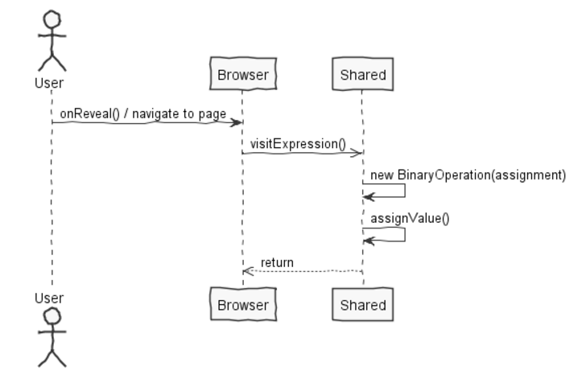
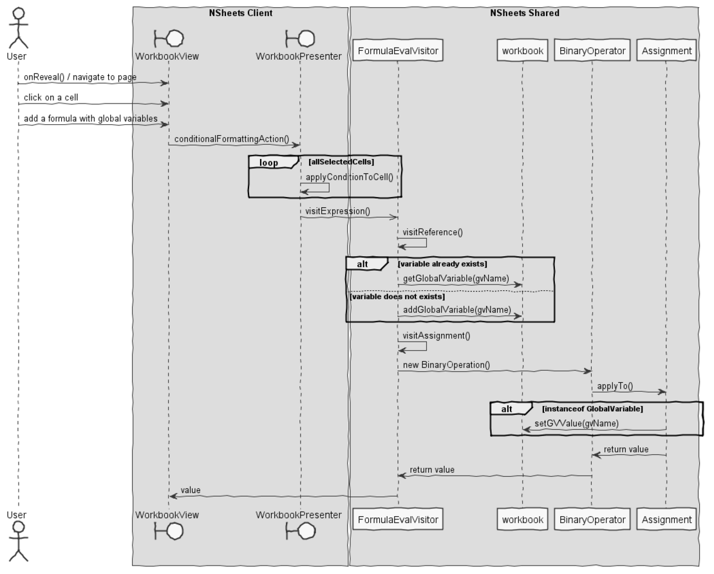

**Leandro Pinto** (n1160815) - Sprint 2 - Lang02.2
===============================

# 1. General Notes

Global variables are attatched with the woorkbook.

# 2. Requirements
Add support for global variables. Global variables are variables that exist in the context of the workbook and are persisted with the workbook. The name of global variables must start with the "@" sign. When a variable is referred in a formula for the first time it is created. To set the value of a variable it must be used on the left of the assign operator (":="). Attention should be given to synchronization problems. For an example of the use of global variables see Lang01.3.

# 3. Analysis

- Understanding how ther antlr parser works was the important aspect of this sprint.

- Saving the value in the respective global variable

## 3.1 Analysis Diagrams

The main idea for the "workflow" of this feature increment.

**System Sequence Diagrams**

# 4. Design

## 4.1. Tests
Some Functional tests are:

An exppresion of this type: "=FOR{@counter:=1;@counter<10; A2:=A2+@counter; @counter:=@counter+1}" shoul be possible to run.

## 4.2. Requirements Realization

Following the guidelines for JPA from EAPLI we envision a scenario like the following for realizing the use cases for this feature increment.

## 4.3. Classes
The most important classes i used were the following:
* FormulaEvalVisitor
* Formula.g4
* Assignement
* GlobalVariable
* ExcelLanguage

## 4.4. Design Patterns and Best Practices

By memory we apply/use:
- Repository  
- DTO  
- MVP  

# 5. Implementation
**Implementing the global variables**
For this concern i needed to change the grammer so it can handle at sign "@". After that we needed to change how the assignment was done, so it can change to the new value. 
To retrieve that value the class GlobalVariable needs to have two values, the name of the the global variable and the value of the variable itself. In that way, the woorkbook has a list of GlobalVariables, and those variables are unique to the workboook. Workbook has some new functions to support the existance of the variables, and adding.

**Code Organization**  

The code for this sprint:

Project **shared**  
- Added the class: **pt.isep.nsheets.shared.lapr4.green.n1160815.formula.lang.GlobalVarible**: This class is responsable to store and change the values of the global variable

# 7. Final Remarks

Some Questions/Issues identified during the work in this feature increment:

1. Should the global variables be used with characters as well?

# 8. Work Log

Commits:

[Updated the grammer and added the global variables storage area](https://bitbucket.org/lei-isep/lapr4-18-2db/commits/4d6fa1e4d35660bd281abdc7d6d23441c39fb6b9)

[Implementation of assigning a value to the global variable and global variable can be evaluated](https://bitbucket.org/lei-isep/lapr4-18-2db/commits/fd6fed5be771acbb3c9068ad50fa9b30c2b6f006)

