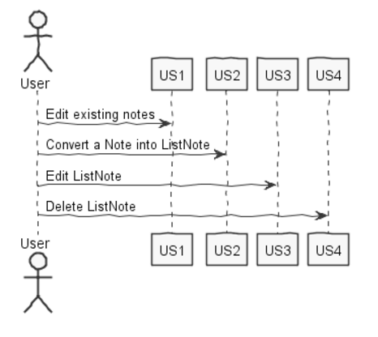
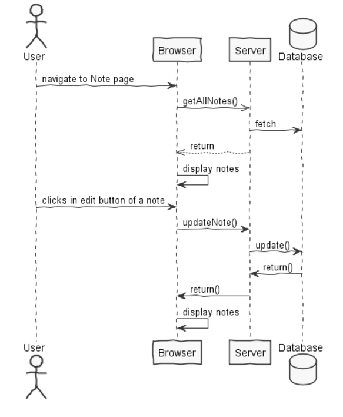
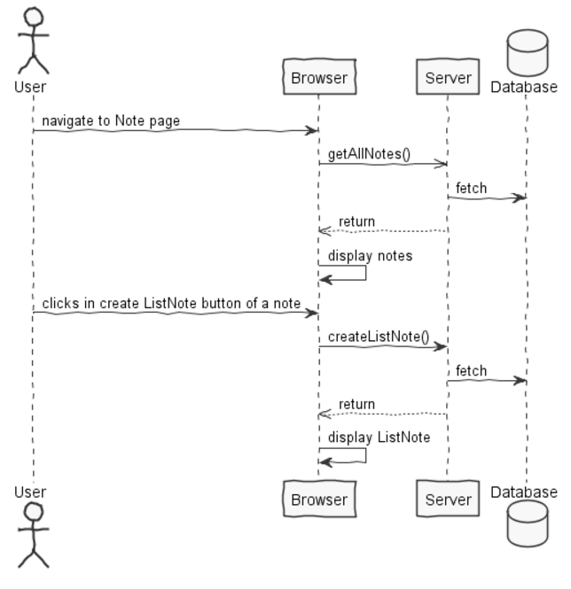
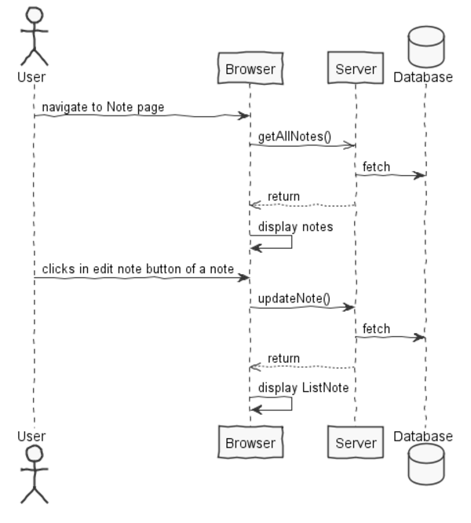
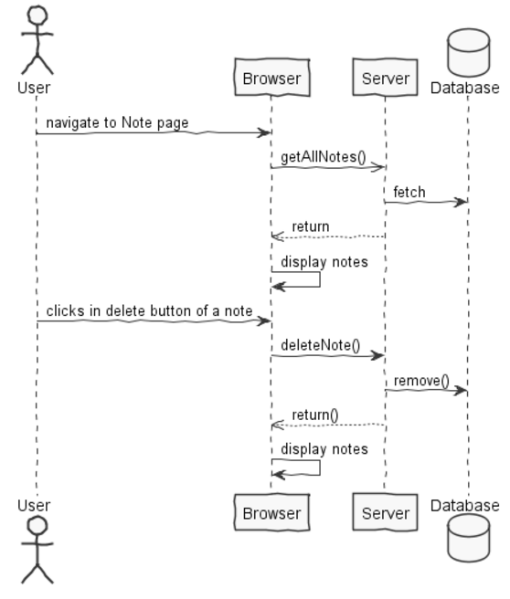

**Leandro Pinto** (n1160815) - Sprint 3 - Core07.2
===============================

# 1. General Notes

To create the ListNote, it gets the note and transforms it in the different check boxes.

# 2. Requirements

Core07.2 - Lists

It should be possible to create, edit and remove list notes. A list note is 
similar to a textual note but each line is displayed as a check box (that can 
be checked or unchecked). The first line is also interpreted as the title of 
the list note. It should be possible to generate a new version of a text note 
or list based on an old version of it. When this happens, the application should 
"open" the new version for edit with the same contents of the old version. This 
is the only "trace" that may eventually link to the old version.

In a more brief text:

The use case is pratically the same as Core07.1 . The only difference is that
The "form" of the ListNotes should be a check box with the ability to check or 
uncheck every line of the ListNotes.

In addiction, it should be possible to edit old Notes and to convert a Note into
a ListNotes. But as the note´s history was not implemented in the sprint 1 it was not possible to implement in this.

US1 - As a User of the Application I want to be able to edit a already existing note

US2 - As a User of the Application I want to be able to convert a already existing
note into a ListNotes

US3 - As a User I want to be able to edit the ListNotes

US4 - As a User I want to be able to delete ListNotes

in this implementation, deleting a ListNote is the same as deleting the Note itself, and vice-versa.

# 3. Analysis

For this feature increment I need to:  

- Understand how the Notes Page is implemented (for instance, how the UI gets the Note that are displayed)  

-Understand what the preveous collegues did, so i can continue their work

- Understand how to integrate a relational database into the project (Will be assuming JPA since it is studied in EAPLI)  

## 3.1 GWT and Project Structure

**Modules**. From the pom.xml file we can see that the application is composed of 5 modules:  
- **server**. It is the "server part" of the web application.  
- **shared**. It contains code that is shared between the client (i.e., web application) and the server.   
- **nsheets**. It is the web application (i.e., Client).  
- **util**. This is the same module as the one of EAPLI.  
- **framework**. This is the same module as the one of EAPLI.   

## 3.2 Note

A note consists of a plain text card, with a time stamp. The first line is the Title and the rest is the body of the note. A user can have as many notes as he wats. For that to be possible it should be implemented a new tab for this porpuse.

## 3.3 ListNote

A ListNote is the same as the note but in each line it as a CheckBox, so it can be marked as solved or not.

## 3.4 Analysis Diagrams

The main idea for the "workflow" of this feature increment.

**Use Cases**

**System Sequence Diagrams**

**For US1**

**For US2**

**For US3**

**For US4**

# 4. Design

## 4.1. Tests

Regarding tests we try to follow an approach inspired by test driven development. However it is not realistic to apply it for all the application (for instance for the UI part). Therefore we focus on the domain classes and also on the services provided by the server.

Some Functional tests are:

-Writting a new Note and automatically displays it.
-After clicking in the save button after updating the note it should save the changed in the databse and display the chenges

## 4.2. Requirements Realization

Following the guidelines for JPA from EAPLI we envision a scenario like the following for realizing the use cases for this feature increment.

**For US1**

**For US2**

**For US3**

**For US4**

Notes:
- It is intended that a user can have one or more ListNotes
- For  the modal has a MaterialTextBox for the Title of the ListNotes and a MaterialTextArea for the Text of the ListNotes, for the porpuse of clarity in the UI.
- For clarity reasons details such as the PersistenceContext or the RepositoryFactory are not depicted in this diagram.   
- **ListNotesServices** realizes the GWT RPC mechanism;
- **SaveNoteController** is one *use case controller*; 
- **DeleteNoteController** is another *use case controller*;   
- **AddListNotesServices** is to add a ListNotes to the noteRepository;
- **ListListNotesServices** is to group together all the services related to ListNotes.

## 4.3. Classes
-Note
-NoteDTO
-NotesService
-NotesServiceAsync
-NotesServiceImpl
-SaveNoteController
-DeleteNoteController
-NoteService
-NotesView
-NotesPresenter

## 4.4. Design Patterns and Best Practices

By memory we apply/use:
- Repository, in the package Server
- DTO, in the package Shared
- MVP, in the package NSheets
- GRASP, GoF, SOLID and DDD, where shown in some classes and relations bettween classes.
	For instance, we have controller pattern in controller classes, pure fabrication in the factory's done by Server,  high cohesion and low coupling especially important for Shared package and many moore.

# 5. Implementation

**For US1**

The UI for this US was implemented according the Home and About implementations.

	**UI: Button for edditing a Note**

	For this concern we decided to use a Material Widget called Material FAB (Floating Action Button). This is a kind of button that usually appears at the left bottom part of the screen and contains actions available for the elements of the page.  

	We updated the NotesView.ui.xml accordingly and declare two elements with the tags *ui:field="openModalBtn"* and *ui:field="saveBtn"*. In the corresponding class View (i.e., NotesView) we bind that button to the corresponding widget class: 	

		@UiField
		MaterialButton openModalBtn, editBtn;

	We must now add the code that invokes the server to edit a new Note when the user clicks in the button. This is an event. To implement this behavior we could use GWT Events such as the SetPageTitleEvent already used in the application. These are special type of events that GWT manages and are available to all pages in the application. 

	We chose to provide our click event globally but to simple use the click event handler of the button and connect it to a method in the NotesPresenter.

	Since Presenters should only depend on a View interface we added a new method to the NotesPresenter.MyView:

		interface MyView extends View {
			void addClickHandlerOpenModal(ClickHandler ch);
			void buttonClickHandlerSaveNote(ClickHandler ch);
			...
		}

**For US2**

This US, uses the note wich is already created and changes the TextArea to a Row in wich we have a Check Box and a Label. The check box is requires for the ListNote and the label if for showing the respective imformation.

**For US3**

This US, is the same as the editNote, because if we edit the note, we effectivaly edit the ListNote. In that case we don´t need to overwrite US.
For the implementation we used two button, a button to "start" the edit and other to "end". The terms "start" and "end" are relative because they just serve to know when the client should push the information to the server.

**For US4**

This US, is the same case as Edit ListNote, if we delete a note we are basicaly deleting a ListNote. For deleting a note we used a button on the respective note, and it calls a async method to the server, and the server handles the request to delete the note.

**Code Organization**  

We followed the recommended organization for packages:  
- Code should be added (when possible) inside packages that identify the group, sprint, functional area and author;
- For instance, I used **lapr4.red.s1.core.n1160815**

The code for this sprint:  
Project **server**    
- pt.isep.nsheets.server.**lapr4.red.s3.core.n1160815**.notes.application: contains the controllers  
- pt.isep.nsheets.server.**lapr4.red.s3.core.n1160815**.notes.domain: contains the domain classes
- pt.isep.nsheets.server.**lapr4.red.s3.core.n1160815**.notes.persistence: contains the persistence/JPA classes  
- pt.isep.nsheets.server.**lapr4.white.s3.core.n4567890**.workbooks.persistence: contains the persistence/JPA classes 
- Created the class: **pt.isep.nsheets.server.NoteServiceImpl**

Project **shared**  
- Updated the classes: **pt.isep.nsheets.shared.services.NoteService** and **pt.isep.nsheets.shared.services.NoteServiceAsync**  

Project **NShests** 
- Updated the classes: **pt.isep.nsheets.client.aaplication.notes.NotesView** and **pt.isep.nsheets.client.aaplication.notes.NotesPresenter**  
- Updated the file: **pt.isep.nsheets.client.aaplication.Notes.NotesView.ui.xml**  
- Created the package (and the classes of that package): **pt.isep.nsheets.client.aaplication.notes** 

# 6. Integration/Demonstration

Nothing to report, all that is important to mention, has already been mentioned

# 7. Final Remarks 

Some Questions/Issues identified during the work in this feature increment:

1. As the history of the notes wasn´t done i was not capable of doing a conversion of a note to a ListNote of a preveous version of a note.
2. I wasn´t capable of persist the check boxes state.

# 8. Work Log

Commits:

[Added new functionality to the UI(Ability to create individual ListNote)](https://bitbucket.org/lei-isep/lapr4-18-2db/commits/a94ed35275810368f9b14ea7f9109788f70fcddc)

[Ability to save a note, after being created.](https://bitbucket.org/lei-isep/lapr4-18-2db/commits/6e54f8efa934dbebbe73ae0004f94a65c06d07e5)

[Added new functionality to delete a note](https://bitbucket.org/lei-isep/lapr4-18-2db/commits/309e80d68a1b1e91639ade1f52d6291096a4edd9)

[Trying to persist the state of the check box](https://bitbucket.org/lei-isep/lapr4-18-2db/commits/a5f7ac023f693c568422cb3c37584a8f40a35491)

[Sequence Diagrams, Sequence System Diagrams, and Use case diagram](https://bitbucket.org/lei-isep/lapr4-18-2db/commits/6f39fe6ff0a3e5284061429fc1a11450e2631613)