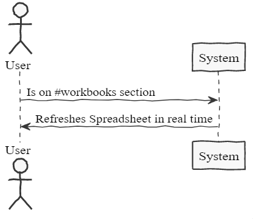
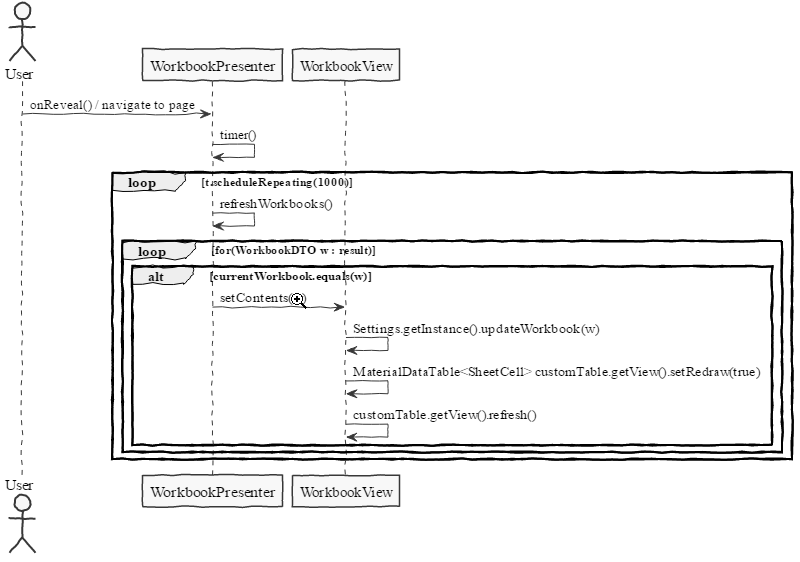

**Mário Vaz** (1160832) - Sprint 1 - IPC07.1
===============================

# 1. General Notes

Visto que este caso de uso é totalmente dependente do Core01.1, devido à persistência das Workbooks e tudo o que estas contêm, passei grande parte do tempo a ajudar o meu colega que estava encarregue desse caso de uso, pois estavam sempre a surgir problemas relativamente à implementação do GWT, entre outros.

Como a não é possível persistir a informação das spreadsheets, não é possível verificar a atualização em tempo real.

# 2. Requirements

IPC07.1 - Concurrent editions of the same Workbook should display updates "as much as possible" in realtime.

US2 - As a User of the Application, I want to be able to get the newest updates of a Workbook if an user changes it.

# 3. Analysis

- Perceber o que é e como funciona o GWT assim como o programa

## 3.1 GWT and Project Structure

**Modules**. From the pom.xml file we can see that the application is composed of 5 modules:  
- **server**. It is the "server part" of the web application.  
- **shared**. It contains code that is shared between the client (i.e., web application) and the server.   
- **nsheets**. It is the web application (i.e., Client).  
- **util**. This is the same module as the one of EAPLI.  
- **framework**. This is the same module as the one of EAPLI.   
  
From [GWT Overview](http://www.gwtproject.org/overview.html): *"The GWT SDK contains the Java API libraries, compiler, and development server. It lets you write client-side applications in Java and deploy them as JavaScript."*

Therefore:
  - The project is totally developed in Java, event for the UI parts.
  - GWT uses a technique know as "transpilation" to translate Java code to Javascript. This is totally transparent to the user
  - A GWT application is comprised of "GWT modules" (see [GWT Tutorial](http://www.gwtproject.org/doc/latest/tutorial/create.html)). These GWT modules are described in .gwt.xml files.
   The nsheets project contains a .gwt.xml file named nsheets.gwt.xml (nsheets/src/main/resources/pt/isep/nsheets/nsheets.gwt.xml). One of the important contents of the file is the specification of the entry point of the application. However, since the application uses the [GWTP framework](http://dev.arcbees.com/gwtp/) the entry point is automatically provided (no need to specify it in the .gwt.xml file). In this case what is specified is the GIN client module pt.isep.nsheets.client.gin.ClientModule:
   
	    <extend-configuration-property name="gin.ginjector.modules"
                                   value="pt.isep.nsheets.client.gin.ClientModule"/>
                                   
   It is from this **ClientModule** that the application starts.
   Another important content of a .gwt.xml file is setting the paths for translatable code, .i.e., java code that should be translated to javascript. Usually the default source path is the client subpackage underneath where the .gwt.xml File is stored. In this case every code inside package pt.isep.nsheets.client and pt.isep.nsheets.shared will be translated to javascript. 
   
	<!-- Specify the paths for translatable code                    -->
    <source path='client'/>
    <source path='shared'/>
        
   The shared package is where shared code between server and client should reside. See [GWT - What to put in the shared folder?](https://stackoverflow.com/questions/5664601/gwt-what-to-put-in-the-shared-folder?utm_medium=organic&utm_source=google_rich_qa&utm_campaign=google_rich_qa) and also [using GWT RPC](http://www.gwtproject.org/doc/latest/tutorial/RPC.html).
   
   In this project the shared, server and client (i.e, nsheets) code are separated also in Maven modules (but they could all be in the same project/maven module).

## 3.4 Analysis Diagrams

# 4. Design

## 4.1. Tests

Visto que não há quaisquer testes unitários relativamente a este caso de uso (pois a utilização das Workbooks, Spreadsheets e Cells foram feitas pelo Core01.1) só podem (e devem) ser realizados os seguintes testes:
Aceder à pagina home, selecionar uma Workbook e de seguida à pagina Workbook -> Resultado esperado: Spreadsheet e toda a informação da Workbook, atualizada.  
Permanecer na pagina Workbook com uma Workbook selecionada -> Resultado esperado: A Spreadsheet deve ser atualizada.

## 4.2. Requirements Realization

## 4.3. Classes

**WorkbookPresenter**
**WorkbookView**

## 4.4. Design Patterns and Best Practices

Através da aplicação de DTO, foi possivel determinar qual a Workbook atual (ou seja, a selecionada pelo user)

By memory we apply/use:
- DTO

# 5. Implementation

Para a implementação deste caso de uso, foi criado um timer dentro da class WorkbookPersenter que, a cada 1 segundo, atualiza a Workbook atual através do WorkbookView.

No WorkbookView, é determinada qual a Workbook atual, e atualizada a Spreadsheet da mesma. Como **atualmente** só a Spreadsheet pode ser alterada numa Workbook, não foi feita a verificação do nome e descrição dessa Workbook ser diferente para proceder à atualização da mesma. Também não foi feita a verificação de qual Spreadsheet foi alterada pois, atualmente, só há uma Spreadsheet por Workbook.

**Code Organization**  

The code for this sprint:  
Project NShests - Updated the classes: **pt.isep.nsheets.client.application.workbook.WorkbookPersenter** and **pt.isep.nsheets.client.application.workbook.WorkbookView**

# 6. Integration/Demonstration

Como dito na secção 1, dispendi bastante do meu tempo a ajudar o meu colega do Core01.1, visto que este se encontrava em dificuldades a implementar o mesmo e também porque era necessária a conclusão deste caso de uso para a possível realização do meu (mesmo este não estando concluido com sucesso).

# 7. Final Remarks 

Some Questions/Issues identified during the work in this feature increment:

1. Caso não se selecione uma Workbook, a Spreadsheet continua a atualizar, mesmo não estando, tecnicamente, a ser alterada.
2. Não é possível verificar qualquer atualização da Spreadsheet pois não está concluída a persistência do conteúdo da Cell.

# 8. Work Log

Commits:

[Documentation](https://bitbucket.org/lei-isep/lapr4-18-2db/commits/a0fe6afb0a8d58e4a5e612c9ecc17c2ffbec194b)

[Unit Tests](https://bitbucket.org/lei-isep/lapr4-18-2db/commits/c6eea36e77aee69e007a8de289fcc7a0be61a7e9)

[Changes in Workbook, Spreadsheet and Cell classes, and creation of controllers relative to Spreadsheets](https://bitbucket.org/lei-isep/lapr4-18-2db/commits/2339414d04e6afea040eb8504a2b910bad81d138)

[Rollback of last commit](https://bitbucket.org/lei-isep/lapr4-18-2db/commits/96181cb34d949bd24e818a5037a84c6130d6f68d)

[Implementation of refresh Workbooks in "real time"](https://bitbucket.org/lei-isep/lapr4-18-2db/commits/31f3d7361ccb26d92a80b014a64877002b503797)

[Correction in recieving current Workbook](https://bitbucket.org/lei-isep/lapr4-18-2db/commits/9b07a8f95e05dfdd941ae266c7fa57c591ae4496)