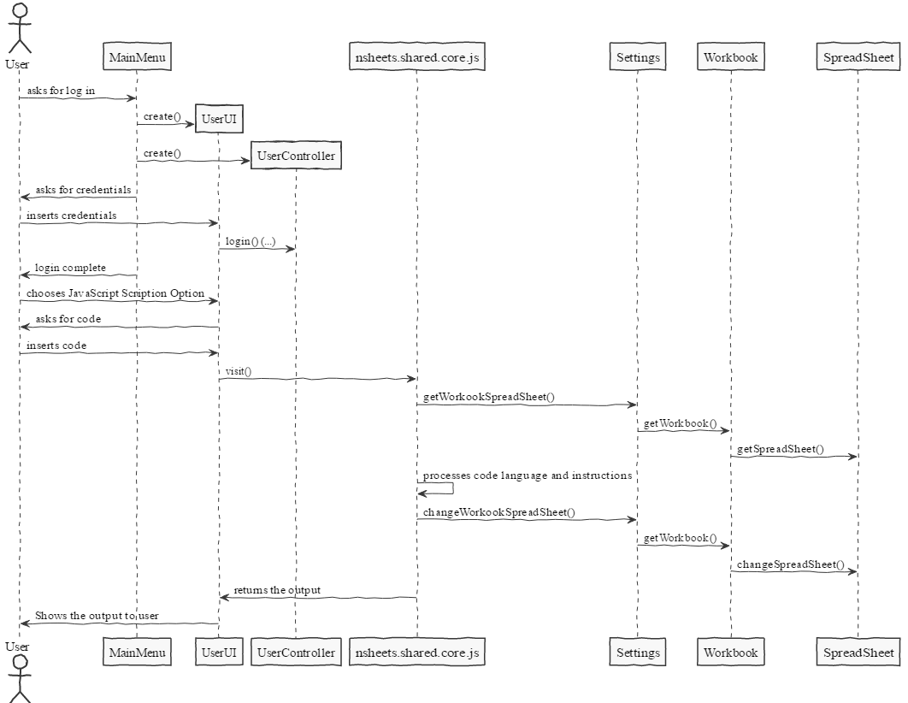

**Mário Vaz** (1160832) - Sprint 2 - Lang08.1
===============================

# 1. General Notes

# 2. Requirements

Lang08.1 - The application should support a language inspired in the syntax of Javascript. This language is to be an alterntive language to writing "Macros". This feature increment should have the same functionality as Lang06.1 but with the adaptations required by the syntax of the language.

US1 - As a User of the Application, I want to be able to write "Macros" on a different language. In this case, JavaScript.

# 3. Analysis

1. User logs in and selects option to add JavaScript Code

2. System redirects user to the correct module

3. User inserts the code

4. System reads the code inserted and executes the operations

## 3.1 GWT and Project Structure

## 3.4 Analysis Diagrams

# 4. Design

## 4.1. Tests

Visto que não há quaisquer testes unitários relativamente a este caso de uso (pois a utilização das Workbooks, Spreadsheets e Cells foram feitas pelo Core01.1) só podem (e devem) ser realizados os seguintes testes:
Aceder à pagina Workbook, selecionar JavaScript e de seguida adicionar código java à caixa de texto e verificar a transformação do mesmo. Também foi possível realizar o mesmo numa class Main criada somente para este propósito.

## 4.2. Requirements Realization

## 4.3. Classes

**Code_JavaScriptModule**
**Code_JavaScriptPresenter**
**Code_JavaScriptView**
**Code_JavaScriptView.ui.xml**
**Js.g4**
**EvalVisitor**
**Js.tokens**
**JsBaseListener**
**JsBaseVisitor**
**JsLexer**
**JsLexer.tokens**
**JsListener**
**JsParser**
**JsVisitor**

## 4.4. Design Patterns and Best Practices

# 5. Implementation

Para a implementação deste caso de uso, foi criada uma janela própria para a interação com o User (#code_js), uma gramática (Js.g4) assim como os Listener, Visitor, Lexer e Parsers classes.

Depois de inserido o código pelo User, é alterada essa mesma informação da Cell que o User pretender (indicado no código).

**Code Organization**  

The code for this sprint:  
Project NShests - Created the classes: **pt.isep.nsheets.client.application.code_js.Code_JavaScriptModule** and **pt.isep.nsheets.client.application.code_js.Code_JavaScriptPresenter** and **pt.isep.nsheets.client.application.code_js.Code_JavaScriptView** and **pt.isep.nsheets.client.application.code_js.Code_JavaScriptView.ui.xml**
Project Shared - Created the classes: **antlr4.pt.isep.nsheets.shared.core.js.compiler.Js.g4** and **java.pt.isep.nsheets.shared.core.js.EvalVisitor** and **java.pt.isep.nsheets.shared.core.js.Js.tokens** and **java.pt.isep.nsheets.shared.core.js.JsBaseListener** and **java.pt.isep.nsheets.shared.core.js.JsBaseVisitor** and **java.pt.isep.nsheets.shared.core.js.JsLexer** and **java.pt.isep.nsheets.shared.core.js.JsLexer.tokens** and **java.pt.isep.nsheets.shared.core.js.JsListener** and **java.pt.isep.nsheets.shared.core.js.JsParser** and **java.pt.isep.nsheets.shared.core.js.JsVisitor**

# 6. Integration/Demonstration

# 7. Final Remarks

# 8. Work Log

Commits:

[[Implementation] UI creation](https://bitbucket.org/lei-isep/lapr4-18-2db/commits/e05a1a5b5a72891711f8bf1c58665faaeb958358)

[ANTLR Implementation (JavaScript programming language syntax and logic)](https://bitbucket.org/lei-isep/lapr4-18-2db/commits/6fa66035764c938ff76ca0fe493e438b82f6cabe)

[Corrections in UI connected with EvalVisitor](https://bitbucket.org/lei-isep/lapr4-18-2db/commits/a16369f3750a726d2490494dc9ffd47dc9637ea5)