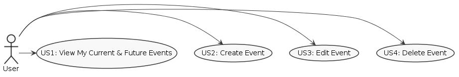
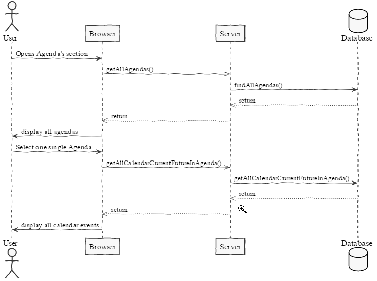
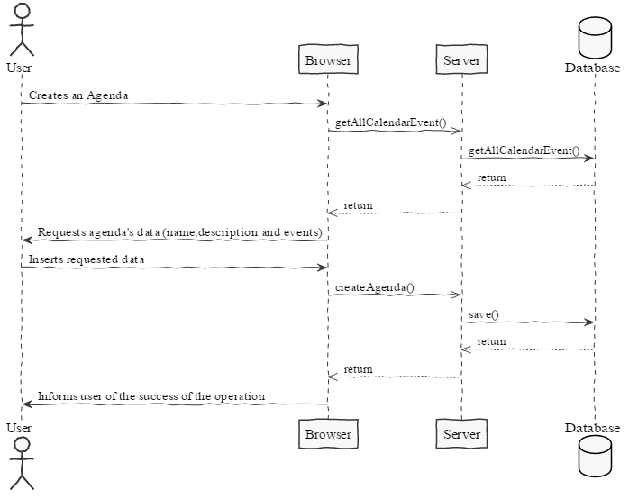
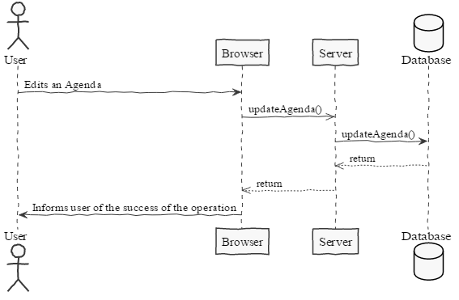
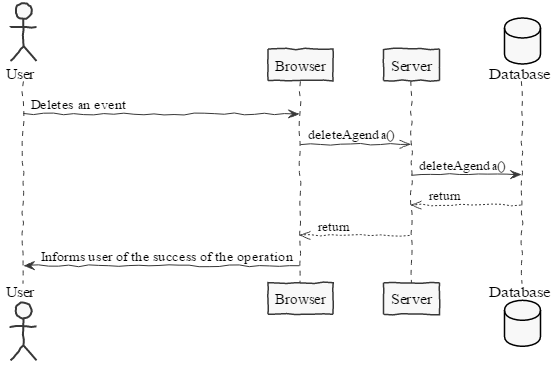
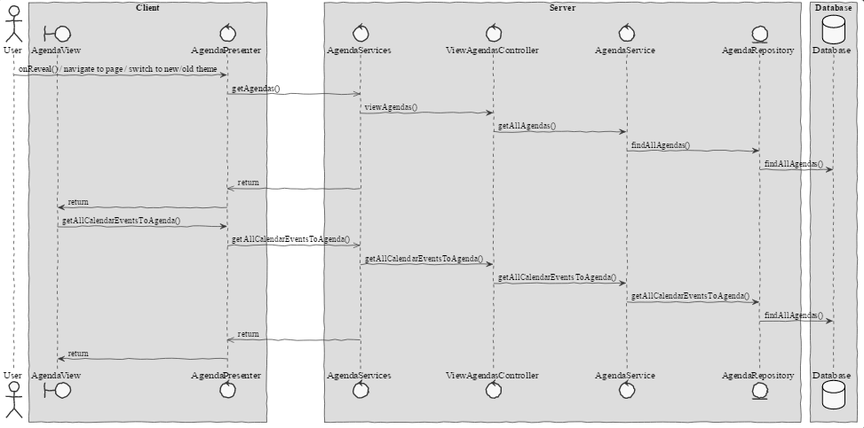
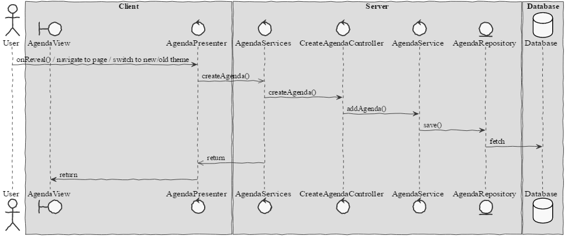
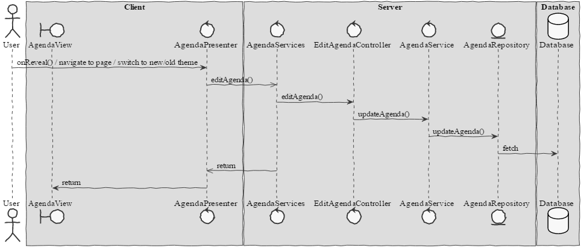
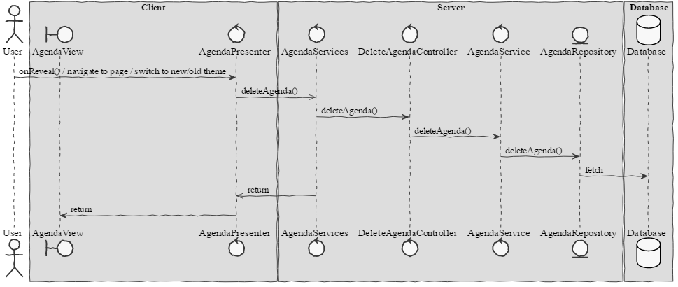

**Mário Vaz** (1160832) - Sprint 3 - Core06.3
===============================

# 1. General Notes

A funcionalidade "Editar" e "Eliminar" não funcionam devido a bugs criados no Core06.2.

Quero agradecer ao meu colega [Tiago Rios](https://bitbucket.org/lei-isep/lapr4-18-2db/src/master/docs/red/1161292/) pela sua ajuda neste caso de uso, pois eu previamente tinha a ideia de utilizar MaterialDataTable e este aconselhou-me a utilizar MaterialCollapsible pois, com a MaterialDataTable estava incapaz de adicionar eventos às diferentes categorias. Também me ajudou a perceber este Widget.

# 2. Requirements

Core06.3 - The agenda view should now have a display area divided in 24 slots, one for each hour of the day. Each of the slots should have a small text displaying the hour of the day. The Events should be displayed in a size corresponding to its duration and in the color of the calendar. It should be possible to select the calendars to display in the view. When double clicking in an event its edit window should appear. It should be possible to switch between this new view and the previous view. The view should include buttons to move between days and to select the day to display.

* US1 - As a User, I want to access my agenda, so I can view my current and future events.

* US2 - As a User, I want to create an agenda with specific events.

* US3 - As a User, I want to edit a previously created agenda, so I can correct misspelled information.

* US4 - As a User, I want to delete an agenda.

# 3. Analysis

## 3.1 Analysis Diagrams

**US1**

**US2**

**US3**

**US4**

# 4. Design

## 4.1. Tests

Visto que não há quaisquer testes unitários relativamente a este caso de uso, só podem (e devem) ser realizados os seguintes testes:
Aceder à pagina Calendar, criar eventos para dias e momentos diferentes e de seguida, na página Agenda, criar uma agenda nova com esses eventos criados. Verificar, finalmente, que ao alterar o tema (antigo (do US Core06.2) e recente) que ambos funcionam como deve de ser.

## 4.2. Requirements Realization

**US1**

**US2**

**US3**

**US4**

## 4.3. Classes

**AgendaView**
**AgendaView.ui.xml**

# 5. Implementation

Para este caso de uso foi adicionado um MaterialPanel com um MaterialCollapsible que, através de um MaterialSwitch (que define qual o layout a utilizar) é ativado, recebendo os eventos especificados previamente na Agenda e organiza-os nas diferentes secções (horas do dia). Também foi adicionado um MaterialDatePicker para especificar qual o dia a apresentar na agenda.

**Code Organization**  

The code for this sprint:  
Project NShests - Changed the classes: **pt.isep.nsheets.client.application.agenda.AgendaView** and **pt.isep.nsheets.client.application.agenda.AgendaView.ui.xml**

# 6. Final Remarks

Some Questions/Issues identified during the work in this feature increment:

- Utilizar botões para a navegação entre dias (como explicito na descrição do caso de uso), ou é preferível um MaterialDatePicker, pois é mais simples que 3 botões (um para "dia anterior", um para "dia seguinte" e outro para "selecionar dia")?

# 7. Work Log

Commits:

[[Implementation]](https://bitbucket.org/lei-isep/lapr4-18-2db/commits/a974112bdff4b9267beff88137398d313d6549f7)