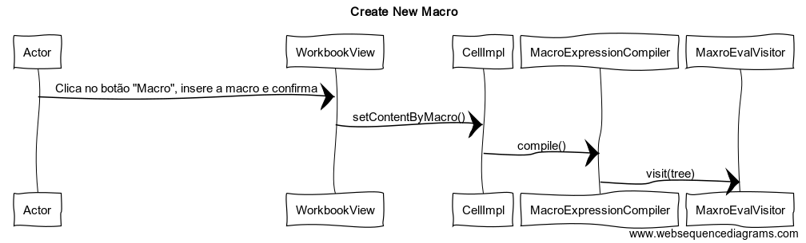

**Rúben RIbeiro** (1160998) - Sprint 2 - Lang06.1
===============================

# 1. General Notes

I found some difficulties in doing more than one formula, since the previous grammar only returned one value.

# 2. Requirements
Lang06.1 - A user should be able to enter the workbook section and create a new Macro. Then, the entered macro should be validated and the result should appear on the respective cell and the macro window.

Proposal:
US1 - Create a single macro.

# 3. Analysis
## 3.1 GWT and Project Structure

**Modules**. From the pom.xml file we can see that the application is composed of 5 modules:  
- **server**. It is the "server part" of the web application.  
- **shared**. It contains code that is shared between the client (i.e., web application) and the server.   
- **nsheets**. It is the web application (i.e., Client).  
- **util**. This is the same module as the one of EAPLI.  
- **framework**. This is the same module as the one of EAPLI.   

From [GWT Overview](http://www.gwtproject.org/overview.html): *"The GWT SDK contains the Java API libraries, compiler, and development server. It lets you write client-side applications in Java and deploy them as JavaScript."*

Therefore:
  - The project is totally developed in Java, event for the UI parts.
  - GWT uses a technique know as "transpilation" to translate Java code to Javascript. This is totally transparent to the user
  - A GWT application is comprised of "GWT modules" (see [GWT Tutorial](http://www.gwtproject.org/doc/latest/tutorial/create.html)). These GWT modules are described in .gwt.xml files.
   The nsheets project contains a .gwt.xml file named nsheets.gwt.xml (nsheets/src/main/resources/pt/isep/nsheets/nsheets.gwt.xml). One of the important contents of the file is the specification of the entry point of the application. However, since the application uses the [GWTP framework](http://dev.arcbees.com/gwtp/) the entry point is automatically provided (no need to specify it in the .gwt.xml file). In this case what is specified is the GIN client module pt.isep.nsheets.client.gin.ClientModule:

	    <extend-configuration-property name="gin.ginjector.modules"
                                   value="pt.isep.nsheets.client.gin.ClientModule"/>

   It is from this **ClientModule** that the application starts.
   Another important content of a .gwt.xml file is setting the paths for translatable code, .i.e., java code that should be translated to javascript. Usually the default source path is the client subpackage underneath where the .gwt.xml File is stored. In this case every code inside package pt.isep.nsheets.client and pt.isep.nsheets.shared will be translated to javascript.

	<!-- Specify the paths for translatable code                    -->
    <source path='client'/>
    <source path='shared'/>

   The shared package is where shared code between server and client should reside. See [GWT - What to put in the shared folder?](https://stackoverflow.com/questions/5664601/gwt-what-to-put-in-the-shared-folder?utm_medium=organic&utm_source=google_rich_qa&utm_campaign=google_rich_qa) and also [using GWT RPC](http://www.gwtproject.org/doc/latest/tutorial/RPC.html).

   In this project the shared, server and client (i.e, nsheets) code are separated also in Maven modules (but they could all be in the same project/maven module).

## 3.2 GWTP Manipulation

  The components used were initiated in the HomeView, where each workbook is a MaterialCard with a button to open the "Options". The position of this components
  is manipulated in the HomeView.ui.xml file, where is defined the icons, text, grid, effects, etc.
  The ActionHandlers are implemented in the HomePresenter class, where each button is a function. So:

  1. **HomeModule**
  2. **HomePresenter**
  3. **HomeView**
  4. **HomeView.ui.xml**

# 4. Design

## 4.1. Tests
There are no tests for this funcionality.

## 4.2. Requirements Realization
**Sequence Diagram**

## 4.3. Classes
*MacroEvalVisitor*
Validates the macro after compilation;
*Macro.g4*
The new grammar created to validate macros.

## 4.4. Design Patterns and Best Practices

# 5. Implementation

***ANTRL4: Macro.g4***
The only difference to the original created grammar is the fact that there can be several expressions, comments start with ; and to insert an expression you don´t need = sign.

**Code Organization**  
**Project shared**  
***Added the classes on the following packages:***
 pt.isep.nsheets.shared.core.formula.compiler:
MacroEvalVisitor to validate the entered macro.

**Project NShests**
***Updated the classes on the following packages:***
pt.isep.nsheets.client.application.workbook:
WorkbookView.ui.xml entered the button to create a new macro, the text field to enter the macro, and the button to run the macro;
WorkbookView.java entered the action for the previously referred buttons;

**Files**
***Created the following G4:***
Macro.g4, a grammar to validate the inserted Macro.

# 6. Integration/Demonstration

# 7. Final Remarks
The content of the active cell is incorrect since it is the full processed macro.

# 8. Work Log
