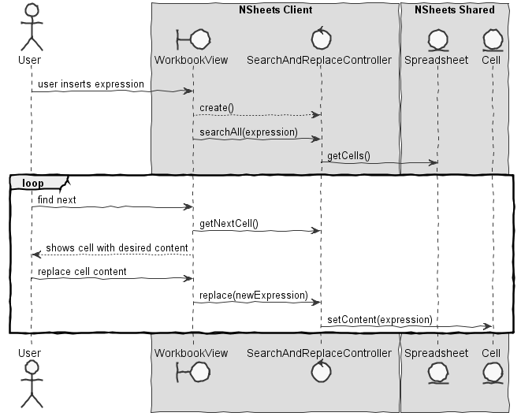
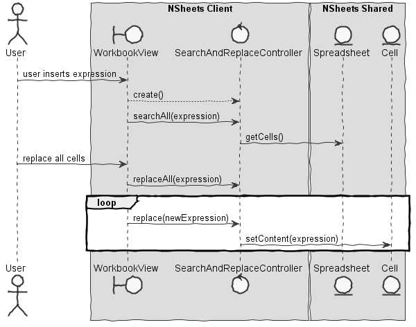

**João Reis** (1160600) - Sprint 2 - IPC02.2
===============================

# 1. General Notes

# 2. Requirements
**IPC02.2 - Workbook Search and Replace**

The application should now have a new option for "Search and Replace". This new window should be similar to the search window but with an area to enter the replacing text. When search and replace is launched, when a match is found, the window should display "what" was found, "where" the match has occurred and how it will become after the replace. The user should then confirm the replacement or select next (to continue the search). The window should include a button to apply the replacing to all the matches without asking each time. Similarly to the search only option, this option should also have parameters to refine the search, for instance, what type of cells to include in the search (or if it should include formulas or comments). "Search" and "Search and Replace" should should include contents of all the spreadsheets of the active workbook.

We can further specify this textual requirements as user stories.

Proposal:

US1 - As a user I want to be able replace one occurrence of my desired expression at a time.
US2 - As a user I want to be able to replace all occurrences of my specified expression

# 3 Analysis
Use case diagram:

# 4 Design
## 4.1 TESTS

### Test Search And replace
1. User requests search of certain expression
2. System finds the first/next cell that contains the specified expression
4. User requests a change in the cell contents
5. The cell content is changed

### Test Replace All
1. User requests that all cells that contain the specified expression are changed
2. The system finds all occurrences of the expression and changes the content of all cells

## 4.2. Requirements Realization
For us1 -

For US2 -

## 4.3 Design patterns
-Controller

## 5 Implementation

Since most of the code was just identifying strings and manipulating strings using the String class methods most implementation was done in the controller.
