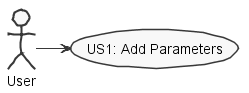
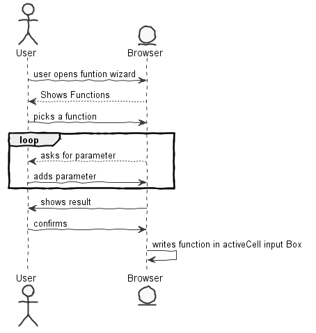

**João Reis** (1160600) - Sprint 3 - LANG04.2
===============================

# 1. General Notes
In this iteration I had to added new fucntions to the function wizard so that the user is able to add parameters in the wizard window and having the wizard inform the user on what is missing or wrong with their parameters.

# 2. Requirements

**Lang04.2 - Insert Function Intermediate Wizard**

The wizard window should display an edit box for each parameter of the selected function. The user should use these edit boxes to enter the values for each parameter of the function. As the user enters the values the wizard should display (in a new region of the window) the result of the execution of the formula or a message explaining the problem. The function list should now include also the operators as well as the functions that are dynamically loaded from java.lang.Math. The wizard should be now launched from an icon or button located in the "formula bar".

We can further specify this textual requirements as user stories.

Proposal:

US1 - As the user I want to be able to add parameters to the selected function in the wizard window.

# 3. Analysis
In this sprint I had to research gwt even further, mainly to learn how to use scrollPanels and materialWindows

## 3.1 Analysis Diagrams

# 4. Design

# 5. Implementation

All the new code was implemented in the UI classes (WorkbookView.java and WorkbookView.XML).
No new classes added.
