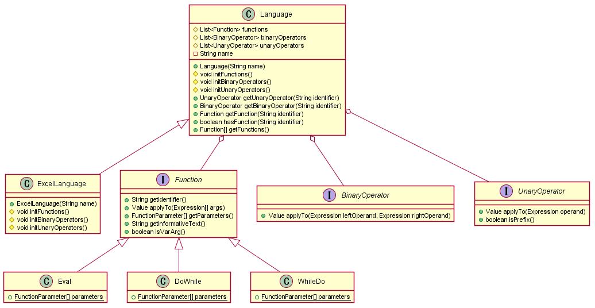
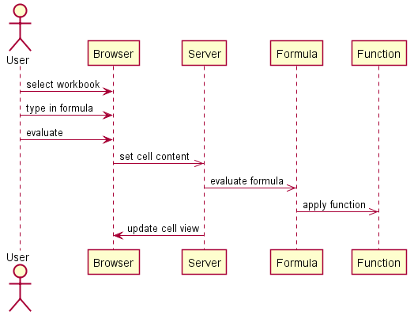
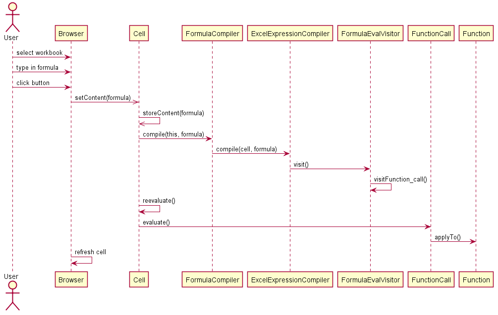

**José Santo** (1160629) - Sprint 3 - Lang01.3
===============================

# 1. Requirements

Three Excel functions must be added.  
A function to evaluate the result of an expression - "Eval"  
A Do While loop - "DoWhile"  
A While Do loop - "WhileDo"
	
# 2. Analysis Diagrams

##Domain Model

##System Sequence Diagram

# 3. Design Diagram

##Sequence Diagram

