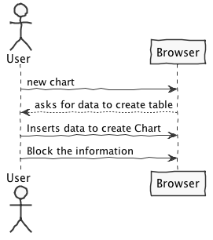
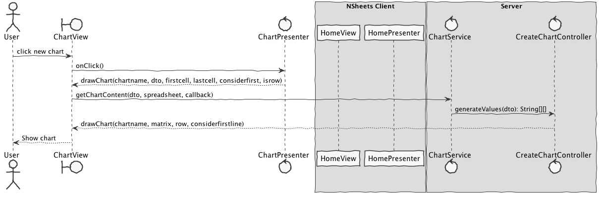

**José Monteiro** (1160630) - Sprint 1 - Core04.1
===============================

# 1. General Notes
In Application Engineering (EAPLI) were shown several standards/patterns for project development.
The of LAPR4 is to take advantage of the knowledge acquired in EAPLI and apply it, however for this iteration, as we are limited in a matter of time and it is the first time that we came in contact with the project, I found it well to ignore the TDD standard (test-driven development) for at least this iteration. This way I tried as hard as I could to implement my Use Case based on the domain model, and as I was implementing it, I improved my project structure skills.

# 2. Requirements

**Core04.1 - Basic Chart Wizard**

The application should have a new menu option to launch a wizard to help the user create a bar chart. The wizard should have 2 steps. In the first step, the user should input the name of the chart and the range of cells that contains the data for the plot of the chart. The user should also select if the data is in the rows or columns of the range and if the first row or the first column are to be considered labels. In the second step the wizard should display a preview of the chart. The wizard should allow the user to move between steps 1 and 2. If the wizard is confirmed the cell in the left upper corner of the range should have a mark (e.g., icon) that indicates that the cell has a chart associated with it. A popup menu option in the cell should provide access to the chart.

We can specify this requirements in 3 User Stories:

* US1 - As a user I want a wizard to help me to insert the data to create the bar chart;

* US2 - As a user I want to save the created chart;

* US3 - As a user I want to get all the charts, so I can access it from the workbook page;

# 3. Analysis

As this iteration is our first contact with the project, we have to deepen our knowledge about the project itself, and the libraries and toolkits that it uses.
This way 3 research points were established:
* Study of the project organization,this is: classes, packages and layers...;
* Read the main GWT toolkit documentation;
* Explore more about Material Design guidelines;
* Deepen the knowledge about this "new" UI;
* Find out if the project's database is close to the one learned in the EAPLI curricular unit, if not, investigate it;

## 3.1 Project Structure and new "UI"

Our project is composed by 5 modules:
    * server;
    * shared;
    * nsheets;
    * util;
    * framework;

In this project we can see a new User Interface/ Front-end different from what We used to. Each view/page is composed by at least 4 files:
    1. A module: that binds the UI elements;
    2. A presenter: in the documentation a class that extends a Presenters, buils a block of the model-view-presenter architecture.;
    3. A view: extends a ViewImpl, this is completly related with the ui.xml file, basically we can add elements/behaviours to the ui.xml file;
    4. A ui.xml file: looks like an html file, where we can insert the GWT components;

   
## 3.2 GWT Toolkit
Google Web Toolkit, it's a open source toolkit which allows users to create ajax applications through java. 
**How it works?** GWT uses a technique known as "transpilation" to translate Java code to Javascript.
**Prequesites:** For GWT it will be good if we understand a little of: HTML, CSS and AJAX. But the "main" language it's JAVA sure.

## 3.3 Material Design
Its a "design language" developed by Google. It was announced in 2014. This new interface is based in shadow elements, with smooth animations. 
* We can find more information in [Google Material Design website](https://material.io/design/);
* For this specific GWT project we can find all the Material Design components [here](https://gwtmaterialdesign.github.io/gwt-material-demo/);

## 3.4 Persistence
For this project it seems like we are using the same API that we used in EAPLI for data persistence - JPA - Java Persistence API and we also have a configuration to save the data in memory.
Based on JPA, in this project, we usually find:
* **Entities:** used to inform that the class it's an Entity, since that JPA will establish a connection between the entity and a table in the DB (with the same name) where the data of the object can be persisted;

## 3.45 Analysis Diagrams

####USE CASES

* **Use Cases:** Since these use cases have a one-to-one correspondence with the User Stories we do not add here more detailed use case descriptions. We find that these use cases are very simple and may eventually add more specification at a later stage if necessary.

####DOMAIN MODEL (for this feauture increment)

* **Domain Model:** Since we found no specific requirements for the structure of Chart we follow the Structure of the existing DTO (ChartDTO).

####SHORT SEQUENCE DIAGRAMS
#####FOR UC1

#####FOR UC2

#####FOR UC3

# 4. Design

## 4.1. Functional Test

* Tried to make unit tests, but for some reason they are not working.

####TEST ADD A CHART SUCCEFULLY
1. User requests a chart creation;
2. The system shows the "Create Chart" UI;
3. The User inserts all the data to create the chart and locks the information;
4. The systems verifies the information e shows a correct chart based on it;

####TEST ADD A CHART WITH INVALID CELL RANGE
1. User requests a chart creation;
2. The system shows the "Create Chart" UI;
3. The User inserts all the data to create the chart and locks the information;
4. The systems verifies the information :
    4.1 The Spresheat does not support de chosen cell range;
    4.2 The system goes to 2;

####TEST CREATE A CHART WITH A RANGE WITH ZERO ELEMENT
1. User requests a chart creation;
2. The system shows the "Create Chart" UI;
3. The User inserts all the data to create the chart and locks the information;
4. The systems verifies the information:
    4.1 The chart has no content;
    4.2 The systems shows a message informing that a return to 2;

## 4.2. Requirements Realization
#####FOR UC1

#####FOR UC2

#####FOR UC3

## 4.3. Classes

## 4.4. Design Patterns and Best Practices
* MVP;
* Repository;
* Hibernate;
* SOLID (Interface segregation principle);

# 5. Implementation

Code Organization

We followed the recommended organization for packages:
- Code should be added (when possible) inside packages that identify the group, sprint, functional area and author; - For instance, we used lapr4.red.s1.core.1160630

The code for this sprint:
Project server 
- pt.isep.nsheets.server.lapr4.red.s1.core.1160630.chart.application: contains the controllers
- pt.isep.nsheets.server.lapr4.red.s1.core.1160630.chart.domain: contains the domain classes
- pt.isep.nsheets.server.lapr4.red.s1.core.1160630.chart.persistence: contains the persistence/JPA classes;
* Updated the existing packages: 
    * pt.isep.nsheets.server.lapr4.white.s1.core.n4567890.workbooks.persistence.jpa;
        * Added JpaChartRepository;
    * pt.isep.nsheets.server.services;
        * Added ChartServiceImpl;

Project shared
- Updated the classes: pt.isep.nsheets.shared.services.ChartDTO, pt.isep.nsheets.shared.services.ChartType,  pt.isep.nsheets.shared.services.ChartService and pt.isep.nsheets.shared.services.ChartServiceAsync

Project NShests - Updated the classes: pt.isep.nsheets.client.aaplication.home.ChartView and pt.isep.nsheets.client.aaplication.home.ChartPresenter
pt.isep.nsheets.client.application.home.ChartView.ui.xml

<!-- # 6. Integration/Demonstration -->

# 7. Final Remarks 
As a gwt chart only supports one type of data (STRING, NUMBERS...) I decided to only accept numbers and ignore other types;

# 8. Work Log
* [Added dummy matrix](https://bitbucket.org/lei-isep/lapr4-18-2db/commits/60bea2466c78e2ce65e9525879193cc97462a9d8)
* [Complete Analysis and Design](https://bitbucket.org/lei-isep/lapr4-18-2db/commits/01643c9557ad3d9f3f7613d5bd2cdaecade0da2c)
* [Tried to make the chart work with the current spreedsheat](https://bitbucket.org/lei-isep/lapr4-18-2db/commits/420b2306a57047200f9eaaf2b652759a8260e181)
* [Added Sequence diagrams and SSD to the documentations](https://bitbucket.org/lei-isep/lapr4-18-2db/commits/83a763163052a3ad699e03862830ad54689c1fc5)
* [Create chart using the active spreadsheet](https://bitbucket.org/lei-isep/lapr4-18-2db/commits/98081d6c84ac441bf6817d526604dbdb5d566799)
* [Adjust Create Chart Button](https://bitbucket.org/lei-isep/lapr4-18-2db/commits/665bec9e47b7079c87d61216dcc52a2dd6887d92)
* [Added a functional popup when a cell has a/various chart(s) associated](https://bitbucket.org/lei-isep/lapr4-18-2db/commits/f0e427eeb7e0b6fac5dee2cc8727404dc09aaa35)
* [Added more information to de Analisys - GWT, Material design and DataBase](https://bitbucket.org/lei-isep/lapr4-18-2db/commits/f0e427eeb7e0b6fac5dee2cc8727404dc09aaa35)
* [Added javadoc](https://bitbucket.org/lei-isep/lapr4-18-2db/commits/fc9420cd8b756e86196d6f7bb7ab67c12083b85e)
* [Added a functional popup menu in cell with associated charts](https://bitbucket.org/lei-isep/lapr4-18-2db/commits/20bf885842a3d6c2cfcb5ed5217e4403955b608c)
* [Chart working using ChartDTO](https://bitbucket.org/lei-isep/lapr4-18-2db/commits/07faf7003e2dda4d4729ec26b3de832e6fcef7d7)
* [Structured the Chart Page based on GWT Material documentation, not functional yet;](https://bitbucket.org/lei-isep/lapr4-18-2db/commits/49f41f545ca84d1b03ad3987789693daace9dfdb)
* [Structured the Chart Page based on GWT Material documentation, not functional yet;](https://bitbucket.org/lei-isep/lapr4-18-2db/commits/49f41f545ca84d1b03ad3987789693daace9dfdb)
* [Added Chart UI package](https://bitbucket.org/lei-isep/lapr4-18-2db/commits/95bcf85e7846e9b02260625a404b8f3f042eb8e0)
* [Added Chart option to menu bar](https://bitbucket.org/lei-isep/lapr4-18-2db/commits/9a64835fda6b9d7bafdbc6c058373e184ba9f697)
* [Added User Story analysis](https://bitbucket.org/lei-isep/lapr4-18-2db/commits/05c83e6cdaea33a68957b2d196e354c491a2b181);