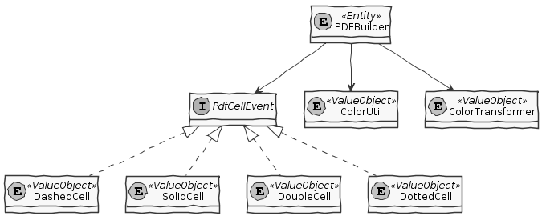
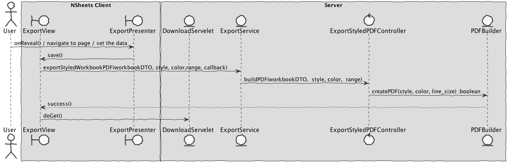

**José Monteiro** (1160630) - Sprint 2 - IPC03.2
===============================

# 1. General Notes
For this iteration I changed my functional area to IPC related to Http Services (in this case).
Here I had to apply the knowedge acquired in RCOMP (Network class).
For this feature increment I found that my colegues previously had not implemented the "main feature" of this area, that is the Client-Server comunication, so I did it;

# 2. Requirements

**Core03.2 - PDF Style Export**
The generated PDF should now mimic as far as possible the screen style of the exported contents. For instance, the formatting of the cells in the PDF should be similar to the screen. It should be also possible to configure the type of lines to use for cell delimitation, the type of line and color. This is to be applied when rendering all cells in the PDF. Note that this is different from the style used for cells borders in the screen.

We can specify this requirements in 1 User Story only:
+ US1 - As a user I want to export my Styled spreadsheet table to a PDF;

# 3. Analysis
In this part of the project I had to explore a little bit more about Http, I thougth it would be complicated, but since we made our last RCOMP project (related) in Java, actually it was very similiar;

## 3.1 HTTP
I used **HttpServelet** in my project:
 + Provides an abstract class to be subclassed to create an HTTP servlet suitable for a Web site. A subclass of HttpServlet must override at least one method, usually one of these:
    + doGet, if the servlet supports HTTP GET requests
    + doPost, for HTTP POST requests
    + doPut, for HTTP PUT requests
    + doDelete, for HTTP DELETE requests
    + init and destroy, to manage resources that are held for the life of the servlet
    + getServletInfo, which the servlet uses to provide information about itself
[HttpServel Documentation](https://docs.oracle.com/javaee/7/api/javax/servlet/http/HttpServlet.html)

## 3.2 Analysis Diagrams
####USE CASES

####DOMAIN MODEL (For this feauture increment)

# 4. Design

## 4.1 Requirements Realization

## 4.4. Design Patterns and Best Practices

* MVP;
* SOLID (Interface segregation principle);
* Singleton;

# 5. Implementation
####CODE ORGANIZATION

We followed the recommended organization for packages: - Code should be added (when possible) inside packages that identify the group, sprint, functional area and author; - For instance, we used lapr4.red.s2.ipc.1160630

The code for this sprint: 
**Project server**
- pt.isep.nsheets.server.lapr4.red.s2.ipc.1160630.PDFStyleExport.application: contains the controllers 
- pt.isep.nsheets.server.lapr4.red.s1.core.1160630.PDFStyleExport.domain: contains the domain classes 
- pt.isep.nsheets.server.lapr4.red.s1.core.1160630.PDFStyleExport.persistence: contains the persistence/JPA classes; 
- pt.isep.nsheets.server.services: added DownloadServelet;

**Updated the existing packages:**

Project NShests - Updated the classes: pt.isep.nsheets.client.aaplication.home.ExportView  pt.isep.nsheets.client.aaplication.home.ExportPresenter pt.isep.nsheets.client.application.home.ExportView.ui.xml

<!-- # 6. Integration/Demonstration -->

# 6. Work Log

