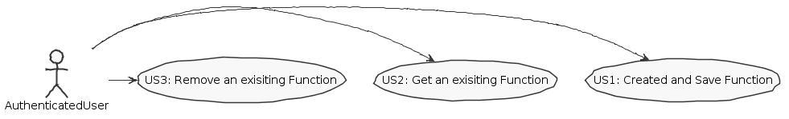
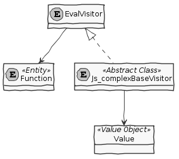

**José Monteiro** (1160630) - Sprint 3 - LANG08.2
===============================

# 1. General Notes
For this iteration I incremented the simple javascript compiler, and I added an additional feature - (persisted) functions.
To do this, I looked at the LPROG notes and provided documents.

# 2. Requirements
**Lang08.2 - Javascript with Methods without parameters**
This feature increment should have the same functionality as **Lang06.2** but with the adaptations required by the syntax of the language.

 * **Lang06.2** - The application should now support multiple macros. Each macro should have a name and should be associated with an workbook. The grammar of the macros should also have a mechanism to support the invocation of macros. It only should be possible to invoke macros of the same workbook. Special attention should be devoted to recursion (i.e., avoiding infinite recursion).

 We can specify this requirements in 3 User Story only:
+ US1 - As a user I want to create and save a function;
+ US2 - As a user I want to get an exisiting function;
+ US3 - (aditional) As a user I want to remove a function;

# 3. Analysis
In this part of the project I had to get in contact with the use of Antlr in Java.
It was hard at the beginning to understand, but after a step-by-step debug, it seems pretty easy actually.

## 3.1 Antlr

Some information that I got from the internet, to learn the tool:

In computer-based language recognition, ANTLR (pronounced Antler), or Another Tool For Language Recognition, is a parser generator that uses LL(*) for parsing. ANTLR is the successor to the Purdue Compiler Construction Tool Set (PCCTS).

**LL PARSER** -  An LL parser is a top-down parser for a subset of context-free languages. It parses the input from Left to right, performing Leftmost derivation of the sentence.

[From wikipedia](https://en.wikipedia.org/wiki/ANTLR)

   
## 3.2 Antlr in Java
To make a language reconizer, We need at least to create 2 files:
* Create a G4 file, this file is the grammar;
* After created this file, and run mvn clean install we'll get 6 auto generated files;
* Now we'll create our eval visitor, this class will extend the generated BaseVisitor, in here we'll also define the behaviour of the grammar;

## 3.4 Analysis Diagrams

####USE CASES

####DOMAIN MODEL (For this feauture increment)

# 4. Design

## 4.2. Requirements Realization

## 4.3. Classes

## 4.4. Design Patterns and Best Practices
* MVP;
* SOLID (Interface segregation principle);

# 5. Implementation

# 6. Integration/Demonstration

# 7. Final Remarks 

# 8. Work Log

