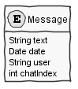
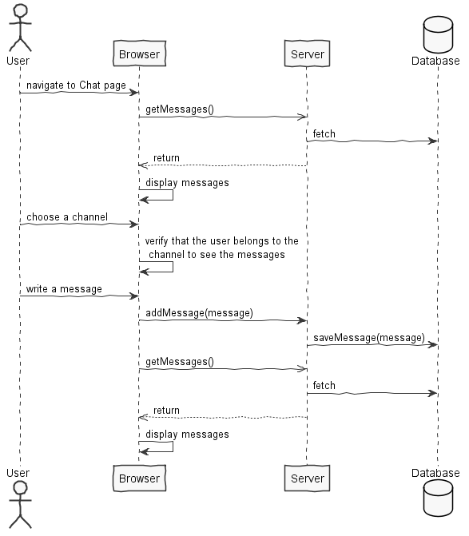
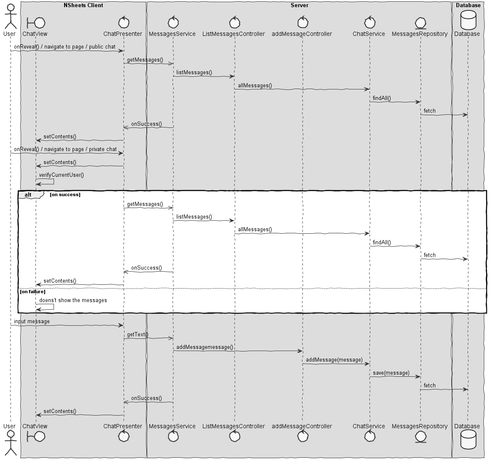

**Pedro Vieira** (1160634) - Sprint 2 - IPC08.2)
===============================

# 1. General Notes

(In previous iteration)
Updating information may have a small delay, because it only update from second to second.

# 2. Requirements

IPC08.2 - Users should now be able to create private chat rooms. They should invite other users (by using their email).

# 3. Analysis

## 3.2 Messages

(In previous iteration)
Messages are entities composed with an atribute text wich is stored the content of the message, user wich is stored the user who send the message and a date, wich saves the date wich the message was sent.

## 3.3 Refreshing the Messages

(In previous iteration)
In this application i used a pooling method, wich consists of in a certain time interval the client asks the server for all of is messages. In that way we can "delete" all the messages currently in the client and replace them with the new ones. This method can become slow because the client can be asking for new messages and updating them but nothing changes, so it becomes inefficent.

Another solution is the server pushes the new messages when they are creted, resulting in a better perfoming server. This solution is a lot harder to develop and brings little to none beneficts to this particular application, so i opted for the polling method.

## 3.4 Analysis Diagrams

**Use Cases**

**Domain Model (for this feature increment)**

**System Sequence Diagrams**

# 4. Design

## 4.1. Tests

Regarding tests, I tried to follow an approach inspired by test driven development. However it is not realistic to apply it for all the application (for instance for the UI part). Therefore I focus on the domain classes and also on the services provided by the server.

**Domain classes**

For the Domain classes we will have a class that represents the entity **Note**. This entity will have attributes that, for the moment, will be based on the class **NoteDTO**:

	- titleNote (string)
	- textNote (string)
    - dateNote (Date) 

**Test:** We should ensure that a Note can be created when all the attributes are set.  

	@Test(expected = IllegalArgumentException.class)
		public void ensureNullIsNotAllowed() {
		System.out.println("ensureNullIsNotAllowed");
		Note instance = new Note(null, null);
	}

**Services/Controllers**

For the services the application already has a service specified in the interface **NotesService**:

	@RemoteServiceRelativePath("notesService")
	public interface NotesService extends RemoteService {
		ArrayList<NoteDTO> getNotes();
	}
	

For US2 we need a method that can be used to create a new Note given a NoteDTO.

The proposal is:

	@RemoteServiceRelativePath("notesService")
	public interface NotesService extends RemoteService {
		ArrayList<NoteDTO> getNotes();
		NoteDTO addNote(NotenDTO noteDto) throws DataException;
	}

Tests:  
- The tests on the controllers require the presence of a database.
- We will use the database in memory (H2).
- We will have a *controller* from adding new Notes. This controller will be invoked by the GWT RPC service.
- We will have a *controller* from listing Notes. This controller will be invoked by the GWT RPC service.

Controller **AddNoteController**

**Test:** Verify the normal creation of an Note.  

	@Test
	public void testNormalBehaviour() throws Exception {
		System.out.println("testNormalBehaviour");
		final String titleNote = "Title of Note1";
		final String textNote = "Text for Note1";
		final Note expected = new Note(titleNote, textNote);
		AddNoteController ctrl = new AddNoteController();
		Note result = ctrl.addNote(expected.toDTO());
		assertTrue("the added Note does not have the same data as input", expected.sameAs(result));
	}

Controller **ListNoteController**

Note: We will be using the annotation @FixMethodOrder(MethodSorters.NAME_ASCENDING) to ensure the test methods are executed in order. This is useful since the memory database will have state changing between tests.
 
**Test:** At the beginning of the tests the memory database should be empty, so listNoteDiscriptions should return an empty set.

	   @Test 
	   public void testAensureGetNotesEmpty() {
		   System.out.println("testAensureGetNotesEmpty");
		   ListNoteController ctrl=new ListNoteController();
		   Iterable<Note> notes=ctrl.listNotes();
		   assertTrue("the list of Notes is not empty", !notes.iterator().hasNext());
	   } 
 
**Test:** If a Note is created it should be present in a following invocation of getNotes().

		@Test
		public void testBtestDatabaseInsertion() throws Exception {
			System.out.println("testBtestDatabaseInsertion");
			final String titleNote = "Title of Note1";
			final String textNote = "Text for Note1";
			final Note expected = new Note(titleNote, textNote);
			AddNoteController ctrlAdd = new AddNoteController();
			Note result = ctrlAdd.addNote(expected.toDTO());
			ListNoteController ctrlList=new ListNoteController();
			Iterable<Note> notes=ctrlList.listNotes();
			assertTrue("the added Note is not in the database", notes.iterator().hasNext());
		}

## 4.2. Requirements Realization

*In this section you should present the design realization of the requirements.*

Following the guidelines for JPA from EAPLI we envision a scenario like the following for realizing the use cases for this feature increment.

Notes:
- For US1, it is intended that a user can have one or moore Notes
- For US3, the modal has a MaterialTextBox for the Title of the Note and a MaterialTextArea for the Text of the Note, for the porpuse of clarity in the UI.
- The diagrams only depicts the less technical details of the scenario;  
- For clarity reasons details such as the PersistenceContext or the RepositoryFactory are not depicted in this diagram.   
- **NoteServices** realizes the GWT RPC mechanism;
- **AddNoteController** is one *use case controller*;   
- **ListNoteController** is one *use case controller*;
- **AddNoteServices** is to add a Note to the noteRepository;
- **ListNoteServices** is to group together all the services related to Note.

## 4.3. Classes

*Present and describe the major classes of you solution.*

The most important classes i used were the following:
-MessageRegister
-Message
-MessageDTO
-AddMessageController
-ListMessagesController
-ChatService
-MessagesService
-MessagesServiceAsync
-MessagesServiceImpl
-ChatPresenter
-ChatView

## 4.4. Design Patterns and Best Practices

*Present and explain how you applied design patterns and best practices.*

By memory we apply/use:
- Singleton, across multiple classes
- Repository, in the package Server
- DTO, in the package Shared
- MVP, in the package NSheets
- GRASP, GoF, SOLID and DDD, where shown in some classes and relations bettween classes.
	For instance, we have controller pattern in controller classes, pure fabrication in the factory's done by Server,  high cohesion and low coupling especially important for Shared package and many moore.

# 5. Implementation

**Code Organization**  

The code for this sprint:  
Project **server**    
- pt.isep.nsheets.server.**lapr4.green.s1.ipc.n1160815**.users.application: contains the controllers and a Service
- pt.isep.nsheets.server.**lapr4.green.s1.ipc.n1160815**.users.domain: contains the domain classes  
- pt.isep.nsheets.server.**lapr4.green.s1.ipc.n1160815**.users.persistence: contains the persistence/JPA classes  
- Created class: **pt.isep.nsheets.server.MessagesServiceImpl**  

Project **shared**  
- Added the class: **pt.isep.nsheets.shared.services.MessagesDTO**: This class is new and is used as a Data Transfer Object for the class Message  

Project **NShests**
- Created the UI: **pt.isep.nsheets.client.application.Chat**

# 6. Integration/Demonstration

*In this section document your contribution and efforts to the integration of your work with the work of the other elements of the team and also your work regarding the demonstration (i.e., tests, updating of scripts, etc.)*

Nothing to report, all that is important to mention, has already been mentioned.

# 7. Final Remarks 

*In this section present your views regarding alternatives, extra work and future work on the issue.*

# 8. Work Log

Commits:

[All my commits](https://bitbucket.org/PedroVieira1160634/)

