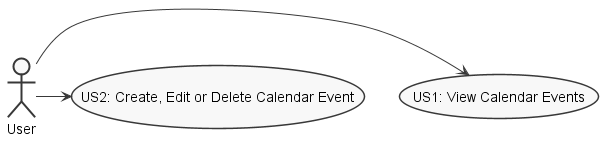
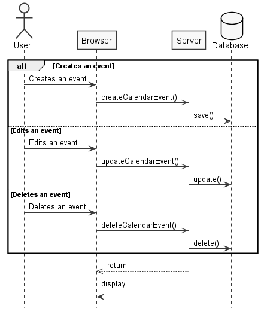
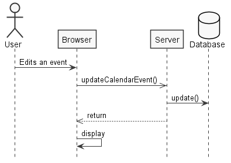
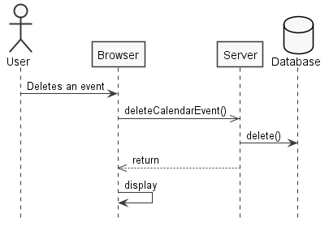
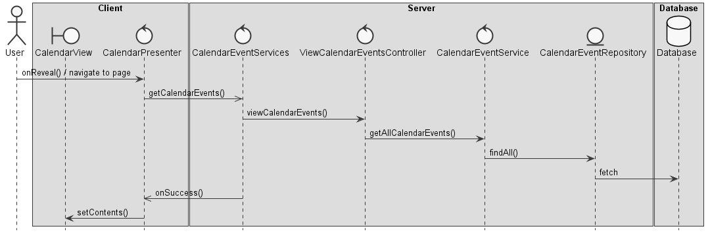
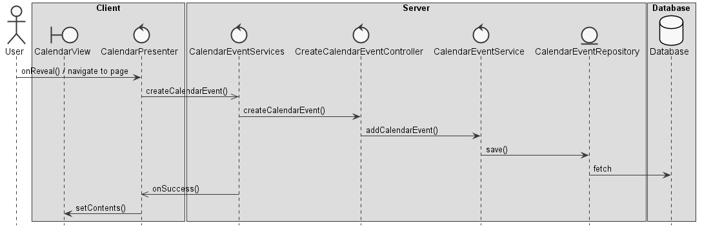
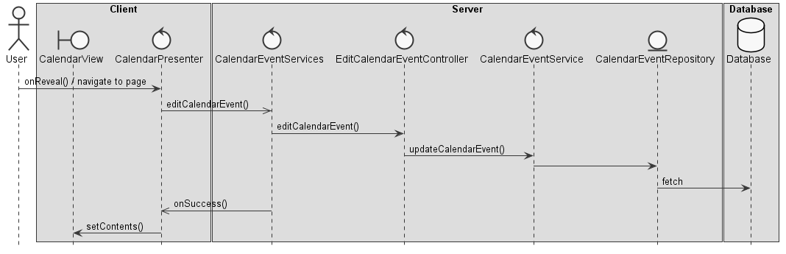
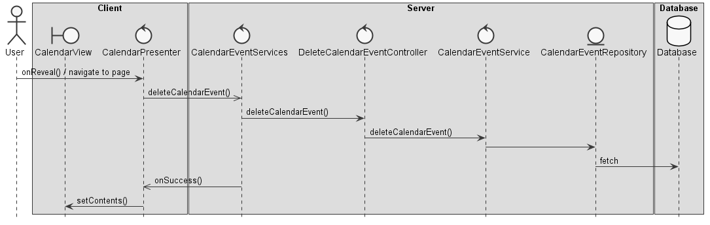

**Gonçalo Silva** (1161140) - Sprint 1 - Core06.1
=================================================

## Requirements

**Core06.1 - Calendar**

The application should have a calendar view to display events. An event has a title, description, time stamp and duration. Events should be displayed in the calendar ordered by their time stamp. It should be possible to create, edit and delete events. The calendar should display all events.

* US1 - As a User, I want to access my calendar, so I can view my events.

* US2 - As a User, I want to create an event, so I can .

* US3 - As a User, I want to edit a previously created event, so I can correct misspelled information.

* US4 - As a User, I want to delete an event, so I can .

## Analysis

**Use Cases**

**System Sequence Diagrams**

**US2**

**US3**

**US4**

## Design

**Tests**

Regarding tests we try to follow an approach inspired by test driven development. However it is not realistic to apply it for all the application (for instance for the UI part). Therefore we focus on the domain classes and also on the services provided by the server.

**Requirements Realization**

**US1**

**US2**

**US3**

**US4**

## Work Log

[Added base folder for documentation](https://bitbucket.org/lei-isep/lapr4-18-2db/commits/e75f35afa3b5a8ec77c9eb332fb9eb97f87f3157)

[Added a Calendar button to the menu](https://bitbucket.org/lei-isep/lapr4-18-2db/commits/7c55f14039cacc4f4895ca4afc66fabd5124fb10)

[Added a (very) basic calendar UI](https://bitbucket.org/lei-isep/lapr4-18-2db/commits/3169b99406af9889aea6cc670fc3566ddb44a5c7)

[Updated calendar events creation](https://bitbucket.org/lei-isep/lapr4-18-2db/commits/a8a6d3863e40b2c7e473bdebdcd81ebde0f84c15)

[Added Calendar related classes for future implementation](https://bitbucket.org/lei-isep/lapr4-18-2db/commits/67874b241c948b555b3209f57d721803dbf58451)

[Updated calendar events UI](https://bitbucket.org/lei-isep/lapr4-18-2db/commits/7fcd7e02a13ea137b98dc679b4c016b06d1c5d69)

[Removed unused classes](https://bitbucket.org/lei-isep/lapr4-18-2db/commits/6a290a9493ce64617e772c59ddb1a2488d61eec6)

[Added Calendar DTOs and updated all Calendar related classes](https://bitbucket.org/lei-isep/lapr4-18-2db/commits/169db031ae57b869c7fedfca953d1bd2b0200534)

[Rewrote event creation modal and added cards for created events](https://bitbucket.org/lei-isep/lapr4-18-2db/commits/0a6a573cec5b269aa959c6e8e99cf62c5ddd6ccc)

[Added and/or updated all Calendar related repository classes](https://bitbucket.org/lei-isep/lapr4-18-2db/commits/381b047fdebfd27cb366d7a4bda73507616fc2fd)

[Updated all Calendar domain and DTO classes](https://bitbucket.org/lei-isep/lapr4-18-2db/commits/4309c4a8c871893d6fa5aaa7a302c32634ac7df0)

[Added more features to CalendarEvent creation and updated the UI](https://bitbucket.org/lei-isep/lapr4-18-2db/commits/5e448abc34b2846a03b63379b36f031523c16e34)

[Removed unused classes](https://bitbucket.org/lei-isep/lapr4-18-2db/commits/bb628f4715873319ca8538fc43474f0969b19a2f)

[Added persistence and an edit option to calendar events](https://bitbucket.org/lei-isep/lapr4-18-2db/commits/b46a5dff80d2aa51ba792673df6f4b8b83c23a3b)