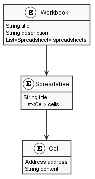
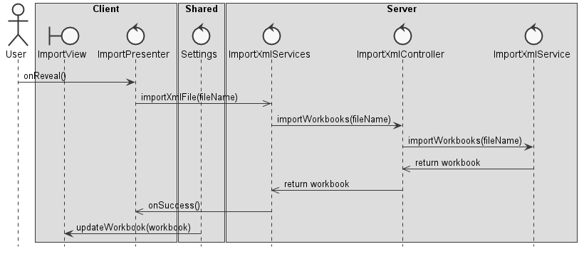

**Gonçalo Silva** (1161140) - Sprint 2 - IPC04.2
================================================

## Requirements

**IPC04.2 - Import XML**

It should be possible to import data from an XML file. Depending on the contents of the XML file, the data from the file can replace the contents of the active workbook, a spreadsheet or a range of a spreadsheet.

We can further specify this textual requirements:

* As a User, I want to import an XML file, so I can resume my work.

## Analysis

**Use Case**

**System Sequence Diagram**

**Domain Model**

## Design

**Requirements Realization**

## Work Log

Commits:

[Started documentation](https://bitbucket.org/lei-isep/lapr4-18-2db/commits/5962775f4bd99578e24e5132c9340574a5b53e58)

[Updated the XML parser](https://bitbucket.org/lei-isep/lapr4-18-2db/commits/9880bde44b9f9c7466d4abc73b813567fbb9d78d)

[Added new Import UI to the side menu](https://bitbucket.org/lei-isep/lapr4-18-2db/commits/d8667f11209e338c3e5d2bcfd4fcd764c61a1bae)

[Added Import Services and Controllers](https://bitbucket.org/lei-isep/lapr4-18-2db/commits/f942daf8c485815ffd1c13a007caf166d8084a00)

[Added file upload feature](https://bitbucket.org/lei-isep/lapr4-18-2db/commits/a4e05e102a198486007f7fdec028b151578852b1)

[Fixed XML file upload](https://bitbucket.org/lei-isep/lapr4-18-2db/commits/bd4984dbff4bd2c7c8f53331b6dff0136a7971f3)

[Updated XML parser for workbooks](https://bitbucket.org/lei-isep/lapr4-18-2db/commits/dcbdb8fb19e01cce25c1dc2b9ca4c87577c68bcc)

[Updated the XML parser](https://bitbucket.org/lei-isep/lapr4-18-2db/commits/9880bde44b9f9c7466d4abc73b813567fbb9d78d)

[Updated the parser and did some code cleanup](https://bitbucket.org/lei-isep/lapr4-18-2db/commits/30fd54da71c91121052e5215052d4bcd92c378e8)

[Finished the XML parser and set imported workbook as the current one](https://bitbucket.org/lei-isep/lapr4-18-2db/commits/771091f1c7e4eeb4f178e817fd8baeb2e2c41dcc)