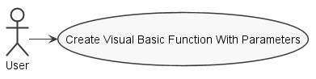
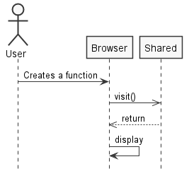
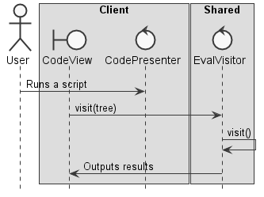

**Gonçalo Silva** (1161140) - Sprint 3 - Lang07.3
=================================================

## Requirements

**Lang07.3 - Visual Basic with Methods with parameters**

Macros should now have parameters. The syntax for macros should now include an header that should include the name of the macro and its parameters (all parameters should have a distinct name). The parameters should be considered only input parameters. However, it should be possible to freely reference parameters inside the macro. That is to say that, inside a macro, parameters should be used like variables. Macros should support local variables that exist only in the context of a macro. This local variables should have a syntax similar to the one described for the temporary variables of formulas. The invocation of macros must now include the values for its parameters.

This feature increment should have the same functionality as Lang06.3 but with the adaptations required by the syntax of the language.

## Analysis

**Use Case**

**System Sequence Diagram**

## Design

**Requirements Realization**

## Work Log

Commits:

[Started documentation](https://bitbucket.org/lei-isep/lapr4-18-2db/commits/7fee6f5ac7dfd0ae8fd6cd7dd3c765718fec6d46)

[Started implementation](https://bitbucket.org/lei-isep/lapr4-18-2db/commits/e20cf3de0022d0d18d79cbc068623c935758eac2)

[Improved Visual Basic UI](https://bitbucket.org/lei-isep/lapr4-18-2db/commits/9809966bf0e4d9e111ea78bfad3704dea71cb62b)

[Removed unused classes and did some code refactoring](https://bitbucket.org/lei-isep/lapr4-18-2db/commits/4a978d587d900d01a19831462a6fc65024b0c08b)

[Added Visual Basic functions and procedures to ANTLR4 grammar](https://bitbucket.org/lei-isep/lapr4-18-2db/commits/4e05b2b59377798d5a7a3b32461c5b6e55de9ab9)

[Added function recognition](https://bitbucket.org/lei-isep/lapr4-18-2db/commits/028374059b7cd6d27b74c391234d53b7f8b64ca4)
