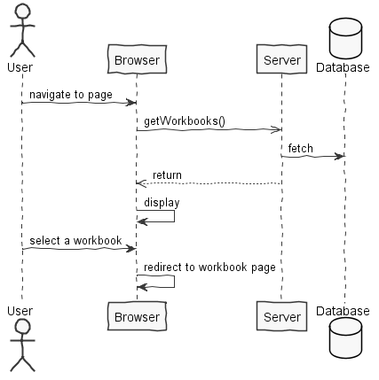

**Tiago Rios** (1161292) - Sprint 1 - Core01.1
===============================

# 1. General Notes

Questions made to Product Owner (PRP):

```
	Q: Does 'saving my workbooks' mean saving each workbooks' state? 
	A: Yes.
```

```
	Q: When user clicks on 'Workbook' tab, can I open the first Workbook that exists on 'Home Page'?
	A: Yes. If it doesn't exist any, you can show an error message.
```

I also want to thanks my roommates [Hilário Coelho](https://bitbucket.org/lei-isep/lapr4-18-2db/src/master/docs/green/1160557/), [Mário Vaz](https://bitbucket.org/lei-isep/lapr4-18-2db/src/cc167398006242b74e9edda58f7c87ce9adc6134/docs/green/1160832/) and [Leandro Pinto](https://bitbucket.org/lei-isep/lapr4-18-2db/src/cc167398006242b74e9edda58f7c87ce9adc6134/docs/green/1160815/) for every help they gave me so I could finish this Use Case, even though it wasn't possible at all.

# 2. Requirements

Core01.1 - The workbook page should be related to one of the workbooks displayed in the home page. It should be possible to create a new empty workbook in the home page. Workbooks should be persisted in the server. At this moment a workbook must only have one spreadsheet.

```
US01
	As an user,
	I want to create an empty 'Workbook',
	So I can start a new work.
```

```
US02
	As an user,
	I want to select a workbook from HomePage and be redirect to Workbook,
	So I can edit my own workbooks.
```

```
US03
	As an user,
	I want to save/persist my workbooks,
	So I don't lose my work.
```

# 3. Analysis

*In this section you should describe the study/analysis/research you developed in order to design a solution.*  

## 3.1 Analysis Diagrams

The main idea for the "workflow" of this feature increment.

**Use Cases**


**Domain Model**


**System Sequence Diagrams**

**For US1**


**For US2**



**For US3**


# 4. Design

*In this section you should present the design solution for the requirements of this sprint.*


## 4.1. Tests

*In this section you should describe the design of the tests that, as much as possibe, cover the requirements of the sprint.*

Regarding tests we try to follow an approach inspired by test driven development. However it is not realistic to apply it for all the application (for instance for the UI part). Therefore we focus on the domain classes and also on the services provided by the server.


## 4.2. Requirements Realization

*In this section you should present the design realization of the requirements.*

**For US1**


**For US2**


**For US3**


## 4.3. Classes

*Present and describe the major classes of you solution.*

## 4.4. Design Patterns and Best Practices

*Present and explain how you applied design patterns and best practices.*

- Repository
- Singleton 
- DTO
- MVP

# 5. Implementation

*If required you should present in this section more details about the implementation. For instance, configuration files, grammar files, etc. You may also explain the organization of you code. You may reference important commits.*

**For US1**

The UI for this US was already implemented. We simply implemented the server as described previously.

**For US2**


**Code Organization**  


# 6. Integration/Demonstration

*In this section document your contribution and efforts to the integration of your work with the work of the other elements of the team and also your work regarding the demonstration (i.e., tests, updating of scripts, etc.)*

# 7. Final Remarks 

*In this section present your views regarding alternatives, extra work and future work on the issue.*

Some Questions/Issues identified during the work in this feature increment:

1. The method getWorkbooks in the WorkbooksService returns an ArrayList. Maybe we should not bind the result to a specific collection implementation.

# 8. Work Log

* [Fixed workbook loading](https://bitbucket.org/lei-isep/lapr4-18-2db/commits/5f07efe16a57b83d9fb2427b8db0416791423c17)
* [Fixed compilation errors](https://bitbucket.org/lei-isep/lapr4-18-2db/commits/389d8f43710b26bf6473d9846b5f053e285d975f)
* [Fixed Settings class](https://bitbucket.org/lei-isep/lapr4-18-2db/commits/5474adbcee2366e04103e9b82577db512ca0451b)
* [Added persisting methods calls](https://bitbucket.org/lei-isep/lapr4-18-2db/commits/bd898fdd7751687a1ff10ffefba7f0b59b136e6a)
* [Fixed JPA annotations and methods declarations](https://bitbucket.org/lei-isep/lapr4-18-2db/commits/63bff045391e16a9f9a08fbe73bc2552a23b3d8b)
* [Added method to persist workbook with spreadsheets](https://bitbucket.org/lei-isep/lapr4-18-2db/commits/00b590f79b9a638f6cffab13ea6bd923663caa6f)
* [Fixed JPA annotations](https://bitbucket.org/lei-isep/lapr4-18-2db/commits/ded87a97db859ae3e19c4dba3a64f964afdff614)
* [Added save button on workbook page](https://bitbucket.org/lei-isep/lapr4-18-2db/commits/9955aca9a83b3ab4e45cfea5976bd1437c195633)
* [Added workbook redirect when clicking in a workbook](https://bitbucket.org/lei-isep/lapr4-18-2db/commits/9639c69507ce083343975acd19cf4939610da296)
* [Fixed Settings\' singleton implementation](https://bitbucket.org/lei-isep/lapr4-18-2db/commits/a5b077bd25ae7496612d67d360707aa4b3118446)
* [Fixed Workbook page module](https://bitbucket.org/lei-isep/lapr4-18-2db/commits/a418ccfc0d80ed58a82f925b5ff262e552927bab)
* [UI working with Workbooks too](https://bitbucket.org/lei-isep/lapr4-18-2db/commits/28b5951a3e0ed63c549943dc46421ad4567184a0)
* [Changed database methods declaration](https://bitbucket.org/lei-isep/lapr4-18-2db/commits/3180edc2826ca8f76a12fe4be3d59f4842e30976)
* [Added persistence annotations and create DTO handler methods](https://bitbucket.org/lei-isep/lapr4-18-2db/commits/434cf9abc01190f1b0fe637c7666badb2ecc2771)
* [Fixed persistence problems and project is working with workbooks now](https://bitbucket.org/lei-isep/lapr4-18-2db/commits/7ba3fa75539f184968470dec6cdf82ad1586ea3b)
* [Added and fixed some DTOs classes](https://bitbucket.org/lei-isep/lapr4-18-2db/commits/b0870fb13d0e661466448bd0c63620cf9f39003d)
* [Corrected Workbooks persistence](https://bitbucket.org/lei-isep/lapr4-18-2db/commits/e0910d2960c6de149ccb5cabb3cbd45a10cec48b)
* [Added code to client side to get workbooks](https://bitbucket.org/lei-isep/lapr4-18-2db/commits/29c7c6ab827fdb8006ccaff1d3a7d769bd041930)
* [Added necessary methods to get Workbook from DB](https://bitbucket.org/lei-isep/lapr4-18-2db/commits/2d6aae636931d1d4bdc43cb54ac3ad63a318657b)
* [Added class Settings. Project knows which is the activate Workbook](https://bitbucket.org/lei-isep/lapr4-18-2db/commits/30f8f20fe637a875b20e62b03d648b8a0d48341b)
* [Added ClickHandler Event to Save Button](https://bitbucket.org/lei-isep/lapr4-18-2db/commits/3fb997c1ddb933640f853cfa5c8345336367ff5c)
* [Added JPA annotations for domain classes](https://bitbucket.org/lei-isep/lapr4-18-2db/commits/512a6c9bbba3b4f1a25f0aa560088d436f1df134)
* [Created new UI when creating new workbook](https://bitbucket.org/lei-isep/lapr4-18-2db/commits/8056409bb45a665c92344183a1502202b0d6c74e)
* [Added DTOs to domain classes](https://bitbucket.org/lei-isep/lapr4-18-2db/commits/ffbd921e1bf50f4de5191adcd33f5fc90811a2ae)
* [Fixed Diagrams name](https://bitbucket.org/lei-isep/lapr4-18-2db/commits/9fca8da6c44b440bdb66013429f12e76aabda940)
* [Added analysis diagrams for Core01.1](https://bitbucket.org/lei-isep/lapr4-18-2db/commits/324e6c0eb2c6615a53221e84d05bce05887207c2)
* [Started Core01.1 analysis](https://bitbucket.org/lei-isep/lapr4-18-2db/commits/036afbe6bb61ef2dcfe9503647c027b2e16b40aa)
