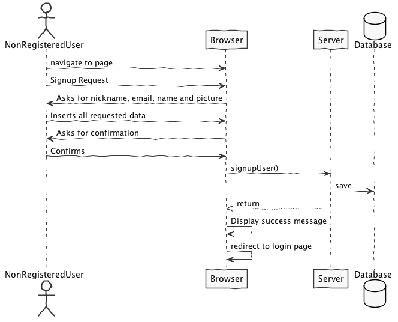

**Tiago Rios** (1161292) - Sprint 2 - IPC01.2
===============================

# 1. General Notes

Questions made to Product Owner (LMN):

```
Q: Should I add security measures, for instance, password hash?
A: Yes.
```

```
Q: Can I create business rules, like Password with minimum requirements?
A: Yes.
```

# 2. Requirements

IPC01.2 - The application should add the possibility of registering new users. The identification of a user should be based on his email. Each user should have an email, name, nickname and picture (i.e., face photo). The application should display the nickname and photo of the authenticated user in the top of every page.

```
US01
    As a non-registered user,
    I want to create a new account,
    So I can use all the functionalities.
```

# 3. Analysis

*In this section you should describe the study/analysis/research you developed in order to design a solution.*  

## 3.1 Analysis Diagrams

The main idea for the "workflow" of this feature increment.

**Use Cases**


**Domain Model**


**System Sequence Diagrams**

**For US1**



# 4. Design

*In this section you should present the design solution for the requirements of this sprint.*


## 4.1. Tests

*In this section you should describe the design of the tests that, as much as possibe, cover the requirements of the sprint.*

Regarding tests we try to follow an approach inspired by test driven development. However it is not realistic to apply it for all the application (for instance for the UI part). Therefore we focus on the domain classes and also on the services provided by the server.

**UserBuilder**: This class represents the Builder Pattern. It has the knowledge of how to build a User entity by knowing his attributes. We tested this class to make sure that after calling **build()** method, we have our entity represented with our information.

```java
@Test
public void ensureUserBuilderIsWorking(){
    System.out.println("ensureUserBuilderIsWorking");
    final Boolean expected = true;
    
    final UserDTO expectedDTO = new UserDTO("1161292@isep.ipp.pt", "Tiago", "tiago", "Teste123", false);
    final UserDTO resultDTO = new UserBuilder().withEmail("1161292@isep.ipp.pt").withName("Tiago").withNickname("tiago").withPassword("Teste123").withSuperUser(false).build();
    
    assertEquals(expected, resultDTO.equals(expectedDTO));
}
```

```java
@Test
public void ensureUserBuilderIsNotWorkingBecauseEmail(){
    System.out.println("ensureUserBuilderIsNotWorkingBecauseEmail");
    final Boolean expected = false;
    
    final UserDTO expectedDTO = new UserDTO("1161292@isep.ipp.pt", "Tiago", "tiago", "Teste123", false);
    final UserDTO resultDTO = new UserBuilder().withEmail("1161291@isep.ipp.pt").withName("Tiago").withNickname("tiago").withPassword("Teste123").withSuperUser(false).build();
    
    assertEquals(expected, resultDTO.equals(expectedDTO));
}
```

```java
@Test
public void ensureUserBuilderIsNotWorkingBecauseName(){
    System.out.println("ensureUserBuilderIsNotWorkingBecauseName");
    final Boolean expected = false;
    
    final UserDTO expectedDTO = new UserDTO("1161292@isep.ipp.pt", "Tiago", "tiago", "Teste123", false);
    final UserDTO resultDTO = new UserBuilder().withEmail("1161292@isep.ipp.pt").withName("João").withNickname("tiago").withPassword("Teste123").withSuperUser(false).build();
    
    assertEquals(expected, resultDTO.equals(expectedDTO));
}
```

```java
@Test
public void ensureUserBuilderIsNotWorkingBecauseNickname(){
    System.out.println("ensureUserBuilderIsNotWorkingBecauseNickname");
    final Boolean expected = false;
    
    final UserDTO expectedDTO = new UserDTO("1161292@isep.ipp.pt", "Tiago", "tiago", "Teste123", false);
    final UserDTO resultDTO = new UserBuilder().withEmail("1161292@isep.ipp.pt").withName("Tiago").withNickname("joão").withPassword("Teste123").withSuperUser(false).build();
    
    assertEquals(expected, resultDTO.equals(expectedDTO));
}
```  

```java
@Test
public void ensureUserBuilderIsNotWorkingBecausePassword(){
    System.out.println("ensureUserBuilderIsNotWorkingBecausePassword");
    final Boolean expected = false;
    
    final UserDTO expectedDTO = new UserDTO("1161292@isep.ipp.pt", "Tiago", "tiago", "Teste123", false);
    final UserDTO resultDTO = new UserBuilder().withEmail("1161292@isep.ipp.pt").withName("Tiago").withNickname("tiago").withPassword("Teste1234").withSuperUser(false).build();
    
    assertEquals(expected, resultDTO.equals(expectedDTO));
}
```

```java
@Test
public void ensureUserBuilderIsNotWorkingBecauseSuperUser(){
    System.out.println("ensureUserBuilderIsNotWorkingBecauseSuperUser");
    final Boolean expected = false;
    
    final UserDTO expectedDTO = new UserDTO("1161292@isep.ipp.pt", "Tiago", "tiago", "Teste123", false);
    final UserDTO resultDTO = new UserBuilder().withEmail("1161292@isep.ipp.pt").withName("Tiago").withNickname("tiago").withPassword("Teste123").withSuperUser(true).build();
    
    assertEquals(expected, resultDTO.equals(expectedDTO));
}
```

**SignupController**: This class is responsible for the communication between UI and Domain. In this case, it is where the signup begins in the server, so it can persist a new User in the database.

The information below represents the dummy information used for testing normal behaviour.

```java
private static final String EMAIL = "1161292@isep.ipp.pt";
private static final String USERNAME = "tiago";
private static final String NAME = "Tiago";
private static final String PASSWORD = "Teste123";
private static final Boolean SUPERUSER = false;
```

```java
@Test
public void testNormalBehaviour() throws Exception {
    System.out.println("testNormalBehaviour");
    
    final User expected = new User(EMAIL, NAME, USERNAME, PASSWORD, SUPERUSER);
    SignupController ctrl = new SignupController();

    User result = ctrl.signupUser(new UserDTO(EMAIL, NAME, USERNAME, PASSWORD, SUPERUSER));

    assertTrue("The added User does not have the same data as input", expected.sameAs(result));
}
```

```java
@Test
public void testIfUserWasAdded() throws Exception {
    System.out.println("testIfUserWasAdded");

    final User expected = new User(EMAIL, NAME, USERNAME, PASSWORD, SUPERUSER);
    SignupController ctrl = new SignupController();
    User result = ctrl.signupUser(new UserDTO(EMAIL, NAME, USERNAME, PASSWORD, SUPERUSER));

    ListUserController ctrlList = new ListUserController();
    Iterable<User> list = ctrlList.listUsers();

    assertTrue("The added User is not in the database", list.iterator().hasNext());
}
```

## 4.2. Requirements Realization

*In this section you should present the design realization of the requirements.*

**For US1**


## 4.3. Classes

*Present and describe the major classes of you solution.*

## 4.4. Design Patterns and Best Practices

*Present and explain how you applied design patterns and best practices.*

- Repository
- Builder
- MVP

# 5. Integration/Demonstration

*In this section document your contribution and efforts to the integration of your work with the work of the other elements of the team and also your work regarding the demonstration (i.e., tests, updating of scripts, etc.)*

# 6. Final Remarks 

*In this section present your views regarding alternatives, extra work and future work on the issue.*

Some Questions/Issues identified during the work in this feature increment:

# 7. Work Log

* [Removed Password Value Object. GWT UI is working with Regex](https://bitbucket.org/lei-isep/lapr4-18-2db/commits/3a21401073446b8c76c029d28717e3374fef6911)
* [Fixed logged in user UI bugs](https://bitbucket.org/lei-isep/lapr4-18-2db/commits/d9ff5af8bd1064ee3ac792e766ed73d22ffc9592)
* [Application now shows who is logged in](https://bitbucket.org/lei-isep/lapr4-18-2db/commits/ac8f96bccaf2d7cb71f974a5adc611efbfabb447)
* [Added redirection to Login Page after signup](https://bitbucket.org/lei-isep/lapr4-18-2db/commits/c26852b13854e7fcf222225badd56570f3e1c8b0)
* [Implemented input validation](https://bitbucket.org/lei-isep/lapr4-18-2db/commits/f2f1fcaf8c22109354ece287bfb7a9ee1b847624)
* [Fixed Login issues](https://bitbucket.org/lei-isep/lapr4-18-2db/commits/282185efe8e19ae2a70534c074c6edbacab24a1b)
* [Fixed servlet location](https://bitbucket.org/lei-isep/lapr4-18-2db/commits/399c1744d15985a0b35e9fea3433e1091b3afbce)
* [Created add user to database service](https://bitbucket.org/lei-isep/lapr4-18-2db/commits/c40c22cca5b829c8aed4ec50d57f9f3885a77e66)
* [Fixed Signup UI](https://bitbucket.org/lei-isep/lapr4-18-2db/commits/fcbf0a808cf999aea8e759183aaeffec49b8d9f3)
* [Added SignupServices in server module](https://bitbucket.org/lei-isep/lapr4-18-2db/commits/593ef2c0a1ab0b70d24b4c4a31d0ed30e4a86df6)
* [Added SignupServlet](https://bitbucket.org/lei-isep/lapr4-18-2db/commits/f562e3202dfb6be554235726113288c59262ff59)
* [Added all Signup Services](https://bitbucket.org/lei-isep/lapr4-18-2db/commits/c20281b2aff243b68faa289b17c98b3f4638dbf3)
* [Added SignupController](https://bitbucket.org/lei-isep/lapr4-18-2db/commits/e5550b84772240362e8ce65d563dc14bdd3ce120)
* [Fixed User Implementation and Login](https://bitbucket.org/lei-isep/lapr4-18-2db/commits/3944d1cea73d739f6e8f6f28ea72c57cbed78fbb)
* [Implemented ValueObject pattern and Password class; Started Builder pattern implementation](https://bitbucket.org/lei-isep/lapr4-18-2db/commits/f357f501be2867aae9f22d78e3db6060b09558c9)
* [Solved NameTokens merge conflict](https://bitbucket.org/lei-isep/lapr4-18-2db/commits/4d4db65cc9a4d60abf76e0de56dfbff40de02a1e)
* [Implemented IPC01.2 UI](https://bitbucket.org/lei-isep/lapr4-18-2db/commits/bd6b477286f62a5875b3e0f081106d9cb4aae202)
* [Application installs SignupModule](https://bitbucket.org/lei-isep/lapr4-18-2db/commits/64fa94c53a63774e43aca54e3a7be7d2d6764c16)
* [Updated IPC01.2 Documentation](https://bitbucket.org/lei-isep/lapr4-18-2db/commits/dd252ec54d2fb8dfee088d0b91eca52df2b25305)
* [Added all IPC01.2 diagrams](https://bitbucket.org/lei-isep/lapr4-18-2db/commits/df682bd5185781fcef3730ac35917ebf20ed13c1)
* [Added IPC01.2 US analysis](https://bitbucket.org/lei-isep/lapr4-18-2db/commits/b2ab8171bcb22fd2e1e19954af3a4a60d14dfc21)
* [Started IPC01.2 analysis](https://bitbucket.org/lei-isep/lapr4-18-2db/commits/f3867671478948778f5b260af24a603b0a29ab35)