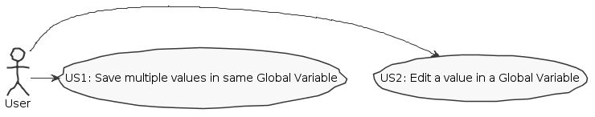
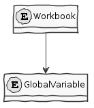
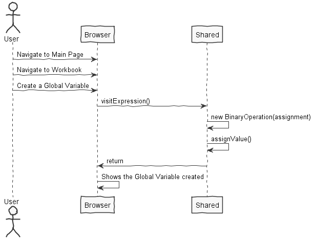
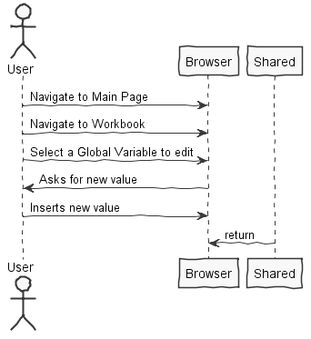
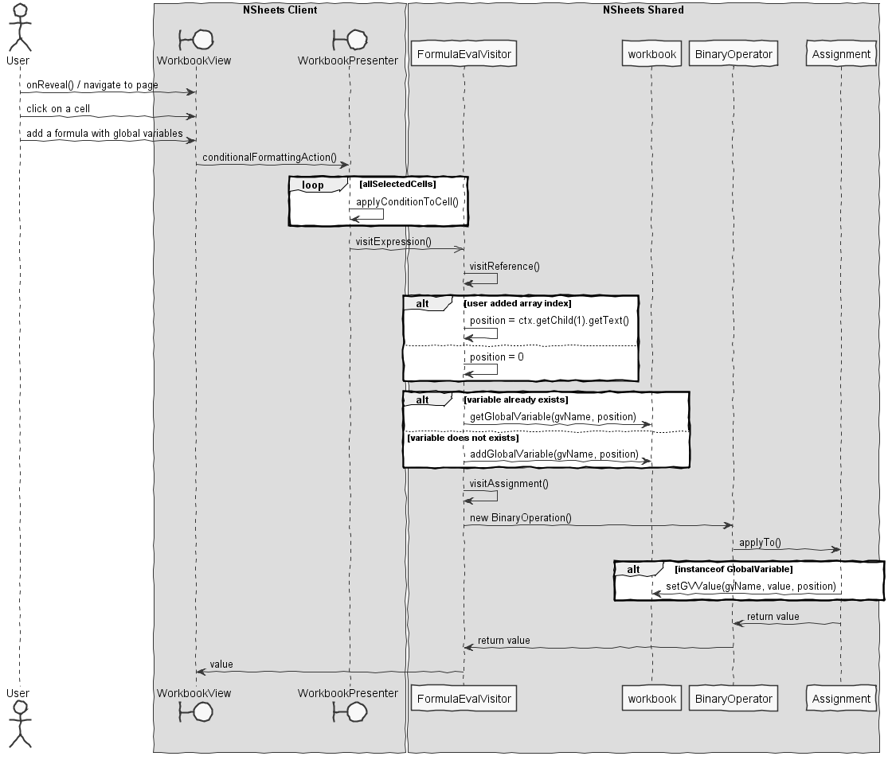
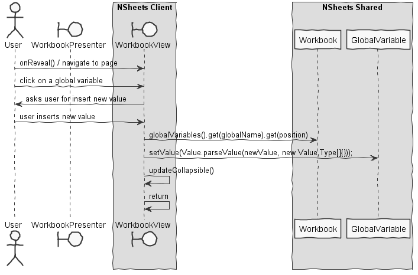

**Tiago Rios** (1161292) - Sprint 3 - Lang02.3
===============================

# 1. General Notes


# 2. Requirements

Lang02.3 - Arrays and Variable Editor: Add support for array variables (temporary and global). Any variable can be an array. When accessing a variable only by its name it should be inferred the position 1 of the array. To explicitly access a position in a array variable the position index should be specified inside brackets (following the name of the variable). For example, the formula "=@abc[2]:=123" will set the position 2 of the global variable @abc to the value 123. Each position of an array can be of a different type. For instance it should be possible to have an array with numeric and alphanumeric values. There should also be a window to display and edit the value of global variables. The values that appear in this window should be automatically updated when the variables are updated.

```
US01:
    As an user,
    I want to save multiple values in the same Global Variable,
    So I can work with it as an array.
```

```
US02:
    As an user,
    I want to edit a Global Variable,
    So I can modify a specific value from a Global Variable.
```

# 3. Analysis

##### *In this section you should describe the study/analysis/research you developed in order to design a solution.*  

## 3.1 Analysis Diagrams

The main idea for the "workflow" of this feature increment.

**Use Cases**



**Domain Model**



**System Sequence Diagrams**

**For US1**



**For US2**



# 4. Design

##### *In this section you should present the design solution for the requirements of this sprint.*


## 4.1. Tests

##### *In this section you should describe the design of the tests that, as much as possibe, cover the requirements of the sprint.*

##### Regarding tests we try to follow an approach inspired by test driven development. However it is not realistic to apply it for all the application (for instance for the UI part). Therefore we focus on the domain classes and also on the services provided by the server.

## 4.2. Requirements Realization

*In this section you should present the design realization of the requirements.*

**For US1**



**For US2**




## 4.3. Classes

*Present and describe the major classes of you solution.*

## 4.4. Design Patterns and Best Practices

*Present and explain how you applied design patterns and best practices.*

- Repository
- MVP

# 5. Implementation

## 5.1 Formula.g4

```java
grammar Formula;

@header {
	//package pt.isep.nsheets.shared.core.formula.compiler;
}
	         
expression
	: EQ comparison /* EOF */
	;
	
comparison
	: concatenation
		( ( EQ | NEQ | GT | LT | LTEQ | GTEQ ) concatenation )?
	;

block
        : manyexpressions
        | FOR forexpression
        ;

forexpression
        : assignment SEMI comparison (SEMI concatenation)+ FCHA
        ;

concatenation
        : ( MINUS )? atom                                       
        | concatenation PERCENT
        | <assoc=right> concatenation POWER concatenation
        | concatenation ( MULTI | DIV ) concatenation
        | concatenation ( PLUS | MINUS ) concatenation
        | concatenation AMP concatenation
        | block
        ;

atom
	:	function_call
	|	reference
    |   assignment
	|	literal
	|	LPAR concatenation RPAR
    |   temporaryreference
	;

function_call
	:	FUNCTION LPAR
		comparison RPAR
	;

reference
	:	CELL_REF
		( ( COLON ) CELL_REF )?
    |   NAMEGLOBAL ARRAY?
	;
	
literal
	:	NUMBER
	|	STRING
    |   nameTemporary
    |   NAMEGLOBAL
	;
	
manyexpressions
	:	ICHA comparison (SEMI comparison)* FCHA
	;
	
assignment
	:	reference ASSIGN concatenation
	;

LETTER: ('a'..'z'|'A'..'Z') ;
  
FUNCTION : ( LETTER )+
	;	
	 
CELL_REF
	:	( ABS )? LETTER ( LETTER )?
		( ABS )? ( DIGIT )+
	;
	
temporaryreference
    :	nameTemporary ASSIGN concatenation
    ;

nameTemporary
    :   UNDERSCORE ( LETTER )+ 
    ;

NAMEGLOBAL
    :   ARROBA ( LETTER )+
    ;

ARRAY : ( LBRACKET INDEX RBRACKET ) ;

/* String literals, i.e. anything inside the delimiters */
STRING  : QUOT ('\\"' | ~'"')* QUOT
        ;


QUOT: '"' 
	;

/* Numeric literals */
NUMBER: DIGITNOTZERO ( DIGIT )* FRACTIONALPART? 
        | DIGIT FRACTIONALPART
        ;
		
FRACTIONALPART:  COMMA  DIGIT DIGIT
                | DOT DIGIT DIGIT?
                ;

INDEX: DIGIT
    | DIGITNOTZERO ( DIGIT )*
    ;


DIGIT : '0'..'9' ;
DIGITNOTZERO : '1'..'9' ;

/* Comparison operators */
EQ	: '=' ;
NEQ	: '<>' ;
LTEQ	: '<=' ;
GTEQ	: '>=' ;
GT	: '>' ;
LT	: '<' ;

/* Text operators */
AMP	: '&' ;

/* Arithmetic operators */
PLUS	: '+' ;
MINUS	: '-' ;
MULTI	: '*' ;
DIV	: '/' ;
POWER	: '^' ;
PERCENT : '%' ;

/* Reference operators */
fragment ABS : '$' ;
fragment EXCL:  '!'  ;
COLON	: ':' ;
UNDERSCORE : '_' ;
ARROBA : '@' ;

/* Miscellaneous operators */
COMMA	: ',' ;
DOT     : '.' ;
SEMI	: ';' ;
LPAR	: '(' ;
RPAR	: ')' ;
ICHA	: '{' ;
FCHA	: '}' ;
LBRACKET : '[' ;
RBRACKET : ']' ;

/* Assignment Operator */
ASSIGN 	: ':=' ;

/* For Operator */
FOR : 'FOR{';	

/* White-space (ignored) */
WS: ( ' ' | '\r' '\n' | '\n' | '\t' ) -> skip ;
```

This was the grammar that I worked with during this sprint. The main changes I made so it could accept array indexes in global variables were:

```java
reference
        :	CELL_REF
        ( ( COLON ) CELL_REF )?
        |   NAMEGLOBAL ARRAY?
        ;
```

```java
ARRAY 
    : ( LBRACKET INDEX RBRACKET ) 
    ;
```

These first two changes allowed the application accept an array index. Which means that user can write ```=@abc:=123``` or ```=@abc[0]:=123```. Since ```Number``` grammar rule was forcing number starts with a digit different than 0, I had to create a new rule for array indexes.

```java
INDEX
    : DIGIT
    | DIGITNOTZERO ( DIGIT )*
    ;
```


# 6. Integration/Demonstration

##### *In this section document your contribution and efforts to the integration of your work with the work of the other elements of the team and also your work regarding the demonstration (i.e., tests, updating of scripts, etc.)*

# 7. Final Remarks 

##### *In this section present your views regarding alternatives, extra work and future work on the issue.*

Some Questions/Issues identified during the work in this feature increment:

# 8. Work Log

* []()
* []()
* []()
* [GlobalVariables refresh is now called when done button is pressed](https://bitbucket.org/lei-isep/lapr4-18-2db/commits/4bc5ed6eb83148b8049b551590607861c3b1cba2)
* [Added Lang02.3 design](https://bitbucket.org/lei-isep/lapr4-18-2db/commits/1edb68d24b5cb10125adb9c4e9b969d689525b8c)
* [Added Lang02.3 analysis](https://bitbucket.org/lei-isep/lapr4-18-2db/commits/b7a1889ef49c020321743bad3b99ad23a3c2edca)
* [User can edit global variable value](https://bitbucket.org/lei-isep/lapr4-18-2db/commits/a30e1f3bd30f0ad1f8d76d0875907deb695a1255)
* [Updated Lang02.3 documentation. Missing diagrams](https://bitbucket.org/lei-isep/lapr4-18-2db/commits/748732c48b63643a24bcf5d6f09eab5cf6c7f555)
* [Fixed Assignment to treat globalvariable position](https://bitbucket.org/lei-isep/lapr4-18-2db/commits/23c9ea57a1be8e71da357fb3de4381817f53143d)
* [Fixed GlobalVariables attribute realted methods](https://bitbucket.org/lei-isep/lapr4-18-2db/commits/7bdb549b3ce11043979c8b74cc47f9e1589c46f6)
* [Application has a GlobalVariable collapsible](https://bitbucket.org/lei-isep/lapr4-18-2db/commits/0cd1d9d4267aacc3cc9400e0631e32ab84b470d4)
* [Global Variable has position attribute](https://bitbucket.org/lei-isep/lapr4-18-2db/commits/174d255207518a2e170352814e681c460bdbd40d)
* [Application now accepts array indexes for GlobalVariables](https://bitbucket.org/lei-isep/lapr4-18-2db/commits/b67aa594ac7a2dabea6e6c74c52daff8fae0b1ad)
* [Updated Formula.g4 grammar for treating array indexes](https://bitbucket.org/lei-isep/lapr4-18-2db/commits/619b743119779e0b6b31e6476f74314ed8b76ea8)
* [Updated grammar to accept array indexes](https://bitbucket.org/lei-isep/lapr4-18-2db/commits/c5fcd9d01ce9496a9f84ba2117f28b58e0492eaa)
* [Created interaction between Global Variables and UI](https://bitbucket.org/lei-isep/lapr4-18-2db/commits/326c668043de8015eb61a795e3f9d6721af39600)
* [Added Collapsible to Workbook Page](https://bitbucket.org/lei-isep/lapr4-18-2db/commits/9603fc390f0c46836b5998dc97add2771021e5d7)
